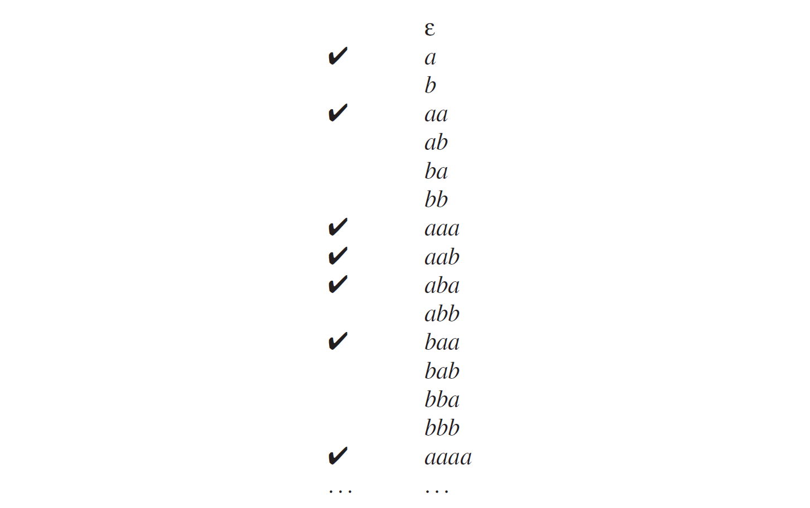

# 2.1.3 无限集带来的问题

上述将语言定义为序号序列的无限集，以及将语法定义为构造句子的配方的定义，引出了两个令人尴尬的问题：

1.一个有限的配方如何能产生无限的句子集呢？

2.如果一个句子只是一个序列而没有结构，或者如果一个句子，可以通过其结构推导出其他的意义，那我们该如何理解这个句子呢？

这两个问题有一个漫长而复杂的答案，不过确实是有答案的。我们先解决第一个问题，然后在带着第二个问题去阅读本书的主体部分。

### 2.1.3.1 有限描述的无限集

其实从一个有限的描述中得到一个无限集，并没有什么问题：“所有正整数集合”是一个非常有限的描述，但描述的却是一个无限集合。不过，还是有一些令人不安的想法，所以我们把问题换一个说法：“所有的语言都能用有限的描述来说明吗？” 正如上文暗示的，答案是“不行”，不过证据却不是无关紧要的。实际上是非常有趣并且有名气的，如果不展示一下或者至少大致的介绍一下，将会是一个遗憾。

### 2.1.3.2 枚举描述

证明是基于两个意见和一个技巧之上的。第一个意见是，描述是可以列举的并且有一个数据。如下所示。首先，找出全部大小为1的，也就是那些上都只有一个字母的，然后将他们按字母顺序排序。这是我们列表的开头。基于这个，实际上我们在接受一种描述，长度为1的描述可能是0，或27（所有字母+空格），或者95（所有可打印的ASCII字符）或者其他类似的；具体是什么对下面的讲解都不重要。

第二步，我们找出长度为2的并将他们按照字母顺序排序，然后将他们放在列表中的第二块；然后是长度为3的，长度为4的等等等等，都这样做。每一个描述都这样在列表中获得一个位置。例如“所有正整数的集合（the set of all positive integers）”这个描述，集合大小为32个字符（英文），不算引号。若要查找其在列表中的位置，我们要先计算有多少少于32字符的描述，称为L。然后我们必须生成所有长度为32的描述，对他们进行排序，然后确定我们的描述在其中的位置，称为P，然后把L和P加起来。这肯定会是一个巨大的数字[^1]，不过这就能确保我们的描述处于这个完整定义的列表中了；见图Fig.2.1。

有两件事情应该指出。第一，只是根据字母列出全部描述，而不指出其长度将不会起作用：已经有很多以“a”开头的描述，以及没有以其他字母开头的描述，将会在列表中获取一个位置。第二，其实没有必要列出全部的描述。这只是一个思想实验，使我们在无法亲自检测结构的情况下，能有一个方式来检测一个行为体系并得出结论。 

此外，列表中会有一些荒谬的描述；不过这对我们的论点来说是无关紧要的。重点是有用的描述都在列表中，以上描述能确保这一点。

> 注
> 
> [1] 一些计算表明，在ASCII-128假设下，这个数字是248 17168 89636 37891 49073 14874 06454 89259 38844 52556 26245 57755 89193 30291，或者大致是2.5× $$10^{67}$$。

### 2.1.3.3 语言，无限的比特串

我们知道，在语言中单词（句子）被视为一组有限的符号集；这个集合被称为“字母表”。我们假设字母表中的字母是有序的。那么语言中的单词也是有序的。我们用字母Σ来表示字母表。

现在最简单的语言就是，使用字母表Σ中的字母组成了所有单词的语言。通过字母表Σ = {a,b}，我们获得了一门语言{ , a, b, aa, ab, ba, bb, aaa, . . . }。我们应该把这个语言称为Σ*，稍后再说为什么这么称呼；暂时这只是一个名字。

The set notation Σ∗ above started with “ { , a,”, a remarkable construction; the first word in the language is the empty word, the word consisting of zero as and zero bs. There is no reason to exclude it, but, if written down, it may easily be overlooked, so we shall write it as ε (epsilon), regardless of the alphabet. So, Σ∗ = { ε, a, b, aa, ab, ba, bb, aaa, . . . }. In some natural languages, forms of the present tense of the verb “to be” are empty words, giving rise to sentences of the form “I student”, meaning “I am a student.” Russian and Hebrew are examples of this.

Since the symbols in the alphabet Σ are ordered, we can list the words in the language Σ∗, using the same technique as in the previous section: First, all words of size zero, sorted; then all words of size one, sorted; and so on. This is actually the order already used in our set notation for Σ∗.

The language Σ∗ has the interesting property that all languages using alphabet Σ are subsets of it. That means that, given another possibly less trivial language over Σ, called L, we can go through the list of words in Σ∗ and put ticks on all words that are in L. This will cover all words in L, since Σ∗ contains any possible word over Σ.

Suppose our language L is “the set of all words that contain more as than bs”. L is the set {a, aa, aab, aba, baa, . . . }. The beginning of our list, with ticks, will look as follows:

Given the alphabet with its ordering, the list of blanks and ticks alone is entirely sufficient to identify and describe the language. For convenience we write the blank as a 0 and the tick as a 1 as if they were bits in a computer, and we can now write L = 0101000111010001· · · (and Σ∗ = 1111111111111111· · · ). It should be noted that this is true for any language, be it a formal language like L, a programming language like Java or a natural language like English. In English, the 1s in the bitstring will be very scarce, since hardly any arbitrary sequence of words is a good English sentence (and hardly any arbitrary sequence of letters is a good English word, depending on whether we address the sentence/word level or the word/letter level).

### 2.1.3.4 Diagonalization

The previous section attaches the infinite bit-string 0101000111010001· · · to the description “the set of all the words that contain more as than bs”. In the same vein we can attach such bit-strings to all descriptions. Some descriptions may not yield a language, in which case we can attach an arbitrary infinite bit-string to it. Since all descriptions can be put on a single numbered list, we get, for example, the following picture:

At the left we have all descriptions, at the right all languages they describe. We now claim that many languages exist that are not on the list of languages above: the above list is far from complete, although the list of descriptions is complete.We shall prove this by using the diagonalization process (“Diagonalverfahren”) of Cantor.

Consider the language C = 100110· · · , which has the property that its n-th bit is unequal to the n-th bit of the language described by Description #n. The first bit of C is a 1, because the first bit for Description #1 is a 0; the second bit of C is a 0, because the second bit for Description #2 is a 1, and so on. C is made by walking the NW to SE diagonal of the language field and copying the opposites of the bits we meet. This is the diagonal in Figure 2.2(a). The language C cannot be on the list! It cannot be on line 1, since its first bit differs (is made to differ, one should say) from that on line 1, and in general it cannot be on line n, since its n-th bit will differ from that on line n, by definition.

So, in spite of the fact that we have exhaustively listed all possible finite descriptions, we have at least one language that has no description on the list. But there exist more languages that are not on the list. Construct, for example, the language whose n+10-th bit differs from the n+10-th bit in Description #n. Again it cannot be on the list since for every n > 0 it differs from line n in the n+10-th bit. But that means that bits 1. . . 9 play no role, and can be chosen arbitrarily, as shown in Figure 2.2(b); this yields another 29 = 512 languages that are not on the list. And we can do even much better than that! Suppose we construct a language whose 2n-th bit differs from the 2n-th bit in Description #n (c). Again it is clear that it cannot be on the list, but now every odd bit is left unspecified and can be chosen freely! This allows us to create freely an infinite number of languages none of which allows a finite description; see the slanting diagonal in Figure 2.2. In short, for every language that can be described there are infinitely many that cannot.

The diagonalization technique is described more formally in most books on theoretical computer science; see e.g., Rayward-Smith [393, pp. 5-6], or Sudkamp [397, Section 1.4].

### 2.1.3.5 Discussion

The above demonstration shows us several things. First, it shows the power of treating languages as formal objects. Although the above outline clearly needs considerable amplification and substantiation to qualify as a proof (for one thing it still has to be clarified why the above explanation, which defines the language C, is not itself on the list of descriptions; see Problem 2.1, it allows us to obtain insight into properties not otherwise assessable.

Secondly, it shows that we can only describe a tiny subset (not even a fraction) of all possible languages: there is an infinity of languages out there, forever beyond our reach.

Thirdly, we have proved that, although there are infinitely many descriptions and infinitely many languages, these infinities are not equal to each other, and the latter is larger than the former. These infinities are called ℵ0 and ℵ1 by Cantor, and the above is just a special case of his proof that ℵ0 < ℵ1.