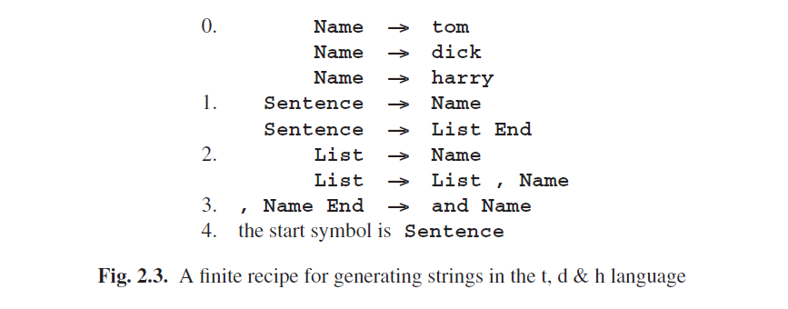

# 2.1.4 Describing a Language through a Finite Recipe

A good way to build a set of objects is to start with a small object and to give rules for how to add to it and construct new objects from it. “Two is an even number and the sum of two even numbers is again an even number” effectively generates the set of all even numbers. Formalists will add “and no other numbers are even”, but we will take that as understood.

Suppose we want to generate the set of all enumerations of names, of the type “Tom, Dick and Harry”, in which all names but the last two are separated by commas. We will not accept “Tom, Dick, Harry” nor “Tom and Dick and Harry”, but we shall not object to duplicates: “Grubb, Grubb and Burrowes”[^2] is all right. Although these are not complete sentences in normal English, we shall still call them “sentences” since that is what they are in our midget language of name enumerations. A simpleminded recipe would be:

0. Tom is a name, Dick is a name, Harry is a name;

1. a name is a sentence;

2. a sentence followed by a comma and a name is again a sentence;

3. before finishing, if the sentence ends in “, name”, replace it by “and name”.

Although this will work for a cooperative reader, there are several things wrong with it. Clause 3 is especially wrought with trouble. For example, the sentence does not really end in “, name”, it ends in “, Dick” or such, and “name” is just a symbol that stands for a real name; such symbols cannot occur in a real sentence and must in the end be replaced by a real name as given in clause 0. Likewise, the word “sentence” in the recipe is a symbol that stands for all the actual sentences. So there are two kinds of symbols involved here: real symbols, which occur in finished sentences, like “Tom”, “Dick”, a comma and the word “and”; and there are intermediate symbols, like “sentence” and “name” that cannot occur in a finished sentence. The first kind corresponds to the words or tokens explained above; the technical term for them is terminal symbols (or terminals for short). The intermediate symbols are called nonterminals, a singularly uninspired term. To distinguish them, we write terminals in lower case letters and start non-terminals with an upper case letter. Non-terminals are called (grammar) variables or syntactic categories in linguistic contexts.

To stress the generative character of the recipe, we shall replace “X is a Y” by “Y may be replaced by X”: if “tom” is an instance of a Name, then everywhere we have a Name we may narrow it down to “tom”. This gives us:

0. Name may be replaced by “tom”

Name may be replaced by “dick”

Name may be replaced by “harry”

1. Sentence may be replaced by Name

2. Sentence may be replaced by Sentence, Name

3. “, Name” at the end of a Sentence must be replaced by “and Name” before Name is replaced by any of its replacements

4. a sentence is finished only when it no longer contains non-terminals

5. we start our replacement procedure with Sentence

Clause 0 through 3 describe replacements, but 4 and 5 are different. Clause 4 is not specific to this grammar. It is valid generally and is one of the rules of the game. Clause 5 tells us where to start generating. This name is quite naturally called the start symbol, and it is required for every grammar.

Clause 3 still looks worrisome; most rules have “may be replaced”, but this one has “must be replaced”, and it refers to the “end of a Sentence”. The rest of the rules work through replacement, but the problem remains how we can use replacement to test for the end of a Sentence. This can be solved by adding an end marker after it. And if we make the end marker a non-terminal which cannot be used anywhere except in the required replacement from “, Name” to “and Name”, we automatically enforce the restriction that no sentence is finished unless the replacement test has taken place. For brevity we write ---> instead of “may be replaced by”; since terminal and non-terminal symbols are now identified as technical objects we shall write them in a typewriter-like typeface. The part before the ---> is called the left-hand side, the part after it the right-hand side. This results in the recipe in Figure 2.3.

This is a simple and relatively precise form for a recipe, and the rules are equally straightforward: start with the start symbol, and keep replacing until there are no non-terminals left.

[^2]:The Hobbit, by J.R.R. Tolkien, Allen and Unwin, 1961, p. 311.