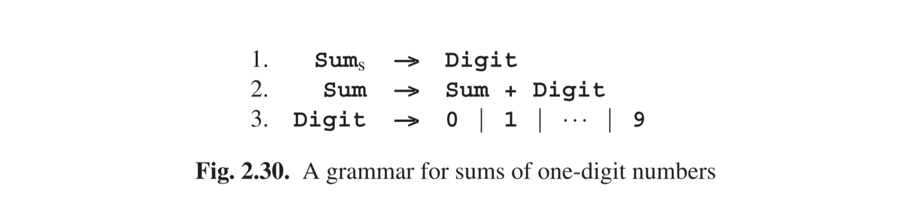

# 2.11 The Semantic Connection

Sometimes parsing serves only to check the correctness of a string; that the string conforms to a given grammar may be all we want to know, for example because it confirms our hypothesis that certain observed patterns are indeed correctly described by the grammar we have designed for it. Often, however, we want to go further: we know that the string conveys a meaning, its semantics, and this semantics is directly related to the structure of the production tree of the string. (If it is not, we have the
wrong grammar!)

Attaching semantics to a grammar is done in a very simple and effective way: to each rule in the grammar, a semantic clause is attached which relates the semantics of the members of the right-hand side of the rule to the semantics of the left-hand side, in which case the semantic information flows from the leaves of the tree upwards to the start symbol; or the other way around, in which case the semantic information flows downwards from the start symbol to the leaves; or both ways, in which case the semantic information may have to flow up and down for a while until a stable situation is reached. Semantic information flowing down is called inherited: each rule inherits it from its parent in the tree. Semantic information flowing up is called
derived: each rule derives it from its children.

There are many ways to express semantic clauses. Since our subject is parsing and syntax rather than semantics, we will briefly describe only two often-used and well-studied techniques: attribute grammars and transduction grammars. We shall explain both using the same simple example, the language of sums of one-digit numbers; the semantics of a sentence in this language is the value of the sum. The
language is generated by the grammar of Figure 2.30. One of its sentences is, for example, 3+5+1; its semantics is 9.

