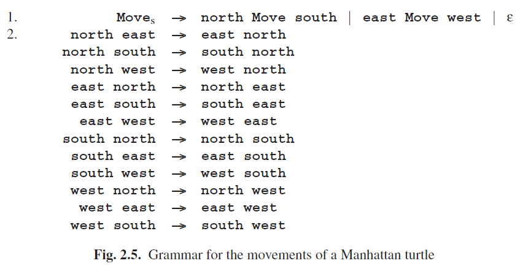
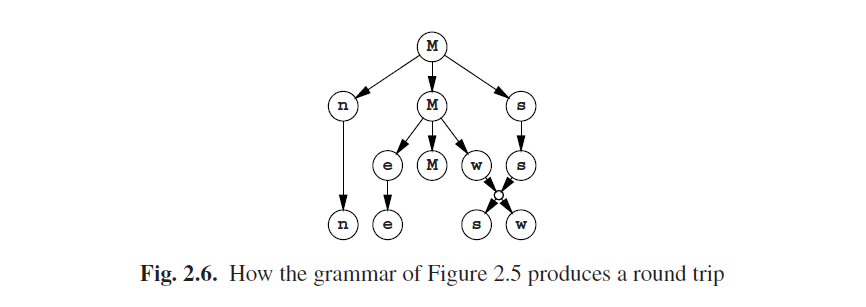

# 2.2.3 正式语法的表达力量

正式语法的主要属性就是它有生成规则，可用于重写部分句子形式（=正在构建的句子），和产生所有句子形式的起始符。在生成规则中我们发现有终结符和非终结符；而在完整的句子中只有终结符。这大概就是：剩下的部分就看语法作家和句子创造者的创造力了。

This is a framework of impressive frugality and the question immediately rises: Is it sufficient? That is hard to say, but if it is not, we do not have anything more expressive. Strange as it may sound, all other methods known to mankind for generating sets have been proved to be equivalent to or less powerful than a phrase structure grammar. One obvious method for generating a set is, of course, to write a program generating it, but it has been proved that any set that can be generated by a program can be generated by a phrase structure grammar. There are even more arcane methods, but all of them have been proved not to be more expressive. On the other hand there is no proof that no such stronger method can exist. But in view of the fact that many quite different methods all turn out to halt at the same barrier, it is highly unlikely[^1] that a stronger method will ever be found. See, e.g. Révész [394, pp 100-102].

As a further example of the expressive power we shall give a grammar for the movements of a Manhattan turtle. A Manhattan turtle moves in a plane and can only move north, east, south or west in distances of one block. The grammar of Figure 2.5 produces all paths that return to their own starting point. As to rule 2, it should be noted that many authors require at least one of the symbols in the left-hand side to be a non-terminal. This restriction can always be enforced by adding new non-terminals.

The simple round trip north east south west is produced as shown in Figure 2.6 (names abbreviated to their first letter). Note the empty alternative in rule (the ε), which results in the dying out of the third M in the above production graph.

[^1]:Paul Vitány has pointed out that if scientists call something “highly unlikely” they are still generally not willing to bet a year’s salary on it, double or quit.