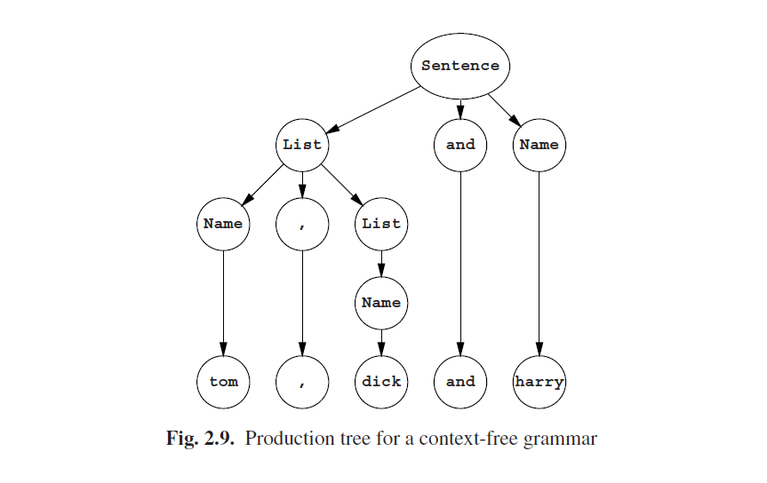
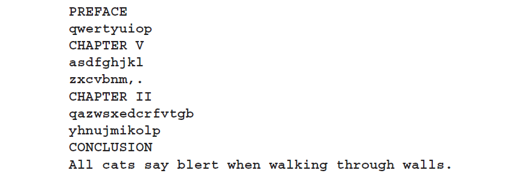
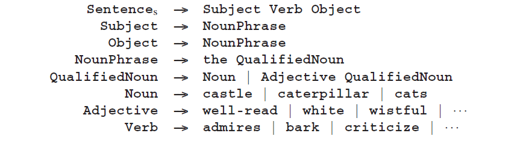
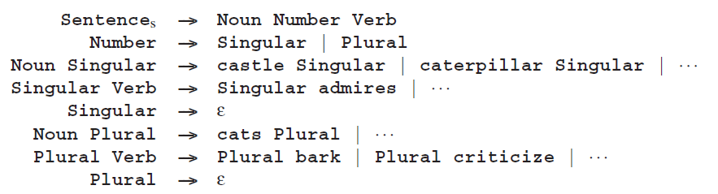
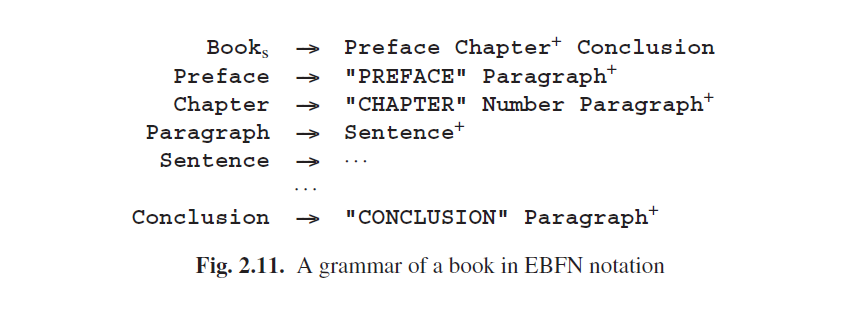
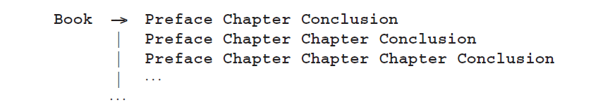
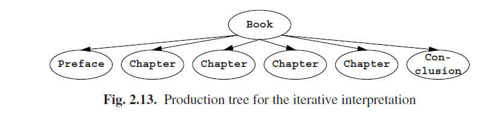

# 2.3.2 2型语法

Type 2 grammars are called context-free grammars (CF grammars) and their relation to context-sensitive grammars is as direct as the name suggests. A context-free grammar is like a context-sensitive grammar, except that both the left and the right contexts are required to be absent (empty). As a result, the grammar may contain only rules that have a single non-terminal on their left-hand side. Sample grammar:

### 2.3.2.1 Production Independence

Since there is always only one symbol on the left-hand side, each node in a production graph has the property that whatever it produces is independent of what its neighbors produce: the productive life of a non-terminal is independent of its context. Starlike forms as we saw in Figures 2.4, 2.6, and 2.8 cannot occur in a context-free production graph, which consequently has a pure tree-form and is called a production
tree. An example is shown in Figure 2.9.

Since there is only one symbol on the left-hand side, all right-hand sides for a given non-terminal can always be collected in one grammar rule (we have already done that in the above grammar) and then each grammar rule reads like a definition of the left-hand side:

- A **Sentence** is either a **Name** or a **List** followed by **and** followed by a **Name**.
- A **List** is either a **Name** followed by a , followed by a **List**, or it is a **Name**.

This shows that context-free grammars build the strings they produce by two processes: concatenation (“. . . followed by . . . ”) and choice (“either . . . or . . . ”). In addition to these processes there is the identification mechanism which links the name of a non-terminal used in a right-hand side to its defining rule (“. . . is a . . . ”).

At the beginning of this chapter we identified a language as a set of strings, the set of terminal productions of the start symbol. The independent production property allows us to extend this definition to any non-terminal in the grammar: each nonterminal produces a set, a language, independent of the other non-terminals. If we write the set of strings produced by A as L(A) and A has a production rule with, say, two alternatives, *A → α|β, then L(A) = L(α) ∪ L(β)*, where ∪ is the union operator on sets. This corresponds to the choice in the previous paragraph. If α then consists of, say, three members PqR, we have *L(α) = L(P) ◦ L(q) ◦ L(R)*, where ◦ is the concatenation operator on strings (actually on the strings in the sets). This corresponds to the concatenation above. And L(a) where a is a terminal is of course the set {a}. A non-terminal whose language contains ε is called nullable. One also says that it “produces empty”.

Note that we cannot define a language L(Q) for the Q in Figure 2.7: Q does not produce anything meaningful by itself. Defining a language for a non-start symbol is possible only for Type 2 grammars and lower, and so is defining a non-start nonterminal as nullable.

Related to the independent production property is the notion of recursion. A non-terminal A is recursive if an A in a sentential form can produce something that again contains an A. The production of Figure 2.9 starts with the sentential form Sentence, which uses rule 1.2 to produce List and Name. The next step could very well be the replacement of the List by Name,List, using rule 2.1. We see that List produces something that again contains List:

**Sentence ---> List and Name ---> Name , List and Name**

List is recursive, more in particular, it is directly recursive. The non-terminal A in **A--->Bc, B--->dA** is indirectly recursive, but not much significance is to be attached to the difference.

It is more important that List is right-recursive: a non-terminal A is rightrecursive if it can produce something that has an A at the right end, as List can:

**List ---> Name , List**

Likewise, a non-terminal A is left-recursive if it can produce something that has an A at the left end: we could have defined

**List ---> List , Name**

A non-terminal A is self-embedding if there is a derivation in which A produces A with something, say α, before it and something, say β, after it. Self-embedding describes nesting: α is the part produced when entering another level of nesting; β is the part produced when leaving that level. The best-known example of nesting is the use of parentheses in arithmetic expressions:

A non-terminal can be left-recursive and right-recursive at the same time; it is then self-embedding. **A--->Ab|cA|d** is an example.

If no non-terminal in a grammar is recursive, each production step uses up one non-terminal, since that non-terminal will never occur again in that segment. So the production process cannot continue unlimitedly, and a finite language results. Recursion is essential for life in grammars.

### 2.3.2.2 Some Examples

In the actual world, many things are defined in terms of other things. Context-free grammars are a very concise way to formulate such interrelationships. An almost trivial example is the composition of a book, as given in Figure 2.10. Of course this

is a context-free description of a book, so one can expect it to also generate a lot of good-looking nonsense like

but at least the result has the right structure. Document preparation and text mark-up systems like SGML, HTML and XML use this approach to express and control the basic structure of documents.

A shorter but less trivial example is the language of all elevator motions that return to the same point (a Manhattan turtle restricted to 5th Avenue would make the same movements)

(in which we assume that the elevator shaft is infinitely long; it would be, in Manhattan).

If we ignore enough detail we can also recognize an underlying context-free structure in the sentences of a natural language, for example, English:

which produces sentences like:

**the well-read cats criticize the wistful caterpillar**

Since, however, no context is incorporated, it will equally well produce the incorrect

**the cats admires the white well-read castle**

For keeping context we could use a phrase structure grammar (for a simpler language):

where the markers Singular and Plural control the production of actual English words. Still, this grammar allows the cats to bark. . . . For a better way to handle context, see the various sections in Chapter 15, especially Van Wijngaarden grammars (Section 15.2) and attribute and affix grammars (Section 15.3).

The bulk of examples of CF grammars originate from programming languages. Sentences in these languages (that is, programs) have to be processed automatically (that is, by a compiler) and it was soon recognized (around 1958) that this is much easier if the language has a well-defined formal grammar. The syntaxes of all programming languages in use today are defined through formal grammars.

Some authors (for example Chomsky) and some parsing algorithms, require a CF grammar to be monotonic. The only way a CF rule can be non-monotonic is by having an empty right-hand side. Such a rule is called an ε-rule and a grammar that contains no such rules is called ε-free.

The requirement of being ε-free is not a real restriction, just a nuisance. Almost any CF grammar can be made ε-free by systematic substitution of the ε-rules; the exception is a grammar in which the start symbol already produces ε. The transformation process is explained in detail in Section 4.2.3.1), but it shares with many other grammar transformations the disadvantage that it usually ruins the structure of the grammar. The issue will be discussed further in Section 2.5.

### 2.3.2.3 Notation Styles

There are several different styles of notation for CF grammars for programming languages, each with endless variants; they are all functionally equivalent. We shall show two main styles here. The first is the Backus-Naur Form (BNF) whichwas first used to define ALGOL 60. Here is a sample:

This form’s main properties are the use of angle brackets to enclose non-terminals and of ::= for “may produce”. In some variants, the rules are terminated by a semicolon.

The second style is that of the CF van Wijngaarden grammars. Again a sample:

The names of terminal symbols end in ...symbol; their representations are hardware-dependent and are not defined in the grammar. Rules are properly terminated (with a period). Punctuation is used more or less in the traditional way; for example, the comma binds tighter than the semicolon. The punctuation can be read as follows:

The second rule in the above grammar would then read as: “a sentence is defined as a name, or as a list followed by an and-symbol followed by a name, and as nothing else.” Although this notation achieves its full power only when applied in the twolevel Van Wijngaarden grammars, it also has its merits on its own: it is formal and still quite readable.

### 2.3.2.4 Extended CF Grammars

CF grammars are often made both more compact and more readable by introducing special short-hands for frequently used constructions. If we return to the Book grammar of Figure 2.10, we see that rules like:

**SomethingSequence ---> Something | Something SomethingSequence**

occur repeatedly. In an extended context-free grammar we can write Something+ meaning “one or more Somethings” and we do not need to give a rule for Something+; the rule

**Something+ ---> Something | Something Something+**

is implicit. Likewise we can use Something* for “zero or more Somethings” and Something? for “zero or one Something” (that is, “optionally a Something”). In these examples, the operators +, * and ? work on the preceding symbol. Their range can be extended by using parentheses: (Something ;)? means “optionally a Something-followed-by-a-;”. These facilities are very useful and allow the Book grammar to be written more efficiently (Figure 2.11). Some styles even allow constructions like Something+4, meaning “one or more Somethings with a maximum of 4”, or Something+, meaning “one or more Somethings separated by commas”; this seems to be a case of overdoing a good thing. This notation for grammars is called Extended BNF (EBNF).

The extensions of an EBNF grammar do not increase its expressive powers: all implicit rules can be made explicit and then a normal CF grammar in BNF notation results. Their strength lies in their user-friendliness. The star in the notation X∗ with the meaning “a sequence of zero or more Xs” is called the Kleene star. If X is a set, X∗ should be read as “a sequence of zero or more elements of X”; it is the same star that we saw in Σ∗ in Section 2.1.3.3. Forms involving the repetition operators *, + or ? and possibly the separators ( and ) are called regular expressions. EBNFs, which have regular expressions for their right-hand sides, are for that reason sometimes called regular right part grammars RRP grammars which is more descriptive than “extended context free”, but which is perceived to be a tongue twister by some.

There are two different schools of thought about the structural meaning of a regular right-hand side. One school maintains that a rule like:

**Book ---> Preface Chapter+ Conclusion**

is an abbreviation of

**Book ---> Preface α Conclusion**
**α ---> Chapter | Chapter α**

as shown above. This is the “(right)recursive” interpretation. It has the advantages that it is easy to explain and that the transformation to “normal” CF is simple. Disadvantages are that the transformation entails anonymous rules (identified by α here) and that the lopsided production tree for, for example, a book of four chapters does not correspond to our idea of the structure of the book; see Figure 2.12.

The second school claims that

**Book ---> Preface Chapter+ Conclusion**

is an abbreviation of

This is the “iterative” interpretation. It has the advantage that it yields a beautiful production tree (Figure 2.13), but the disadvantages are that it involves an infinite number of production rules and that the nodes in the production tree have a varying fan-out.

Since the implementation of the iterative interpretation is far from trivial, most practical parser generators use the recursive interpretation in some form or another, whereas most research has been done on the iterative interpretation.

