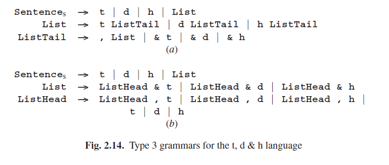
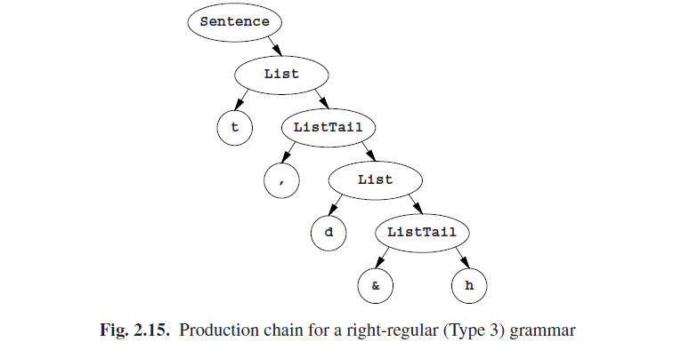

# 2.3.3 3型语法

CF语法的基本属性是它描述的是嵌套：一个对象可能在不同地方包含其他对象，这些对象又可能包含其他对象...等等。在生成过程中我们已经生成了对象中的一个，而右侧依旧“记得”接下来该生成什么：在英语语法中，在升入非终结符**Subject**之后生成类似**wistful cat**的东西，右侧的**Subject Verb Object**依然知道后面必须是一个**Verb**。当我们正在准备**Subject**时，**Verb**和**Object**已经在句子形式的右侧排队等待了，例如：

**the wistful QualifiedNoun Verb Object**

右侧是：

**up ZeroMotion down ZeroMotion**

已经执行了一个**up**和一个任意的复杂的**ZeroMotion**后，右侧依旧知道接下来是一个**down**。

对3型的限制不允许回溯以前的事情：一个右侧可能只包含一个非终结符并且其必须在结尾处。这意味着只有两种规则：[^1]

- 一个非终结符生成零个或多个终结符
- 一个非终结符生成零个或多个其后接着一个非终结符的终结符

3型语法的原始Chomsky定义对规则进行了限制：

- 一个非终结符生成一个终结符。
- 一个非终结符生成一个其后接着一个非终结符的终结符。

我们的定义是等效的并且更加方便，虽然转换为Chomsky3型并不是完全没有意义的。

3型语法也被称为*正则语法*（RE语法）或*有限状态语法*（FS语法）。以上版本的更精确定义称为*右正则*，因为规则中唯一的非终结符出现在右侧的右结尾处。这让其有别于*左正则语法*，其受到以下限制

- 一个非终结符生成零个或多个终结符
- 一个非终结符生成一个其后接着零个或多个终结符的非终结符

其规则中唯一的非终结符出现在右侧的左结尾处。左正则语法相比于右正则语法不那么直观，且不常出现，以及更难处理，但它们确实偶尔会出现（例子见5.1.1节），并且也需要加以考虑。将会在5.6节进行讨论。

由于右正则语法的普遍性高于左正则语法，“正则语法”一词通常是指“右正则语法”，左正则就需要明确指明了。本书中我们也遵照此约定。

比照右正则和右递归的定义是一件有趣的事情。非终结符A是右递归的，如果它能生成一个右侧结尾是A的句子形式；或A是右正则的，如果它能生成一个包含A的句子形式，且A在其右侧结尾处。

在对上下文无关语法的类比中，其被称为在此之后它们不能做到，正则语法应该被称为“非嵌套语法”。

因为正则语法经常被用来描述字符级的文本结构，所以正则语法的终结符号是一个单一字符是很常见的。所以我们应该用**t**代替**Tom**，**d**代替**Dick**，**h**代替**Harry**以及**&**代替**and**。图Fig 2.14（a）以这种形式展示了**t,d&h**语言的右正则语法，Fig 2.14（b）展示的是左正则语法。

3型语法（右正则）的一个句子的生成树退化为非终结符的“生成链”，该链在左侧放置了一列终结符。图Fig 2.15展示了一个例子。相似的生成链由左正则语法形成，其终结符放在左侧。

图Fig 2.14中语法展现出来的致命重复对正则语法来说很正常，然后发明了很多符号处理设备来减弱这个问题。最常用的是使用一组方括号来指出“一组字符集之外的一个”：**[tdh]**是**t|d|h**的缩写：

这个第一次看上去可能很神秘，但实际上却更方便，而且能将语法简化至：

第二种方式是引入宏，语法片段的代名词，其在被使用前被恰当的在语法中进行替代：

正则语法的流行解析生成器*lex*（Lesk and Schmidt [360]）都表现了这些便利性。

如果我们坚持3型的Chomsky定义，那我们的语法将被不会小于：

This form is easier to process but less user-friendly than the lex version. We observe here that while the formal-linguist is interested in and helped by minimally sufficient means, the computer scientist values a form in which the concepts underlying the grammar ($Name, etc.) are easily expressed, at the expense of additional processing.

There are two interesting observations about regular grammars which we want to make here. First, when we use a regular grammar for generating a sentence, the sentential forms will only contain one non-terminal and this will always be at the end; that is where it all happens (using the grammar of Figure 2.14):

The second observation is that all regular grammars can be reduced considerably in size by using the regular expression operators *, + and ? introduced in Section 2.3.2 for “zero or more”, “one or more” and “optionally one”, respectively. Using these operators and ( and ) for grouping, we can simplify our grammar to:

Ss ---> (( [tdh], )* [tdh]& )? [tdh]

Here the parentheses serve to demarcate the operands of the * and ? operators. Regular expressions exist for all Type 3 grammars. Note that the * and the + work on what precedes them. To distinguish them from the normal multiplication and addition operators, they are often printed higher than the level text in print, but in computer input they are in line with the rest, and other means must be used to distinguish them.

[^1]:有一个自然的中间类型，2.5型，其中只允许一个右侧有一个单一的非终结符，不过不需要一定在结尾处。这就给了我们所谓的*线性语法*。