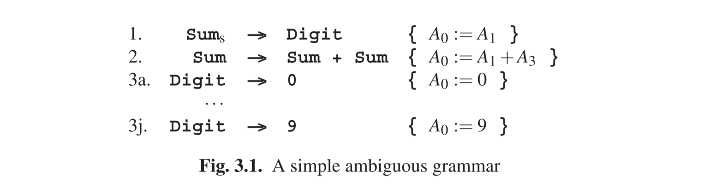

# 3.1.2 各种歧义

A sentence from a grammar can easily have more than one production tree, i.e., there can easily be more than one way to produce the sentence. From a formal point of view this is a non-issue (a set does not count how many times it contains an element), but as soon as we are interested in the semantics, the difference becomes significant. Not surprisingly, a sentence with more than one production tree is called ambiguous, but we must immediately distinguish between essential ambiguity and spurious ambiguity. The difference comes from the fact that we are not interested in the production trees per se, but rather in the semantics they describe. An ambiguous sentence is spuriously ambiguous if all its production trees describe the same semantics; if some of them differ in their semantics, the ambiguity is essential. The notion of “ambiguity” can also be defined for grammars: a grammar is essentially ambiguous if it can produce an essentially ambiguous sentence, spuriously ambiguous if it can produce a spuriously ambiguous sentence (but not an essentially ambiguous one) and unambiguous if it cannot do either. For testing the possible ambiguity of a grammar, see Section 9.14.

A simple ambiguous grammar is given in Figure 3.1. Note that rule 2 differs

from that in Figure 2.30. Now 3+5+1 has two production trees (Figure 3.2) but the semantics is the same in both cases: 9. The ambiguity is spurious. If we change the + into a -, however, the ambiguity becomes essential, as seen in Figure 3.3. The unambiguous grammar in Figure 2.30 remains unambiguous and retains the correct semantics if + is changed into -.

Strangely enough, languages can also be ambiguous: there are (context-free) languages for which there is no unambiguous grammar. Such languages are inherently ambiguous. An example is the language L = ambncn ∪ apbpcq. Sentences in L consist either of a number of as followed by a nested sequence of bsand cs, or of a nested sequence of asand bs followed by a number of cs. Example sentences are: abcc, aabbc,and aabbcc; abbc is an example of a non-sentence. L is produced by the grammar of Figure 3.4.

Intuitively, it is reasonably clear why L is inherently ambiguous: any part of the grammar that produces ambncn cannot avoid producing anbncn, and any part of the grammar that produces apbpcq cannot avoid producing apbpcp. So whatever we do, forms with equal numbers of as, bs, and cs will always be produced twice. Formally proving that there is really no way to get around this is beyond the scope of this book.