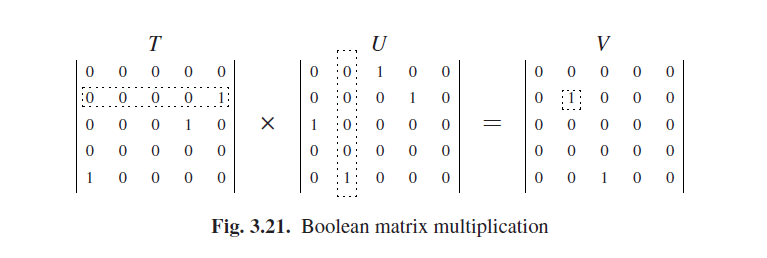

# 3.10 解析与布尔矩阵乘法的关系

在解析和布尔矩阵乘法之间有一个显著但又有点神秘的关系，因为很可能把一个转换为另一个，带有很多可能和但是。这有很有趣的含义。

一个布尔矩阵是一个其中所有元素只能为0或者1的矩阵。比如如果一个矩阵*T*的索引代表镇，那么元素*Ti,j*可能就表示城镇*i*到城镇*j*的直达铁路的距离。这样的矩阵可以和另外一个矩阵*Uj,k*相乘，这可以表示比如，一个城镇j到城镇k的直达巴士的距离。而*Vi,k*（*T*和*U*的乘积）的结果是一个布尔矩阵，这代表从城镇i到城镇k是否能联通，首先考虑火车然后才是巴士。这立刻就可以展示*Vi,k*是怎样计算出来的：必须有一个1，如果存在一个*j*使得*Ti,j*和*Uj,k*都能有保有一个1，否则就必须有一个0。公式如下：

*Vi,k* = (*Ti,1* ∧ *U1,k*)∨(*Ti,2* ∧ *U2,k*)∨· · ·∨(*Ti,n* ∧ *Un,k*)

其中∧是布尔运算的**和**，∨是布尔运算的**或**，n是矩阵的大小。这意味着*O(n)*的行为被*V*的每次输出所要求，其中就有n2；所以这个算法的时间复杂度为O(n3)。

图3.21给了一个示例；矩阵*T2, * *的行和矩阵*U * ,2*的列结合得到了矩阵*V2,2*的输出。布尔矩阵的乘法运算中，是不遵守交换律的：可以大致的理解为从一个镇到另一个镇有一个火车-巴士的路线，但是没有巴士-火车的路线，也就是*T*×*U*不等于*U*×*T*。注意这个跟传递闭包是不同的：在传递闭包中，一个单一关系遵循无限的次数，而在布尔矩阵运算中则是一个关系结果之后才有第二个。

上述是*布尔矩阵乘法（BMM）*的一个小实战，实际上BMM在许多数学和工科分支中是非常重要的，并且关于如何高效的使用它有一个完整的学科[^1]。数十年的集中努力带来了一系列越来越高效和负责的算法。V. Strassen[^2]是第一个打破*O(n3)*阻碍的算法，使用的是*O(n2.81···)*算法，到了现在这个记录是*O(n2.376···)*；时间是1987年。很明显，至少*O(n2)*次运行是必须的，但目前看来这个时间复杂度是达不到的。

对我们的论点来说更重要的是，在1975年Valiant [18]展示了如何将一个CP解析问题转换为一个BMM问题。特别的是，如果可以在O(nk)次操作中将两个*n×n*的布尔矩阵相乘，那就可以在*O(nk)+O(n2)*步中解析一个长度为*n*的字符串，其中*O(n2)*是转换的成本。因此，我们可以在*O(n2.376···)*中进行一般的CF解析，这确实比CYK算法的立方时间依赖性要好。但是Valiant算法和快速BMM算法都太过复杂和耗时，所以这种方法只有当输入字符串以百万计甚至更多的时候才拿来使用比较好。更要命的是，它要求所有的输入都必须存储在内存中，因为它是无方向的算法，因此它使用的数据结构的大小是*O(n2)*，这意味着它只能在内存单位的TB的计算机上运行。简而言之, 它的意义只是理论上的。

在2002年Lee [39]显示了一个BMM问题如何转换为一个CF解析问题。特别的是，如果你可以在*O(n3−δ)*次操作中对一个长度为*n*的字符串进行常规CF解析，那就能在*O(n3−δ/3)*次操作中将两个大小为*n×n*的布尔矩阵相乘。那就再次出现了*O(n2)*的转换成本，但由于δ最多可为2（不太可能在*O(n)*中解析一个实例），*O(n3−δ/3)*的步骤至少是*O(n2 $$\frac{1}{3}$$)*，这决定了*O(n2)*；要注意δ = 0的情况*O(n3)*通常是多个问题的边界。Lee的转换所涉及的计算工作量比那些用Valiant算法的要小的多，所以一个真正快速的通用CF解析算法可能会提供一个快速实用的BMM算法。这样一个快速通用的CF算法必须是非BMM并且比*O(n3)*具有更高的时间复杂性；但不幸的是目前还不知道这样的算法。

一般的CF和布尔矩阵乘法有共同之处，其最佳算法的效率是未知的。图Fig 3.22总结了各种可能性。x轴表示最佳CF算法的效率；y轴表示最佳BMM算法的效率。图中的位置表示了这些值的组合。由于这些值是未知的，我们不知道图中的哪个点对应于实际，但是我们可以排除几个区域。

在现有算法的基础上灰色区域被排除。例如，在*n3*的垂直线的右侧灰色部分由于CYK算法被排除了，它在*O(n3)*中进行一般的CF解析；所以其组合（最好的解析器，最好的BMM）不能有一个大于*O(n3)*的第一组件。同样的，*n1*垂直线的左侧区域代表了小于*O(n)*工作量的算法，而这是不可能的因为解析器必须到达每个令牌。BMM要求至少*O(n2)*次动作，但已经有*O(n2.376···)*这个算法可以用了；这产生了两个水平禁区。

阴影标记部分是被Valiant和Lee转换算法排除的部分。Valiant的结果不包括右侧的水平阴影部分；Lee的结果不包含顶部的垂直阴影部分。真正的最佳解析和BMM算法的组合只能在中间的白色无阴影区域中。

对BMM算法的广泛研究并没有产生一个比*O(n3)*更实用的算法；由于BMM可以被转换为解析，因此可以解释为什么关于CF一般算法的没那么广泛的研究没有产生比*O(n3)*更实用的算法，除了通过BMM。另一方面，图Fig 3.22显示了普通CF解析还是有可能成为线性的（*O(n1)*），以及BMM可能比*O(n2)*更糟糕。

Rytter [34]已经将普通CF解析和一个特定形式在一个格子中用最短路径连接起来，通过某种含义。

Greibach [389]描述了“最难的上下文无关语言”，是一种语言，如果我们能在时间*O(nx)*内解析它，那我们就在*O(nx)*时间内解析任何语言。不用说，肯定很难解析。本文隐式的使用了一种很少被注意到的解析技术；见问题3.7。

[^1]: For a survey see V. Strassen, “Algebraic complexity theory”, in Handbook of Theoretical Computer Science, vol. A, Jan van Leeuwen, Ed. Elsevier Science Publishers, Amsterdam, The Netherlands, pp. 633-672, 1990.

[^2]: V. Strassen, “Gaussian elimination is not optimal”, Numerische Mathematik, 13:354-356, 1969.
