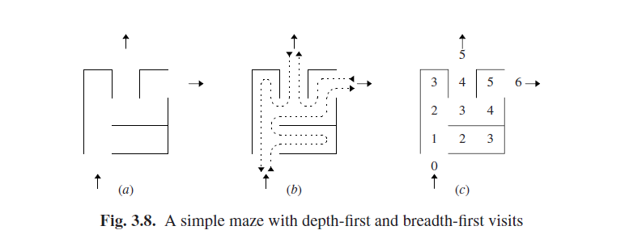

# 3.5.2 Search Techniques

A third way to classify parsing techniques concerns the search technique used to guide the (non-deterministic!) parsing automaton through all its possibilities to find one or all parsings.

There are in general two methods for solving problems in which there are several alternatives in well-determined points: depth-first search, and breadth-first search.

- In depth-first search we concentrate on one half-solved problem. If the problem bifurcates at a given point P, we store one alternative for later processing and keep concentrating on the other alternative. If this alternative turns out to be a failure (or even a success, but we want all solutions), we roll back our actions to point P and continue with the stored alternative. This is called backtracking.

- In breadth-first search we keep a set of half-solved problems. From this set we compute a new set of (better) half-solved problems by examining each old halfsolved problem; for each alternative, we create a copy in the new set. Eventually, the set will come to contain all solutions.

Depth-first search has the advantage that it requires an amount of memory that is proportional to the size of the problem, unlike breadth-first search, which may require exponential memory. Breadth-first search has the advantage that it will find the simplest solution first. Both methods require in principle exponential time. If we want more efficiency (and exponential requirements are virtually unacceptable), we need some means to restrict the search. See any book on algorithms, for example Sedgewick [417] or Goodrich and Tamassia [416], for more information on search techniques.

These search techniques are not at all restricted to parsing and can be used in a wide array of contexts. A traditional one is that of finding an exit from a maze. Figure 3.8(a) shows a simple maze with one entrance and two exits. Figure 3.8(b) depicts the path a depth-first search will take; this is the only option for the human maze-walker: he cannot duplicate himself and the maze. Dead ends make the depthfirst search backtrack to the most recent untried alternative. If the searcher will also backtrack at each exit, he will find all exits. Figure 3.8(c) shows which rooms are examined in each stage of the breadth-first search. Dead ends (in stage 3) cause the search branches in question to be discarded. Breadth-first search will find the shortest way to an exit (the shortest solution) first. If it continues until there are no branches left, it will find all exits (all solutions).

