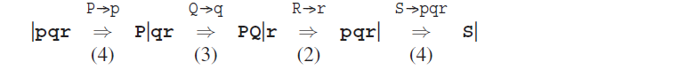
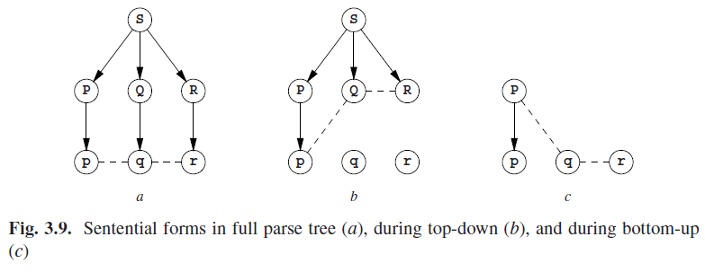

# 3.5.3 一般定向方法

解析就是重建生成过程这个观点，当使用定向方法时就尤为明显。它概述在以下两点中：

- 一个定向的自顶向下（从左到右）的CF解析器，标识生成过程中最左侧的产物。

并且

- 一个定向的自底向上（从左到右）的CF解析器，标识反向生成过程中最右侧的产物。

We will use the very simple grammar

to demonstrate this. The grammar produces only one string, pqr.

The leftmost production process for pqr proceeds as follows:

where the | indicates how far the production process has proceeded. The top-down analysis mimics this process by first identifying the rule that produced the p, P--->p, then the one for q, etc.:

The rightmost production process for pqr proceeds as follows:

where the | again indicates how far the production process has proceeded. The bottom-up analysis rolls back this process. To do this, it must first identify the rule in production step 4, P--->p and use it as a reduction, then step 3, Q--->q, etc. Fortunately the parser can easily do this, because the rightmost production process makes the boundary between the unprocessed and the processed part of the sentential form creep to the left, so the last production brings it to the left end of the result, as we see above. The parsing process can then start picking it up there:

This double reversal is inherent in directional bottom-up parsing.

The connection between parse trees under construction and sentential forms is shown in Figure 3.9, where the dotted lines indicate the sentential forms. On the left we have the complete parse tree; the corresponding sentential form is the string of terminals. The middle diagram shows the partial parse tree in a top-down parser after the p has been processed. The sentential form corresponding to this situation is pQR. It resulted from the two productions S⇒PQR⇒pQR, which gave rise to the partial parse tree. The diagram on the right shows the partial parse tree after the p has been processed in a bottom-up parser. The corresponding sentential form is Pqr, resulting from pqr ⇐ Pqr; the single reduction gave rise to a partial parse tree of only one node.

Combining depth-first or breadth-first with top-down or bottom-up gives four classes of parsing techniques. The top-down techniques are treated in Chapter 6. The depth-first top-down technique allows a very simple implementation called recursive descent; this technique, which is explained in Section 6.6, is very suitable for writing parsers by hand. Since depth-first search is built into the Prolog language, recursive descent parsers for a large number of grammars can be formulated very elegantly in that language, using a formalism called “Definite Clause Grammars” (Section 6.7). The applicability of this technique can be extended to cover all grammars by using a device called “cancellation” (Section 6.8).

The bottom-up techniques are treated in Chapter 7. The combination of breadthfirst and bottom-up leads to the class of Earley parsers, which have among them some very effective and popular parsers for general CF grammars (Section 7.2). A formally similar but implementationwise quite different approach leads to “chart parsing” (Section 7.3).

Sudkamp [397, Chapter 4] gives a full formal explanation of [breadthfirst | depth-first] [top-down | bottom-up] context-free parsing.