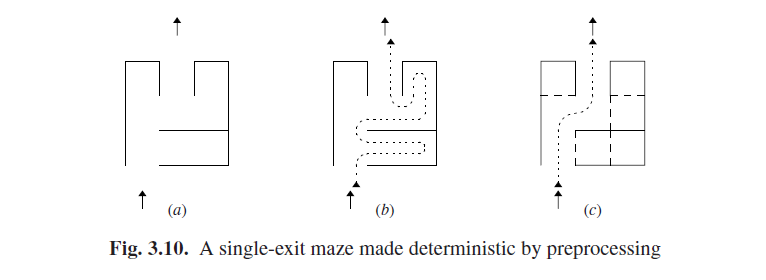

# 3.5.4 线性化方法

上一节所示的大多数一般搜索方法，最坏的情况都依赖于时间指数分布：输入的每个附加符号都将解析时间乘以一个常数因子。这些方法只在输入长度非常小的情况下适用，大约20个字符就是最大值了。即便是上述方法中最优的，在最坏的情况下也要求立方次时间：10个令牌时需要1000次操作，100个令牌时需要1000000次操作，而10000个令牌（一个较大的计算机程序文件）时则需要1012次操作，即便每次操作只需10纳秒也要花费至少3小时的时间。显然在真实的速度下，我们更希望有一个线性时间的计算方法。不幸的是，至今没有找到这样一种方法，尽管没有证据表明这种方法是不存在的，但种种迹象却表明似乎情况就是如此了；详情见3.10节。将此与非严格短语结构解析方法相比，就可以证明没有这种算法存在了（见3.4.2节）。

因此，同时或者永久的，我们将不得不从我们的目标中拿掉一个对象，线性时间通用解析器。我们可以有一个最优也是立方次时间依赖的通用解析器，或者是一个不能适用于所有CF语法的线性解析器，但这两者不能兼有。幸运的是，有延时解析方法（特别是LR解析），可以处理大量语法种类，但依旧如果一个语法只是用最自然的方式来描述一个预期的语言而没有涉及到分析方法，那就只有很小的机会能使用自动线性分析。在实践中，语法通常首先是为了自然而设计，然后通过手动调整来符合现有分析方式的要求。这种调整相对简单，具体取决于所选择的方法。简而言之，对于任意给定语法做一个线性解析器有10%的工作是艰难的，而另外90%可以由计算机来完成。

我们可以通过限制非确定性解析自动机的处理位移数量在每种情况下只有一个来实现线性解析时间。由于这种情况下一个自动机的处理位移没有别的选择，所以被称为“确定性自动机”。

确定性自动机的处理位移是由输入流明确确定的（现在我们可以说是流，因为自动机是从左到右处理的）。这个的序列就是一个自动机能给出的一个句子的唯一一个解析。如果语法是明确的那这就是正确的，单如果语法不明确，那确定性自动机将会把我们定死在一个特定的解析中。我们将在8.2.5.3节和9.9节中细说。

剩下的就是解释如何从语法中推导出解析自动机的确定性控制机制。由于对这个问题没有一个单独的很好的解决办法，那么存在很多的次优的解决方案就不足为奇了。从一个非常广泛的角度来说，它们都使用同样的技术：它们都深入分析语法，以使可用于识别死角的信息被发现。然后就可以避开这些死角。如果应用于该语法的方法，能够避开足够多的死角并使得不在存在死角，那么这个方法对于语法来说就是成功的，并且给我们提供了一个线性时间解析器。或者它失败了，那我们要么换另一个方法要么就改变语法使之能够使用该方法。

与迷宫问题的一个大致的类比可能使让这点更清晰。如果允许我们在迷宫中做预处理（不太可能但有启发性），那下面的方法会使我们的搜索成为确定性的。我们先假定迷宫由正方形房间的网格构成，如果3.10(a)所示。深度优先搜索将在迷宫中找到一个13次移动的路线（图3.10(b)）。现在我们对迷宫预处理如下：如果有一个房间有3面墙，那么给其加上第4面墙，持续进行直到没有拥有3面墙的房间。如果现在所有的房间只有两面或者四面墙壁，并且没有别的选择，那么我们就成功了；见图3.10(c)，现在路径只有5次移动，并且不需要搜索了。通过这个方法我们就看到如何能将死角识别出来了，用以帮助缩小选择范围。

有一点要说明的是，上述的类比是有限的。它只关心迷宫这一个被预处理的对象。在解析中我们要关注两个对象，一个是静态的并且能被预处理的语法，还有一个是变化中的输入。（但请参阅问题3.6 以扩展类推方法。）

回到解析自动机，我们可以说，它的确定性更精确：一个拥有*前瞻符号K*的解析自动机是*确定性*的，如果它的控制机制可以，那么给予内部管理和下一个*符号K*输入信息，以明确决定下一步做什么——要么匹配要么预测以及在自顶向下情况中预测什么，要么转移要么减少以及在自底向上情况中如何减少。

它的原因是确定性自动机创建了一个线性时间解析器，但这并不完全明显。解析器可能在有限的时间内知道下一步该做什么，但对于给定输入令牌可能有很多步要执行。更具体的说，某些确定性技术对于给定位置*k*会需要*k*步，It stands to reason that a deterministic automaton creates a linear-time parser, but this is not completely obvious. The parser may know in finite time what to do in each step, but many steps may have to be executed for a given input token. More specifically, some deterministic techniques can require k steps for a given position k, which suggests that quadratic behavior is possible (see Problem 3.5). But each parsing step either creates a node (predict and reduce) or consumes an input token (match and shift). Both actions can only be performed O(n) times where n is the length of the input: the first because the size of the parse tree is only O(n) and the second because there are only n input tokens. So however the actions of the various tasks are distributed, their total cannot exceed O(n).

Like grammar types, deterministic parsing methods are indicated by initials, like LL, LALR, etc. If a method X uses a look-ahead of k symbols it is called X(k). All deterministic methods require some form of grammar preprocessing to derive the parsing automaton, plus a parsing  lgorithm or driver to process the input using that automaton.