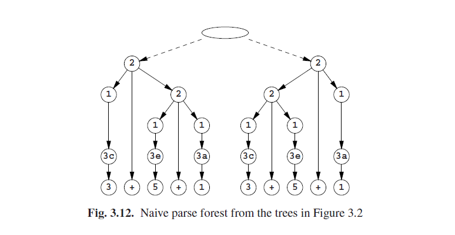
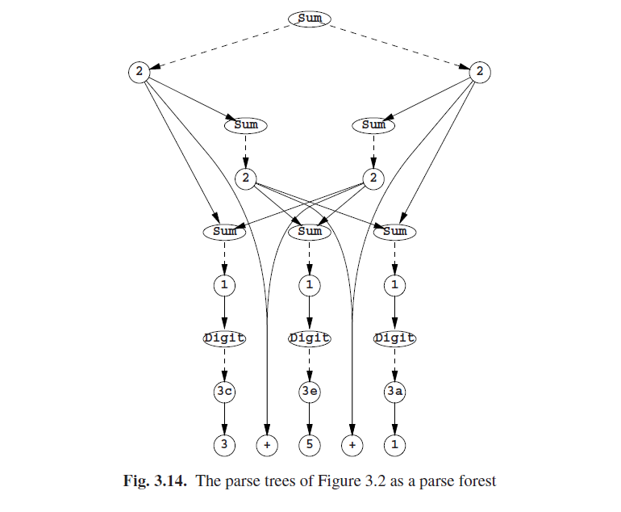

# 3.7.3 解析林

由于森林只是树的集合，所以解析林最天然的形式是由一个单一的节点组成，而解析林中的所有树都可以直接访问。图3.2中的两个解析树合并到图3.12中的解析林中，其中节点中的数字引用了图3.1的语法中的规则号。

当我们看到这幅图时，我们会注意到两件事情：虚线箭头与实线箭头的含义不同；结果树包含大量重复的子树。而且还会好奇顶部的空节点应该是什么。

虚线箭头的含义是“或-或”：顶部的空节点指向左边*或*是右边的标记2的节点，那么实线箭头就是“与-与”：左边标记2的节点由一个标记Sum的节点*与*一个标记+的节点*与*一个标记Sum的节点组成。更特别的是，顶部的空节点，应该被标记为Sum指向规则2的两个应用程序，其中每一个都生成**Sum + Sum**；最左侧的**Sum**指向一个规则1应用程序，第二个**Sum**指向一个规则2应用程序，等等。图3.13展示了完整的*与-或树*，这里我们看到了一个标记非终结符的节点的替换，即*或节点*，以及标记了规则号的节点，即*与节点*。A非终结符的一个或节点对A的终结符的子节点有一个规则号；一个规则号的与节点有右侧规则的子节点的组件。

### 3.7.3.1 合并重复子树

现在我们可以将解析林中的重复子树合并在一起了。我们通过保留标记了非终结符A以及跨越输入的给定子字符串的一个副本来做到。如果*A*以多种方式来生成子字符串，那么多个或箭头将从标记了A的或节点出发，每一个都指向一个标记了规则号的与节点。这样，与-或树就变成了一个有向无环图，一个有向无环图，其实正确的叫法应该是一个*解析有向无环图*，也就是“解析林”变得更加通常了。我们示例的结果如图3.14 所示。

必须注意的是，两个或节点（这代表着规则的右侧）只能在两个节点的其他所有对应节点都相同时才能合并。它不会将图3.14中顶部正下方的两个标记为2两个节点合并；即便它们都是**Sum+Sum**，因为其中**Sum**和**+**都是不一样的。如果将它们合并在一起，那解析林会展示出比对应输入更多的解析树；参见问题3.8.

合并重复子树的过程可以在解析过程中，而不是所有解析树都完成之后。这明显是更高效的，并且有额外的优势，它允许在无限模糊的解析展现在有限的数据结构中。然后解析林就包含循环（环），实际上就是*解析图*。

图3.15总结了各种Chomsky语法类型相对于歧义的情况。请注意，有限状态和上下午相关语法不能无限模糊，因为它们不能包含可以为空（nullable）的规则。有关生产数据结构的类似摘要，请参见图2.16。

### 3.7.3.2 从解析林中检索解析树

解析林的接收器有多个选择。例如，可以从它生成一个解析树序列, 或者更可能的是, 数据结构可以被修改以剔除各种原因产生的解析树。

从解析林中生成解析树基本上很简单：或-或箭头的每一个选择的组合都是一个解析树。实现应该是从上到下的，并且在这里可以简要的勾勒出来。我们对图做深度优先访问，对于每一个或节点，我们将向外指出的虚线箭头转换为实线箭头；我们将这些选择记录在一个回溯链中。当我们完成了深度优先探索后我们就修复了一个解析树。当我们完成后，检查最近的选择节点，由回溯链提供的最后一个元素，然后如果可以的话做一个与之前不一样的选择；如果不可用那么就后退一步，如此。当我们回溯完整个回溯链，我们就找到了所有的解析树。在图3.16中展示了一个解析树的实现过程。

首先挑出解析树是很好的选择。如何完成这取决于挑选标准，但常用的技术如下。在解析林中的每个节点都添加了信息，其方式与属性语法的内容类似（2.11.1节）。无论何时当该节点的信息与该节点的类型相冲突时，都将该节点从解析林中移除。这通常会导致其他一些节点成了从上至下无法到达的情况，这时也可以将它们一起移除。

对图3.14的解析林进行有意义的挑选可以基于以下依据，**+**运算符是左关联的，这意思就是**a+b+c**实际是**（（a+b）+c）**而不是**（a+（b+c））**。然后, 对于每个具有**+**运算符的节点, 其右侧的操作数不能是具有**+**运算符的非终结符。我们看到，图3.14中标记为2的左上节点违反了这个规则：它有一个**+**运算符和一个有一个节点（2）以及一个**+**符号（位置4）的非终结符（Sum）。因此，这个节点可以被移除，以及两个子节点也可以移除。图3.16中的解析书依旧存在。

上面的规则是在算术表达式中关于运算符优先级的一个（非常）特殊的例子；请参阅问题3.10以了解更普遍的情况。