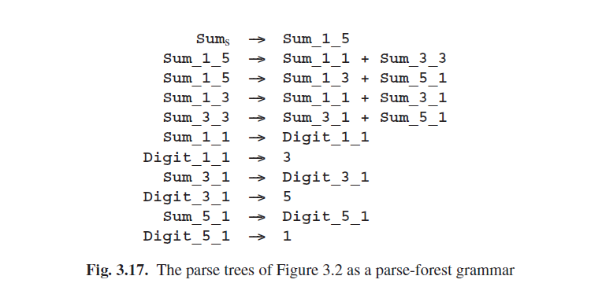

# 3.7.4 解析林语法

Representing the result of parsing as a grammar may seem weird, far-fetched and even somewhat disappointing; after all, should one start with a grammar and a string and do all the work of parsing, just to end up with another grammar? We will, however, see that parse-forest grammars have quite a number of advantages. But none of these advantages is immediately obvious, which is probably why parse-forest grammars were not described in the literature until the late 1980s, when they were introduced by Lang [210, 220, 31], and by Billot and Lang [164]. The term “parse-forest grammar” seems to be used first by van Noord [221].

Figure 3.17 presents the parse trees of Figure 3.2 as a parse-forest grammar, and it is interesting to see how it does that. For every non-terminal A in the original grammar that produces an input segment of length l starting at position i, there is a non-terminal A_i_l in the parse-forest grammar, with rules that show how A_i_l produces that segment. For example, the existence of Sum_1_5 in the parse-tree grammar shows that Sum produces the whole input string (starting at position 1, with length 5); the fact that there is more than one rule for Sum_1_5 shows that the parsing was ambiguous; and the two rules show the two possible ways Sum_1_5 produces the whole input string. When we use this grammar to generate strings, it generates just the input sentence 3+5+1, but is generates it twice, in accordance with the ambiguity.

We write A_i_l rather than Ai,l because A_i_l represents the name of a grammar symbol, not a subscripted element of an entity A: there is no table or matrix A. Nor is there any relationship between A_i_l and say A_i_m: each A_i_l is a separate name of a grammar symbol.

Now for the advantages. First, parse-forest grammars implement in a graphical way the concept, already expressed less directly in the previous section, that there should be exactly one entity that describes how a given non-terminal produces a given substring of the input.

Second, it is mathematically beautiful: parsing a string can now be viewed as a function which maps a grammar onto a more specific grammar or an error value. Rather than three concepts — grammars, input strings, and parse forests — we now need only two: grammars and input strings. More practically, all software used in handling the original grammar is also available for application to the parse-forest grammar.

Third, parse-forest grammars are easy to clean up after pruning, using the algorithms from Section 2.9.5. For example, applying the disambiguation criterion used in the previous section to the rules of the grammar in Figure 3.17 identifies the first rule for Sum_1_5 as being in violation. Removing this rule and applying the grammar clean-up algorithm yields the unambiguous grammar of Figure 3.18, which corresponds to the tree in Figure 3.16.

Fourth, representing infinitely ambiguous parsings is trivial: the parse-forest grammar just produces infinitely many (identical) strings. And producing infinitely many strings is exactly what grammars normally do.

And last but probably not least, it fits in very well with the interpretation of parsing as intersection, an emerging and promising approach, further discussed in Chapter 13.

Now it could be argued that parse forests and parse-forest grammars are actually the same and that the pointers in the first have just been replaced by names in the second, but that would not be fair. Names are more powerful than pointers, since a pointer can point only to one object, whereas a name can identify several objects, through overloading or non-determinism: names are multi-way pointers. More in particular, the name Sum_1_5 in Figure 3.17 identifies two rules, thus playing the role of the top OR-node in Figure 3.14. We see that in parse-forest grammars we get the AND-OR tree mechanism free of charge, since it is built into the production mechanism of grammars.