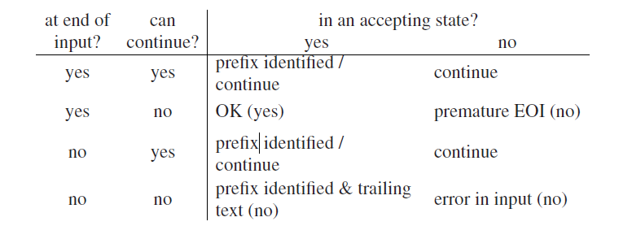

# 3.8 什么时候才是完成了解析呢？

由于非决定性解析器是一次性处理整个输入字符串，并将其汇总到一个单一的数据结构中，然后可以从中提取出解析树，那么何时能完成解析的问题就不大会出现了。当数据结构完成后，第一阶段就完成了；而提取解析树是在数据结构用完之后或者用户满意就完成了。

原则上，一个定向解析器处于接受状态而所有的输入都已经结束，就是完成了。但这本来是重复要求的，有时其中一个条件就蕴含了另外一个；并且通常其他条件会起同样的作用。因此，对定向解析器来说，这个答案很复杂，取决于很多因素:

- 解析器是否在输入的末尾？就是说，它是不是处理完了输入的最后一个符号？

- 解析器是否处于可接受状态？

- 解析器是否可以继续，例如，如果有下一个字符，解析器是不是能继续处理它？

- 解析器是用来生成解析树的还是只是作为一个识别？第一种可能出现几种不同情况；第二种的话我们的答案只会是是/否。

- 如果我们想要解析数，那是想要全部的解析树还是一个就够了呢？

- 解析器必须要接受整个输入，还是用符合语法的合适的隔离符来进行分割？（如果有一个字符串x，是另一个字符串y的开头部分，那x就是一次分割。）

关于我们是否完成了解析的问题的答案，在下表有了对照，其实EOI代表“输入结束”，yes/no代表对选项的回答。

有些答案在直觉上是合理的：如果解析器持续保持在不接受输入的状态下，它应该这样做；如果解析器不能保持在不接受输入的状态，那么输入中存在错误；并且如果解析器在输入结束时仍旧保持可接受状态，那么解析就成功了。但另一些情况要更复杂：如果解析器是在处于可接受状态，我们就会隔离一个前缀，即使解析器在结尾处可以继续“与/或”处理。如果这是我们想要的，那我们可以停止了，但通常情况下，只要可以继续我们就会想要继续：语法**S--->a|ab**以及输入**ab**，我们可以在**a**和声明**a**的一个前缀后结束，但很可能的是我们会想要继续下去，直到**ab**整个被解析结束。这可能是事实，即便我们已经处于结尾处：语法**S--->a|aB**，其中**B**生成**ε**，我们要继续输入**a**以及解析**B**，如果我们想要获取所有的解析。如果解析器做不到，我们在语言中识别了一个字符串，错误信息通常被称为“尾随垃圾”（trailing garbage）。

请注意，“过早处于结尾（premature EOI）”（在语言中一个字符串的输入是一个前缀），是“前缀隔离（prefix isolated）”（输入的前缀是语言中的一个字符串）的对偶。如果我们正在找一个前缀，那我们一般会想找到最长的可能的前缀。这可以通过标记最近的被识别为前缀的位置*P*，然后继续解析直到我们到达结尾或者出现错误被卡住。那么*P*就是最长前缀的末尾。

许多定向解析器使用前瞻方式，这意味着即便在输入的末尾，也必须有足够的标记用于前瞻。这可以通过引入一个*输入结尾*标记来实现，例如**#**或其他任何语法中没有的标记。对于一个使用*k*个标记做前瞻的解析器，*k*个**#**的副本将会被追加到输入字符串中；解析器的前瞻机制将会也会进行相应修改；例子参见9.6节。唯一的接受状态就是第一个**#**即将被接受的状态，而这通常也表示解析完成了。

这大大简化了目前的情形和上面的表格，因为现在解析器在输入没有结束时不能处于可接受状态。这去掉了上表中前缀的两个答案。然后我们将上表的上下部分进行叠加，然后最左边的列就变得多余了。就变成了下面这张表：

然后我们将区分“错误输入”和“过早结束”的工作交给错误报告机制来完成。

由于在定向解析器中没有明确的终止标准，所以每个解析器都有自己的停止标准，这是一个有点不理想的状态。这本书中，我们将使用最终输入标记，只要它有助于终止，并且当然，对于解析器使用前瞻机制。
