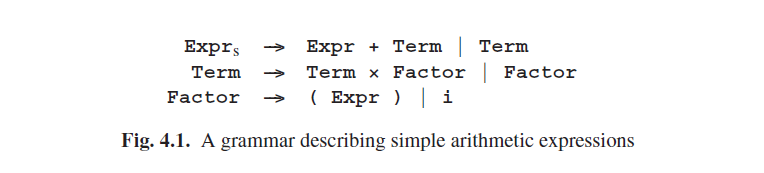

# 4.1.1 不含ε规则和循环的Unger解析方法

为了了解Unger方法如何解决解析问题，让我们举一个小例子。假设我们有一个语法规则：

*S → ABC | DE | F*

并且我们想知道*S*是否推导出输入句子*pqrs*。然后初始解析问题可以用如下示意图来表现：

对于每个手册，我们必须首先生成输入的所有可能的分区。生成分区并不难：如果我们有*m*个杯子，编号从1到*m*，有*n*个大理石，编号从1到*n*，我们必须找到所有的分区，使得一个杯子至少装有一个大理石，每个杯子中大理石的编号都是连续的，并且小编号杯子所含大理石编号比大编号杯子所含大理石编号要小。我们这样来做：首先我们将1号大理石放在1号杯子里，然后将其余的*n*-1个大理石和*m*-1个杯子全部分区。这就让我们有了全部的分区，在第一个杯子中有且只有大理石1的情况。接下来，我们把大理石1、2放在第一个杯子中，然后在对剩下的*n*-2个大理石和*m*-1个杯子进行分区，如此继续下去。如果*n*小于*m*，则不存在分区。

划分输入相当于用杯子（右侧的标志）来划分大理石（输入符号）。如果一个右侧有比句子更多的符号，那就找不到任何分区（没有ε规则）。对于右侧的第一个标志，那分区则必须像以下这样：

第一个子分区产生了以下子问题：*A*是否派生出*p*，*B*是否派生出*q*，*C*是否派生出*rs*？这些问题的答案都必须是肯定的，否则分区就是错误的了。

对于第二个右侧，我们得到以下分区：

对于最后一个右侧，可以得到以下分区：

所有这些子问题都涉及到较短的句子，除了最后一个。它们都将导致类似的拆分，到最后许多都会失败因为右侧的终结符无法与对应部分的分区相匹配。唯一会引起关注的分区是最后一个。它和我们开始的那个一样复杂。这就是我们不允许语法中存在循环的原因。如果语法中存在循环，我们可能就得一次又一次的重复原来的问题。例如，如果上面的示例中存在一个*F→S*的规则，那一定会出现这种情况。

以上说明我们这里有一个搜索的问题，我们可以用深度优先搜索或者广度优先搜索技术（见3.5.2节）来解决它。Unger方法使用深度优先搜索来解决。

In the following discussion, the grammar of Figure 4.1 will serve as an example. This grammar represents the language of simple arithmetic expressions, with operators + and ×, and operand i.

We will use the sentence (i+i)×i as input example. So the initial problem can be represented as:

Fitting the first alternative of Expr with the input (i+i)×i results in a list of 15 partitions, shown in Figure 4.2. We will not examine them all here, although the unoptimized version of the algorithm requires this.We will only examine the partitions that have at least some chance of succeeding: we can eliminate all partitions that do not match the terminal symbol of the right-hand side. So the only partition worth investigating further is:

The first sub-problem here is to find out whether and, if so, how Expr derives (i. We cannot partition (i into three non-empty parts because it only consists of 2 symbols. Therefore, the only rule that we can apply is the rule Expr--->Term. Similarly, the only rule that we can apply next is the rule Term--->Factor. So we now have

However, this is impossible, because the first right-hand side of Factor has too many symbols, and the second one consists of one terminal symbol only. Therefore, the partition we started with does not fit, and it must be rejected. The other partitions were already rejected, so we can conclude that the rule Expr--->Expr+Term does not derive the input.

The second right-hand side of Expr consists of only one symbol, so we only have one partition here, consisting of one part. Partitioning this part for the first right-hand side of Term again results in 15 possibilities, of which again only one has a chance of succeeding:

Continuing our search, we will find the following derivation (the only one to be found):

This example demonstrates several aspects of the method: even small examples require a considerable amount of work, but even some simple checks can result in huge savings. For example, matching the terminal symbols in a right-hand side with the partition at hand often leads to the rejection of the partition without investigating it any further. Unger [12] presents several more of these checks. For example, one can compute the minimum length of strings of terminal symbols derivable from each non-terminal. Once it is known that a certain non-terminal only derives terminal strings of length at least n, all partitions that fit this non-terminal with a substring of length less than n can be immediately rejected.