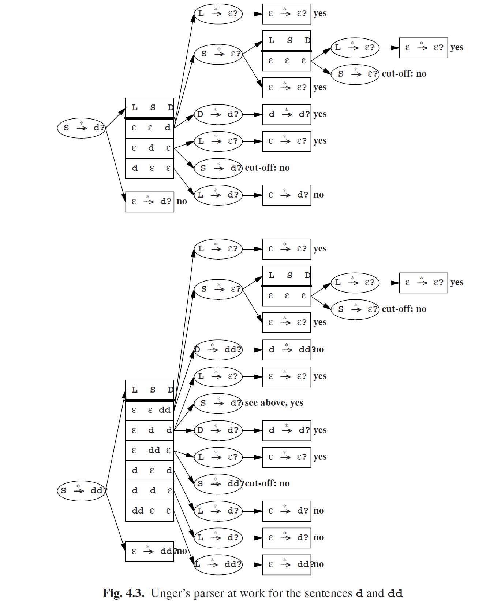

# 4.1.2 Unger’s Method with ε-Rules

So far, we only have dealt with grammars without ε-rules, and not without reason.Complications arise when the grammar contains ε-rules, as is demonstrated by the following example: consider the grammar rule S → ABC and input sentence pqr. If we want to examine whether this rule derives the input sentence, and we allow for ε-rules, many more partitions will have to be investigated, because each of the non-terminals A, B, and C may derive the empty string. In this case, generating all partitions proceeds just as above, except that we first generate the partitions that have no marble at all in the first cup, then the partitions that have marble 1 in the first cup, etc.:

Now suppose that we are investigating whether B derives pqr, and suppose there is a rule B→SD. Then, we will have to investigate the following partitions:

It is the last of these partitions that will cause trouble: in the process of finding out whether S derives pqr, we end up asking the same question again, in a different context. If we are not careful and do not detect this, our parser will loop forever, or run out of memory.

When searching along this path, we are looking for a derivation that is using a recursive loop in the grammar of the form S→· · ·→αSβ. If the grammar contains ε-rules and the parser must assume that α and β can produce ε, this loop will cause the parser to ask the question “does S derive pqr?” over and over again.

If α and β can indeed produce ε, there are infinitely many derivations to be found along this path, provided that there is at least one, so we will never be able to present them all. The only interesting derivations are the ones without the loop. Therefore, we will cut off the search process in these cases. On the other hand, if α and β cannot both produce ε, a cut-off will not do any harm either, because a second search along this path is doomed to fail anyway, if the initial search did not succeed.

So we can avoid the problem altogether by cutting off the search process in these cases. Fortunately, this is not a difficult task. All we have to do is to maintain a list of questions that we are currently investigating. Before starting to investigate a new question (for example “does S derive pqr?”) we first check that the question does not already appear in the list. If it does, we do not investigate this question. Instead, we proceed as if the question were answered negatively.

Consider for example the following grammar:

This grammar generates sequences of ds in an awkward way. The complete search for the questions S --*-> d? and S --*-> dd? is depicted in Figure 4.3. Figure 4.3 must be read from left to right, and from top to bottom. The questions are drawn in an ellipse, with the split-ups over the right-hand sides in boxes. A question is answered affirmatively if at least one of the boxes results in a “yes”. In contrast, a partition only results in an  ffirmative answer if all questions arising from it result in a “yes”.

Checking for cut-offs is easy: if a new question is asked, we follow the arrows in the reversed direction (to the left). This way, we traverse the list of currently investigated questions. If we meet the question again, we have to cut off the search.

To find the parsings, every question that is answered affirmatively has to pass back a list of rules that start the derivation asked for in the question. This list can be placed into the ellipse, together with the question.We have not done so in Figure 4.3, because it is complicated enough as it is. However, if we strip Figure 4.3 of its dead ends, and leave out the boxes, we get Figure 4.4. In this case, every ellipse only has

one possible grammar rule. Therefore, there is only one parsing, and we obtain it by reading Figure 4.4 from left to right, top to bottom:

In general, the total number of parsings is equal to the product of the number of grammar rules in each ellipse.

This example shows that we can save much time by remembering answers to questions. For example, the question whether L derives ε is asked many times. Sheil [20] has shown that the efficiency improves dramatically when this is done: it goes from exponential to polynomial. Another possible optimization is achieved by computing in advance which non-terminals can derive ε. In fact, this is a special case of computing the minimum length of a terminal string that each non-terminal derives. If a non-terminal derives ε, this minimum length is 0.