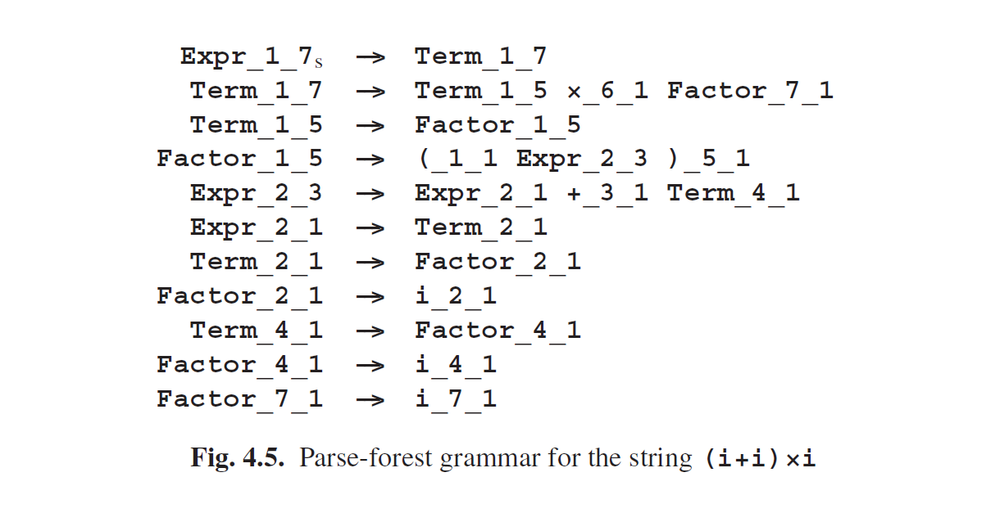

# 4.1.3 Getting Parse-Forest Grammars from Unger Parsing

It is surprisingly easy to construct a parse-forest grammar while doing Unger parsing: all that is needed is to add one rule to the parse-forest grammar for each attempted partition. For example, the first partition investigated in Section 4.1.1 (line 6 in Figure 4.2) adds the rule

to the parse-forest grammar. Each segment of the partition and the partition itself is designated by a specific non-terminal, the name of which is composed of the original name and the starting point and length of the segment is should produce. This even applies to the original terminals, since the above partition claims that the + is specifically the + in position 3 (when counting the input tokens starting from 1).

The first partition in Figure 4.2 adds the rule

but since the input does not contain a +_ 2 _ 1, a + in position 2, the rule can be rejected immediately. Alternatively, one can say that it contains an undefined terminal, and then the grammar clean-up algorithm from Section 2.9.5 will remove it for us. Likewise, the further attempts described in Section 4.1.1 add the rules

which again contains an undefined terminal, i_1_2. (The first alternative of Factor, Factor--->(Expr), is not applicable because it requires breaking Factor_1_2 into three pieces, and we were not yet allowing ε-rules in Section 4.1.1.)

We see that Unger parsing, being a top-down parsing method, creates a lot of undefined non-terminals (and ditto terminals); these represent hypotheses of the topdown process that did not materialize.

The parsing process generates a parse-forest grammar of 294 rules, which we do not show here. After clean-up the parse-forest grammar of Figure 4.5 remains, with 11 rules. One sees easily that it is equivalent to the one parsing found for the string (i+i)×i at the end of Section 4.1.1.