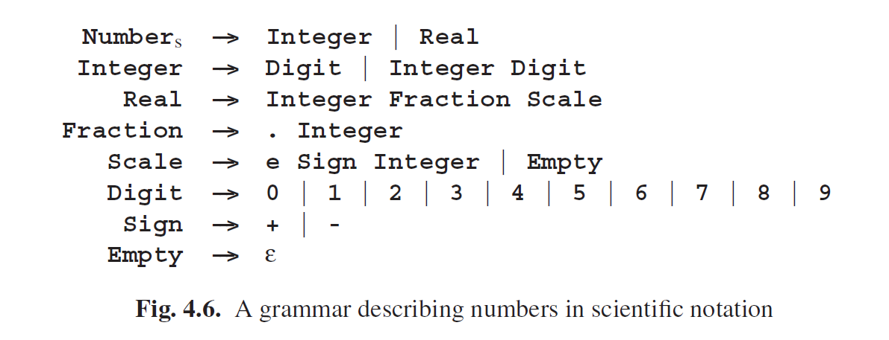
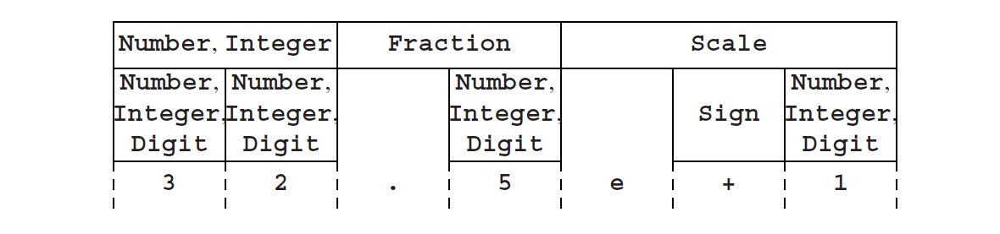
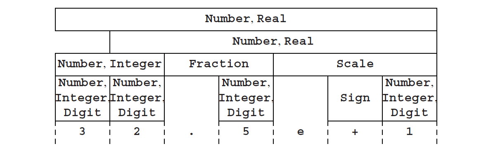
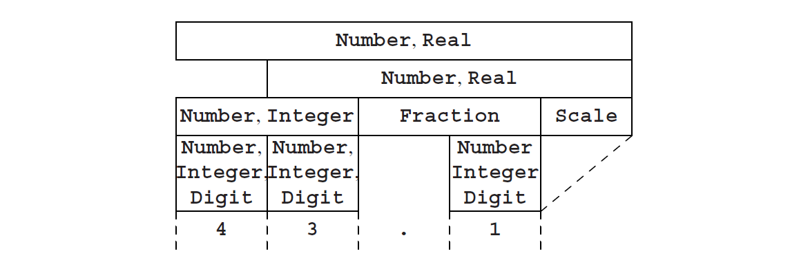
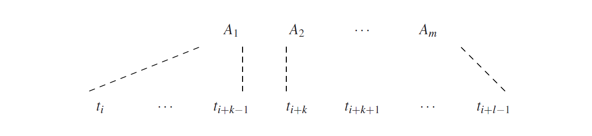

### 4.2.1 CYK Recognition with General CF Grammars

To see how the CYK algorithm solves the recognition and parsing problem, let us consider the grammar of Figure 4.6. This grammar describes the syntax of numbers

in scientific notation. An example sentence produced by this grammar is 32.5e+1. We will use this grammar and sentence as an example.

The CYK algorithm first concentrates on substrings of the input sentence, shortest substrings first, and then works its way up. The following derivations of substrings of length 1 can be read directly from the grammar:

This means that Digit derives 3, Digit derives 2, etc. Note, however, that this picture is not yet complete. For one thing, there are several other non-terminals deriving 3. This complication arises because the grammar contains so-called unit rules, rules of the form A→B, where A and B are non-terminals. Such rules are also called single rules or chain rules. We can have chains of them in a derivation. So the next step consists of applying the unit rules, repetitively, for example to find out which other non-terminals derive 3. This gives us the following result:

Now we already see some combinations that we recognize from the grammar: For example, an Integer followed by a Digit is again an Integer, and a . (dot) followed by an Integer is a Fraction. We get (again also using unit rules):

At this point, we see that the rule for Real is applicable in several ways, and then the rule for Number, so we get:

So we find that Number does indeed derive 32.5e+1.

In the example above, we have seen that unit rules complicate things a bit. Another complication, one that we have avoided until now, is formed by ε-rules. For example, if we want to recognize the input 43.1 according to the example grammar, we have to realize that Scale derives ε here, so we get the following picture:

In general this is even more complicated. We must take into account the fact that several non-terminals can derive ε between any two adjacent terminal symbols in the input sentence, and also in front of the input sentence or at the back. However, as we shall see, the problems caused by these kinds of rules can be solved, albeit at a certain cost.

In the meantime, we will not let these problems discourage us. In the example, we have seen that the CYK algorithm works by determining which non-terminals derive which substrings, shortest substrings first. Although we skipped them in the example, the shortest substrings of any input sentence are, of course, the ε-substrings. We shall have to recognize them in arbitrary position, so we first compute Rε, the set of non-terminals that derive ε, using the following closure algorithm.

The set Rε is initialized to the set of non-terminals A for which A→ε is a grammar rule. For the example grammar, Rε is initially the set {Empty}. Next, we check each grammar rule: If a right-hand side consists only of symbols that are a member of Rε, we add the left-hand side to Rε (it derives ε, because all symbols in the righthand side do). In the example, Scale would be added. This process is repeated until no new non-terminals can be added to the set. For the example, this results in

Rε = {Empty, Scale}.

Now we direct our attention to the non-empty substrings of the input sentence. Suppose we have an input sentence t = t1t2 · · ·tn and we want to compute the set of non-terminals that derive the substring of t starting at position i, of length l. We will use the notation si,l for this substring, so,

si,l = titi+1 · · ·ti+l−1.

or in a different notation: si,l = ti...i+l−1. Figure 4.7 presents this notation graphically, using a sentence of 4 symbols. We will use the notation Ri,l for the set of

non-terminals deriving the substring si,l . This notation can be extended to deal with substrings of length 0: si,0 = ε, and Ri,0 = Rε, for all i.

Because shorter substrings are dealt with first, we can assume that we are at a stage in the algorithm where all information on substrings with length smaller than a certain l is available. Using this information, we check each right-hand side in the grammar, to see if it derives si,l , as follows: suppose we have a right-hand side A1 · · ·Am. Then we divide si,l into m (possibly empty) segments, such that A1 derives the first segment, A2 the second, etc. We start with A1. If A1 · · ·Am is to derive si,l , A1 has to derive a first part of it, say of length k. That is, A1 must derive si,k (be a member of Ri,k), and A2 · · ·Am must derive the rest:

This is attempted for every k for which A1 is a member of Ri,k, including k = 0. Naturally, if A1 is a terminal, then A1 must be equal to ti, and k is 1. Checking if A2 · · ·Am derives ti+k · · ·ti+l−1 is done in the same way. Unlike Unger’s method, we do not have to try all partitions, because we already know which non-terminals derive which substrings.

Nevertheless, there are two problems with this. In the first place, m could be 1 and A1 a non-terminal, so we are dealing with a unit rule. In this case, A1 must derive the whole substring si,l , and thus be a member of Ri,l , which is the set that we are computing now, so we do not know yet if this is the case. This problem can be solved by observing that if A1 is to derive si,l , somewhere along the derivation there must be a first step not using a unit rule. So we have:

A1 →B→· · ·→C→* si,l

where C is the first non-terminal using a non-unit rule in the derivation. Disregarding ε-rules (the second problem) for a moment, this means that at a certain moment in the process of computing the set Ri,l , C will be added to Ri,l . Now, if we repeat the computation of Ri,l again and again, at some moment B will be added, and during the next repetition, A1 will be added. So we have to repeat the process until no new non-terminals are added to Ri,l . This, like the computation of Rε, is an example of a closure algorithm.

The second problem is caused by the ε-rules. If all but one of the At derive ε, we have a problem that is basically equivalent to the problem of unit rules. It too requires recomputation of the entries of R until nothing changes any more, again using a closure algorithm.

In the end, when we have computed all the Ri,l , the recognition problem is solved: the start symbol S derives t(= s1,n) if and only if S is a member of R1,n.

This is a complicated process, where part of this complexity stems from the ε-rules and the unit rules. Their presence forces us to do the Ri,l computation repeatedly; this is inefficient, because after the first computation of Ri,l recomputations yield little new information.

Another less obvious but equally serious problem is that a right-hand side may consist of arbitrarily many non-terminals, and trying all possibilities can be a lot of work. We can see that as follows. For a rule whose right-hand side consists of m members, m−1 segment ends have to be found, each of them combining with all the previous ones. Finding a segment end costs O(n) actions, since a list proportional to the length of the input has to be scanned; so finding the required m−1 segment ends costs O(nm−1). And since there are O(n2) elements in R, filling it completely costs O(nm+1), so the time requirement is exponential in the maximum length of the right-hand sides in the grammar. The longest right-hand side in Figure 4.6 is 3, so the time requirement is O(n4). This is far more efficient than exhaustive search, which needs a time that is exponential in the length of the input sentence, but still heavy enough to worry about.

Imposing certain restrictions on the rules may solve these problems to a large extent. However, these restrictions should not limit the generative power of the grammar significantly.