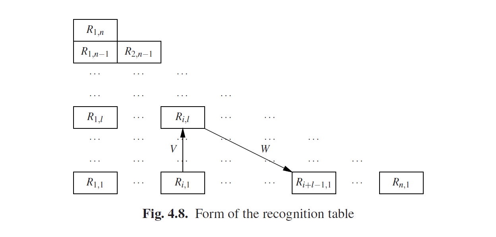
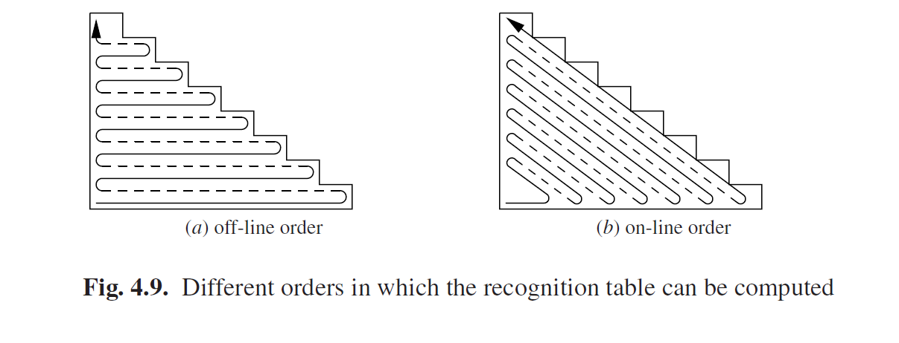

### 4.2.2 Chomsky基本形式语法的CYK识别

我们想对语法施加的两个限制现在已经很明显了：不要单元规则，也不要ε规则。我们还希望将右侧的最大长度限制为2；这将降低时间复杂度到*O(n3)*。这样又回到了有一个完全适合这两个限制的CF语法：Chomsky基本形式。就好像这种基本形式就是为这种算法设计的。*Chomsky基本形式（CNF）*的语法，当所有规则都是形式*A → a*或*A → BC*，其中*a*是终结符而*A，B，C*是非终结符。幸运的是我们稍后将看到，任何CF语法都将可以机械性的转换为CNF语法。

我们将首先讨论CYK算法如何在CNF中处理语法。在CNF语法中是没有ε规则的，因此*Rε*为空。集合R*i*,1可以直接从规则中读取：它们由形式为*A→a*的规则所决定。规则*A→BC*永远不能推导出一个单独的终结符，因为没有ε规则。

接下来，我们像以前一样进行迭代，首先处理长度为2的子字符串，然后是长度为3的，等等。当一个右侧*BC*要推导出一个长度为*l*的子字符串是，*B*必须推导出第一部分（非空），而*C*负责后面的部分（也非空）。

因此*B*必须推导出*si,k*，也就是说，*B*必须是属于*Ri,k*的，同样的*C*必须推导出*si+k,l−k*；也就是说，*C*必须是属于*Ri+k,l−k*。要确定这样的k是否存着很容易：只要试一下所有的可能性；它们的范围从1到l-1。所有集合*Ri,k*和*Ri+k,l−k*这时候已经计算出来了。

这个过程比我们之前看到的复杂度要低的多，它适用于一般的CF语法，原因有二。最重要的一点是，我们不需要一遍又一遍的重复直到没有新的非终结符被添加到*Ri,l*中。在这里我们处理的子字符串是真正的子字符串：它不能与我们开始的字符串相等。第二个原因是，我们只需要找到一个将字符串分为两部分的位置，因为右侧仅包含两个非终结符。在模糊语法中，可能会有几种不同的拆分方法，不过我们并不需要去担心这个。模糊是一个解析问题，而不是识别问题。

该算法生成了一个完整的集合*Ri,l*。句子*t*由*n*个符号组成，因此从位置*i*开始的子字符串绝不可能有超过*n+1-i*个符号。这意味着不存在这样的子字符串*si,l*，其中*i+l > n+1*。因此集合*Ri,l*可以放在一个三角形形式的表中，如图Fig4.8所示。这个表称为识别表(*recognition table*)，或者是正确格式的子字符串表(*well-formed substring table*)。

The entry Ri,l is computed from entries along the arrows V and W simultaneously, as follows. The first entry we consider is Ri,1, at the start of arrow V. All non-terminals B in Ri,1 produce substrings which start at position i and have a length 1. Since we are trying to obtain parsings for the substring starting at position i with length l, we are now interested in substrings starting at i+1 and having length l−1. These should be looked for in Ri+1,l−1, at the start of arrow W. Now we combine each of the Bs found in Ri,1 with each of the Cs found in Ri+1,l−1, and for each pair B and C for which there is a rule A→BC in the grammar, we insert A in Ri,l . Likewise a B in Ri,2 can be combined into an A with a C from Ri+2,l−2, etc., and we continue in this way until we reach Ri,l−1 at the end point of V and Ri+l−1,1 at the end of W.

The entry Ri,l cannot be computed until all entries below it are known in the triangle of which it is the top. This restricts the order in which the entries can be computed but still leaves some freedom. One way to compute the recognition table is depicted in Figure 4.9(a); it follows our earlier description in which no substring of length l is recognized until all string of length l−1 have been recognized. We could also compute the recognition table in the order depicted in Figure 4.9(b). In this order, Ri,l is computed as soon as all sets and input symbols needed for its computation are available. This order is particularly suitable for on-line parsing, where the number of symbols in the input is not known in advance, and additional information is computed each time a new symbol is read.

Now let us examine the cost of this algorithm. Figure 4.8 shows that there are n(n+1)/2 entries to be filled. Filling in an entry requires examining all entries on the arrow V, of which there are at most n; usually there are fewer, and in practical situations many of the entries are empty and need not be examined at all. We will call the number of entries that really have to be considered nocc for “number of occurrences”; it is usually much smaller than n and for many grammars it is even a constant, but for worst-case estimates it should be replaced by n. Once the entry on the arrow v has been chosen, the corresponding entry on the arrowW is fixed, so the cost of finding it does not depend on n. As a result the algorithm has a time requirement of O(n2nocc) and operates in a time proportional to the cube of the length of the input sentence in the worst case, as already announced at the beginning of this section.

The cost of the algorithm also depends on the properties of the grammar. The entries along the V andW arrows can each contain at most |VN| non-terminals, where |VN| is the number of non-terminals in the grammar, the size of the set VN from the formal definition of a grammar in Section 2.2. But again the actual number is usually much lower, since usually only a very limited subset of the non-terminals can produce a segment of the input of a given length in a given position; we will indicate the number by |VN|occ. So the cost of one combination step is O(|VN|2 occ). Finding the rule in the grammar that combines B and C into an A can be done in constant time, by hashing or precomputation, and does not add to the cost of one combination step. This gives an overall time requirement of O(|VN|2 occn2nocc).

There is some disagreement in the literature over whether the second index of the recognition table should represent the length or the end position of the recognized segment. It is obvious that both carry the same information, but sometimes one is more convenient and at other times the other. There is some evidence, from Earley parsing (Section 7.2) and parsing as intersection (Chapter 13), that using the end point is more fundamental, but for CYK parsing the length is more convenient, both conceptually and for drawing pictures.