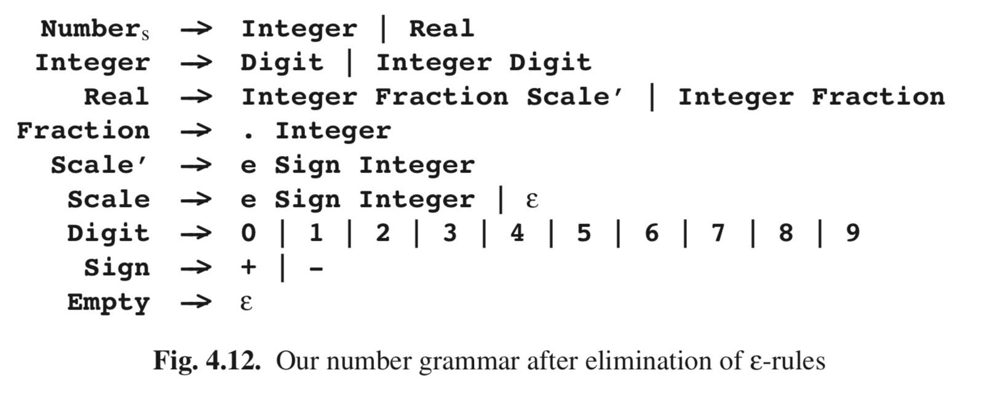
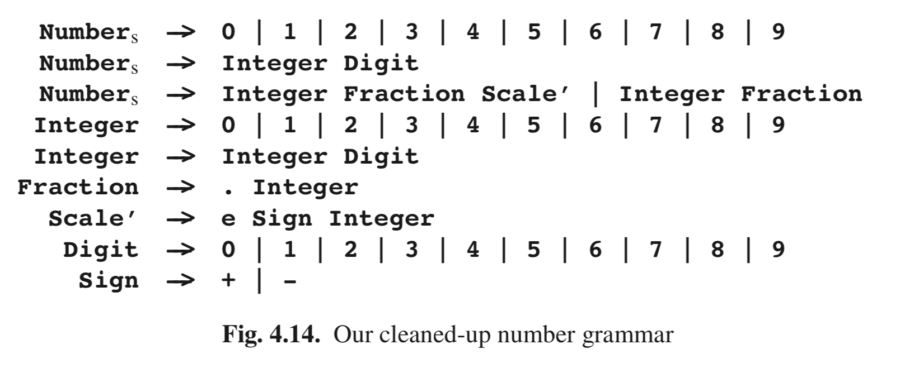

# 4.2.3 Transforming a CF Grammar into Chomsky Normal Form

The previous section has demonstrated that it is certainly worthwhile to try to trans- form a general CF grammar into CNF. In this section, we will discuss this transfor- mation, using our number grammar as an example. The transformation is split up into several stages:

• first, ε-rules are eliminated;
• then, unit rules are eliminated;
• then, the grammar is cleaned as described in Section 2.9.5 (optional);
• then, finally, the remaining grammar rules are modified, and rules are added, until they all have the desired form, that is, either A → a or A → BC.

All these transformations will not change the language defined by the grammar. This is not proven here. Most books on formal language theory discuss these transfor- mations more formally and provide proofs; see for example Hopcroft and Ullman [391].

### 4.2.3.1 Eliminating ε-Rules

Suppose we have a grammar G, with an ε-rule A → ε, and we want to eliminate this rule. We cannot just remove the rule, as this would change the language defined by the non-terminal A, and also probably the language defined by the grammar G. So something has to be done about the occurrences of A in the right-hand sides of the grammar rules. Whenever A occurs in a grammar rule B → αAβ, we replace this rule with two others: B → αAβ, where A is a new non-terminal, for which we shall add rules later (these rules will be the non-empty grammar rules of A), and B → αβ, which handles the case where A derives ε in a derivation using the B → αAβ rule. Notice that the α and β in the rules above could also contain A; in this case, each of the new rules must be replaced in the same way, and this process must be repeated until all occurrences of A are removed. When we are through, there will be no occurrence of A left in the grammar.

Every ε-rule must be handled in this way. Of course, during this process new ε- rules may originate. This is only to be expected: the process makes all ε-derivations explicit. The newly created ε-rules must be dealt with in exactly the same way. Ul- timately this process will stop, because the number of non-terminals that derive ε is finite and in the end none of these non-terminals occur in any right-hand side any more.

The next step in eliminating the ε-rules is the addition of grammar rules for the new non-terminals. If A is a non-terminal for which an A was introduced, we add a rule A → α for all non-ε-rules A → α. Since all ε-rules have been made explicit, we can be sure that if a rule does not derive ε directly, it cannot do so indirectly. A problem that may arise here is that there may not be a non-ε-rule for A. In this case, A only derives ε, so we remove all rules using A.

All this leaves us with a grammar that still contains ε-rules. However, none of the non-terminals having an ε-rule is reachable from the start symbol, with one important exception: the start symbol itself. In particular, we now have a rule S → ε if and only if ε is a member of the language defined by the grammar G. All other non-terminals with ε-rules can be removed safely, but the actual cleaning up of the grammar is left for later.

The grammar of Figure 4.10 is a nasty grammar to test your ε-rule elimination scheme on. Our scheme transforms this grammar into the grammar of Figure 4.11.

This grammar still has ε-rules, but these can be eliminated by the removal of non-productive and/or unreachable non-terminals. Cleaning up this grammar leaves only one rule: S → a. Removing the ε-rules in our number grammar results in the grammar of Figure 4.12. Note that the two rules to produce ε, Empty and Scale, are still present but are not used any more.

### 4.2.3.2 Eliminating Unit Rules

The next trouble-makers to be eliminated are the unit rules, that is, rules of the form A → B. It is important to realize that, if such a rule A → B is used in a derivation, it must be followed at some point by the use of a rule B → α. Therefore, if we have a rule A → B, and the rules for B are

B → α1 | α2 | ··· | αn,

we can replace the rule A → B with

A → α1 | α2 | ··· | αn.

In doing this, we can of course introduce new unit rules. In particular, when repeating this process, we could at some point again get the rule A → B. In this case, we have an infinitely ambiguous grammar, because this means that B derives B. Now this may seem to pose a problem, but we can just leave such a unit rule out; the effect is that we short-cut derivations like

A → B → ··· → B → ···

Also rules of the form A → A are left out. In fact, a pleasant side effect of removing ε-rules and unit rules is that the resulting grammar is not infinitely ambiguous any more.

Removing the unit rules in our ε-free number grammar results in the grammar of Figure 4.13.

### 4.2.3.3 Cleaning up the Grammar

Although our number grammar does not contain non-productive non-terminals, it does contain unreachable ones, produced by eliminating the ε-rules: Real, Scale, and Empty. The CYK algorithm will work equally well with or without them, so cleaning up the grammar, as described in Section 2.9.5, is optional. For conceptual and descriptional simplicity we will clean up our grammar here, but further on (Sec- tion 4.2.6) we shall see that this is not always advantageous. The cleaned-up grammar is shown in Figure 4.14.

### 4.2.3.4 Finally, to the Chomsky Normal Form

After all these grammar transformations, we have a grammar without ε-rules or unit rules, all non-terminal are reachable, and there are no non-productive non-terminals. So we are left with two types of rules: rules of the form A → a, which are already in the proper form, and rules of the form A → X1X2 ···Xm, with m ≥ 2. For every terminal b occurring in such a rule we create a new non-terminal Tb with only the rule Tb → b, and we replace each occurrence of b in a rule A → X1X2 ···Xm with Tb. Now the only rules not yet in CNF are of the form A → X1X2 ···Xm, with m ≥ 3, and all Xi non-terminals. These rules can now just be split up:

A → X1X2···Xm

is replaced by the following two rules:

A → A1X3···Xm

A1 → X1X2

where A1 is a new non-terminal. Now we have replaced the original rule with one that is one shorter, and one that is in CNF. This splitting can be repeated until all parts are in CNF. Figure 4.15 represents our number grammar in CNF.