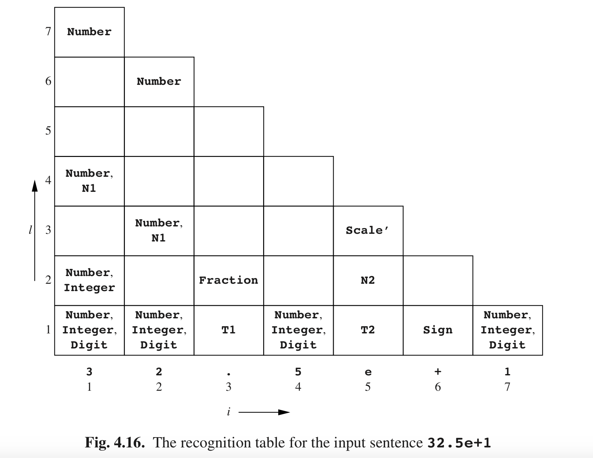

# 4.2.4 重访问示例

现在，让我们来看看CYK语法如何与我们刚刚转换为CNF的示例语法一起工作。同样，我们的输入句子是**32.5e+1**。识别表如图Fig4.16所示。底部的一行可以直接从语法中读取到。例如，唯一有生成规则的右侧为**3**的非终结符是**Number**，**Integer**和**Digit**。请注意，对句子中的每一个标记*a*必须至少有一个具有*A → a*规则的非终结符*A*，否则该句子就不能从语法中生成。

其他行按前所述计算。实际上有两种方法可以计算某一个*Ri,l*。第一种方法是检查语法中的每一个右侧。例如，要知道右侧**N1 Scale’**，是否生成子字符串**2.5e**（= *s2,4*）。到目前为止识别表显示：

- **N1**不是*R2,1*或*R2,2*的一个成员

- **N1**是*R2,3*的一个成员，但**Scale’**不是*R5,1*的一个成员

因此答案是否定的。使用此方法，我们必须用这种方法来检查每一个右侧，将左侧添加到*R2,4*，当我们发现其右侧可以生成*s2,4*。

第二种方法是计算到目前为止，识别表中可能出现的右侧。例如，*R2,4*是具有右侧*AB*的非终结符的集合，同时右侧也不是以下情况：

- *A*是*R2,1*的一个成员，*B*是*R3,3*的一个成员，或者

- *A*是*R2,2*的一个成员，*B*是*R4,2*的一个成员，或者

- *A*是*R2,3*的一个成员，*B*是*R5,1*的一个成员。

这位*AB*提供了可能的组合：**N1** **T2**和**Number T2**。现在我们检查语法中的所有规则，以确定是否有测试是这个集合的成员。如果是这样的，那就把左侧添加到*R2,4*。