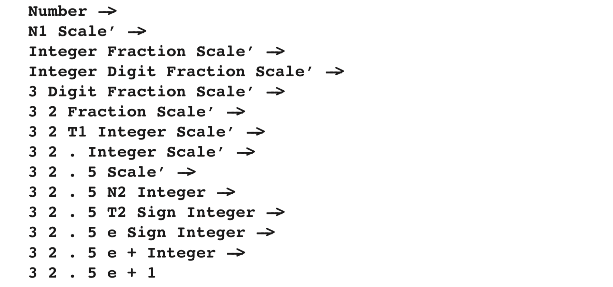

### 4.2.5 CYK Parsing with Chomsky Normal Form

We now have an algorithm that determines whether a sentence belongs to a language or not, and it is much faster than exhaustive search. Most of us, however, not only want to know whether a sentence belongs to a language, but also, if so, how it can be derived from the grammar. If it can be derived in more than one way, we probably want to know all possible derivations. As the recognition table contains the infor- mation on all derivations of substrings of the input sentence that we could possibly make, it also contains the information we want. Unfortunately, this table contains too much information, so much that it hides what we want to know. The table may contain information about non-terminals deriving substrings, where these derivations cannot be used in the derivation of the input sentence from the start symbol S. For example, in the example above, R2,3 contains N1, but the fact that N1 derives 2.5 cannot be used in the derivation of 32.5e+1 from Number.

The key to the solution of this problem lies in the simple observation that the derivation must start with the start symbol S. The first step of the derivation of the input sentence t, with length n, can be read from the grammar, together with the recognition table. If n = 1, there must be a rule S → t; if n ≥ 2, we have to examine all rules S → AB, where A derives the first k symbols of t, and B the rest, that is, A is a member of R1,k and B is a member of Rk+1,n−k, for some k. There must be at least one such rule, or else S would not derive t.

Now, for each of these combinations AB we have the same problem: how does A derive s1,k and B derive sk+1,n−k? These problems are solved in exactly the same way. It does not matter which non-terminal is examined first. Consistently taking the leftmost one results in a leftmost derivation, consistently taking the rightmost one results in a rightmost derivation.

Notice that we can use an Unger-style parser for this. However, it would not have to generate all partitions any more, because we already know which partitions will work.

Let us try to find a leftmost derivation for the example sentence and grammar, using the recognition table of Figure 4.16. We begin with the start symbol, Number.

Our sentence contains seven symbols, which is certainly more than one, so we have to use one of the rules with a right-hand side of the form AB. The Integer Digit rule is not applicable here, because the only instance of Digit that could lead to a derivation of the sentence is the one in R7,1, but Integer is not a member of R1,6. The Integer Fraction rule is not applicable either, because there is no Fraction deriving the last part of the sentence. This leaves us with the production rule Number -> N1 Scale’, which is indeed applicable, because N1 is a mem- ber of R1,4, and Scale’ is a member of R5,3, so N1 derives 32.5 and Scale’ derives e+1.

Next, we have to find out how N1 derives 32.5. There is only one appli- cable rule: N1 -> Integer Fraction, and it is indeed applicable, because Integer is a member of R1,2, and Fraction is a member of R3,2, so Integer derives 32, and Fraction derives .5. In the end, we find the following derivation:

Unfortunately, this is not exactly what we want, because this is a derivation that uses the rules of the grammar of Figure 4.15, not the rules of the grammar of Figure 4.6, the one that we started with.