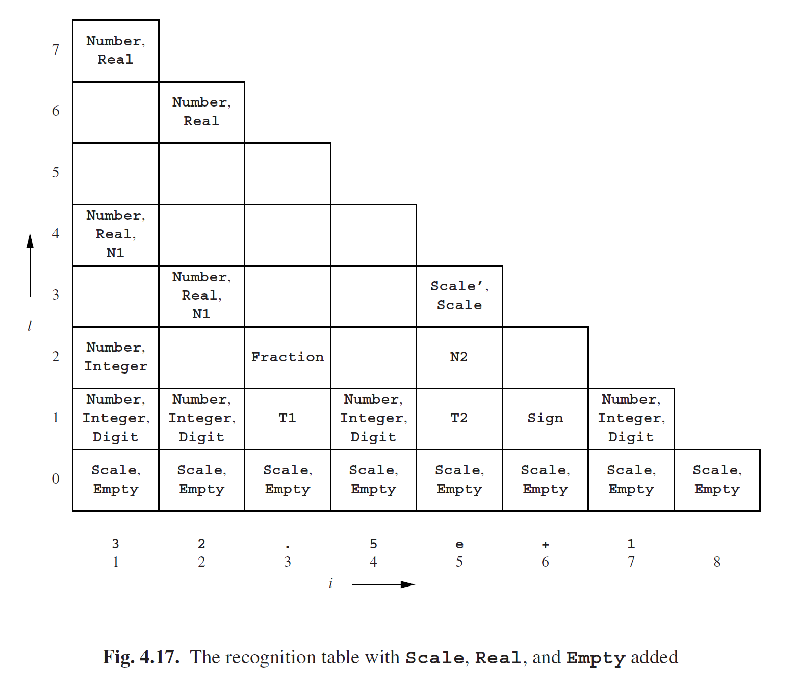
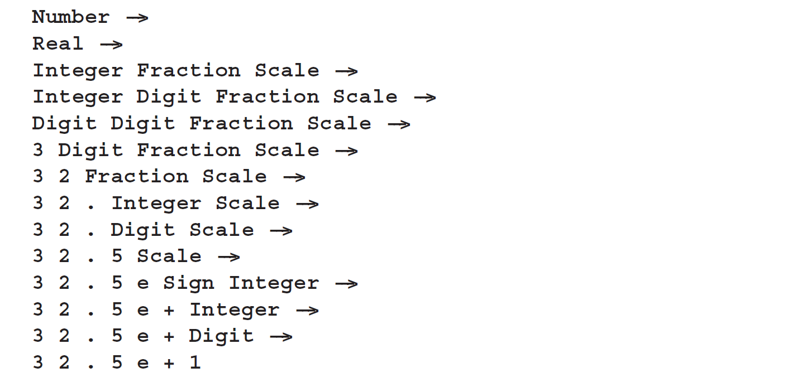

# 4.2.6 消除CNF转换的影响

从图4.6的语法和图4.16的识别表中，我们不难发现识别表包含了原始语法中大部分非终结符的我们所需的信息。但是有一少部分非终结符没有在识别表中：**Scale**，**Real**和**Empty**。**Scale**和**Empty**可以不关注，因为没有ε规则后，它们就变成了死胡同。**Empty**也可以完全不管，因为它只能生成空的句子。而**Scale**由**Scale'**替换，因为**Scale**和**Scale'**生成的几乎一模一样，除了空字符串。我们可以用它来向识别表添加更多信息：每当出现**Scale'**，我们就添加一个**Scale**。

非终结符**Real**被删除了，因为没有单元规则之后就变得无法到达了。不过现在CYK算法并没有要求语法中的所有非终结符都是可到达的。所以我们也可以把**Real**留下，然后将它的规则转换成CNF。接下来当合适的时候，CYK算法将会把**Real**添加到识别表中。**Real**被添加到图Fig4.15的语法的规则将会是如下：

**Real ---> N1 Scale’ | Integer Fraction**

生成的识别表如图4.17所示。 在这个图中，我们也在底部添加了额外的一行。这一行是生成了空字符串的非终结符。这些非终结符可能出现在句子的任意两个符号之间，也可能出现在句子头或句子尾。集合*Ri,0*包含出现在符号*ti*前面的非终结符，而集合*Rn+1,0*包含出现在句子后面的非终结符。

现在我们就有了一个包含了所有我们解析原始语法中句子的所需信息的识别表。同样，从起始符*S*开始生成。如果*A1A2 · · ·Am*是*S*的右侧，我们来看看这个规则是不是也适用，也就是说*A1A2 · · ·Am*是否能生成*s1,n*。确定之后就从*A1*。有两种情况：

- A1 is a terminal symbol. In this case, it must be the first symbol of s1,n, or this rule is not applicable. Then, we must check if A2 · · ·Am derives s2,n−1, in the same way that we are now checking if A1A2 · · ·Am derives s1,n.

- A1 is a non-terminal. In this case, it must be a member of a R1,k, for some k, or this rule is not applicable. Then, we must check if A2 · · ·Am derives sk+1,n−k, in the same way that we are now checking if A1A2 · · ·Am derives s1,n. If we want all parsings, we must do this for every k for which A1 is a member of R1,k. Notice that non-terminals deriving the empty string pose no problem at all, because they appear as a member of Ri,0 for all i.

We have now determined whether the rule is applicable, and if it is, which parts of the rule derive which substrings. The next step now is to determine how the substrings can be derived. These tasks are similar to the task we started with, and are solved in the same way. This process will terminate at some time, provided the grammar does not contain loops. This is simply an Unger parser which knows in advance which partitions will lead to a successful parse.

Let us go back to the grammar of Figure 4.6 and the recognition table of Figure 4.17, and see how this works for our example input sentence. We now know that Number derives 32.5e+1, and want to know how. We first ask ourselves: can we use the Number--->Integer rule? Integer is a member of R1,1 and R1,2, but there is nothing behind the Integer in the rule to derive the rest of the sentence, so we cannot use this rule. Can we use the Number--->Real rule? Yes we can, because Real is a member of R1,7, and the length of the sentence is 7. So we start our derivation with

Number ---> Real ---> · · ·

Now we get similar questions for the Real non-terminal: can we use the Real ---> Integer Fraction Scale rule? Well, Integer is a member of R1,1, but we cannot find a Fraction in any of the R2,k sets. However, Integer is also a member of R1,2, and Fraction is a member of R3,2. Now, Scale is a member of R5,0; this does not help because it would leave nothing in the rule to derive the rest. Fortunately, Scale is also a member of R5,3, and that matches exactly to the end of the string. So this rule is indeed applicable, and we continue our derivation:

Number ---> Real ---> Integer Fraction Scale ---> · · ·

The sentence is now split up into three parts:

It is left to the reader to verify that we will find only one derivation, and that this is it:

