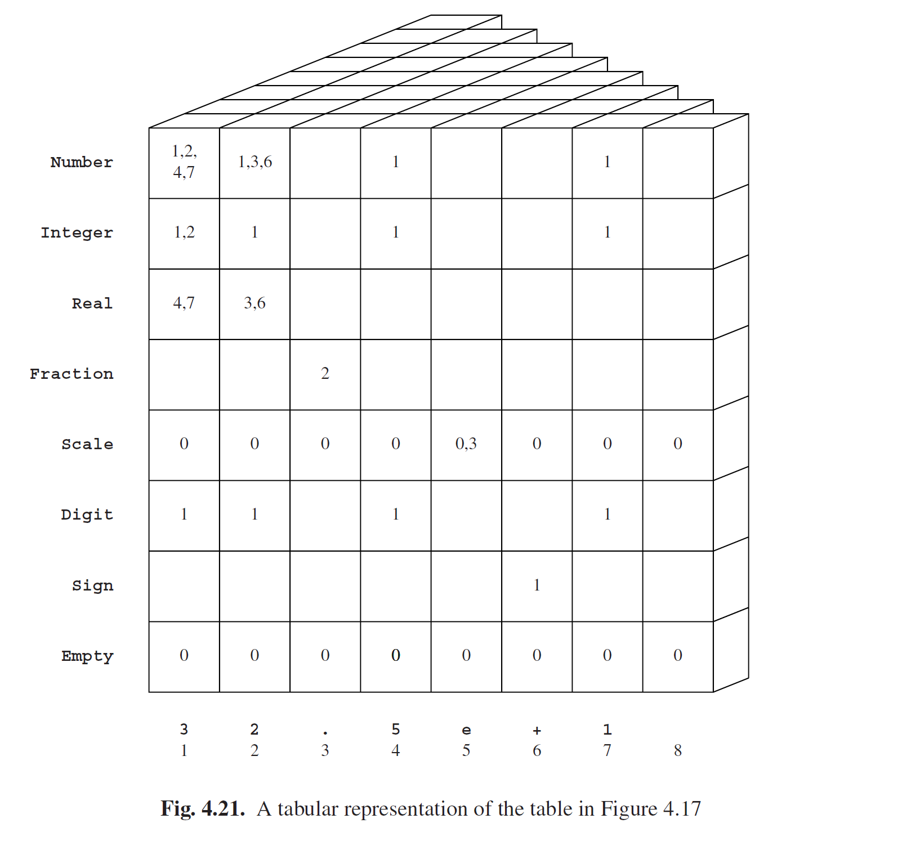

# 4.3.1 自顶向下表解析

为了识别，我们只看表*T*中一个输入的一个元素：*TS,1*是否包含*n*（其中*S*是起始符号，*n*是输入句子的长度）？For recognition we are only interested in one element in one entry of the table T: does TS,1 contain n, where S is the start symbol and n is the length of the input? To

为了找出答案，我们将查询以某种形式放入堆栈，并将所有语法规则对**S**使用，我们绘制了所有*TS,1*的包含*n*的可能的列表，就像我们在Unger解析器中所作的一样。对于像**S--->AB**这样的规则，要考虑：

- *TA,1*是否包含*0*，且*TB,1*是否包含*n*？

- *TA,1*是否包含*1*，且*TB,2*是否包含*n-1*？

- *TA,1*是否包含*2*，且*TB,3*是否包含*n-2*？

- · · ·

- *TA,1*是否包含*n*，且*TB,n+1*是否包含*0*？

如果满足以上的任何一条，那么*TS,1*则必须包含*n*。

每一个新的查询都可以以相同方式扩展和检查。最终这些查询将变成“终结符查询”，可以不产生新的查询来解决现有的查询问题。例如“*Ta,K*是否包含*1*？”这样的问题，可以通过检查输入中位置*K*是否包含**a**来解决，又或者“*TP,K*是否包含*0*？”，这个等同于“*P*是否生成*ε*？”。一旦我们得到了一个问题的答案，并将之存储在表中一个合适的位置，我们这样做不止可以用于顶部问题，也可以用于中间的所有问题。这一点非常重要，因为我们可以不做进一步计算就得到答案，只要同一问题再次出现，而实际上这个情况出现的频率很高。请注意，有可能需要存储一些消极信息（实际上应该是有关缺省的积极信息），在表*T*的输入中：像*TA,K*这样的输入可能包含“是否包含*7*”这样的信息。还有一点，这个过程并不总是计算表中的所有输入内容；监狱语法本身，这些漏掉的输入可能永远不会成为识别的一部分。对于部分应用程序，这是一个优势。

将计算结果存储在表中以便通过表查找来代替重新计算的技术称为*记忆化(memoization)*。这是非常有效且广泛适用的技术，而且可以将算法的时间复杂度从指数级降为线性，就像前面的例子一样。记忆化于1968年由Michie [410]提出，然后由Sheil [20]引入解析（但他至今尚未使用“memoization”一词）；见Norvig [343]。

此外，我们要使用Unger解析器中相同的方式，再来处理一次左递归非终结符。如果非终结符*A*是左递归的，那么问题“*TA,1*是否包含包含*n*”将再次产生问题“*TA,1*是否包含*n*”，然后就会进入一个死循环。但是只要放弃同一问题的递归问题，这个状况就解决了，因为第二个问题不会产生第一个问题已经解决过的问题。生成的问题是否是递归的可以通过在堆栈中查询来确定。简而言之，自顶向下表解析与拥有了记忆化之后的Unger解析非常相似。

该算法的完整实现见17.3节。