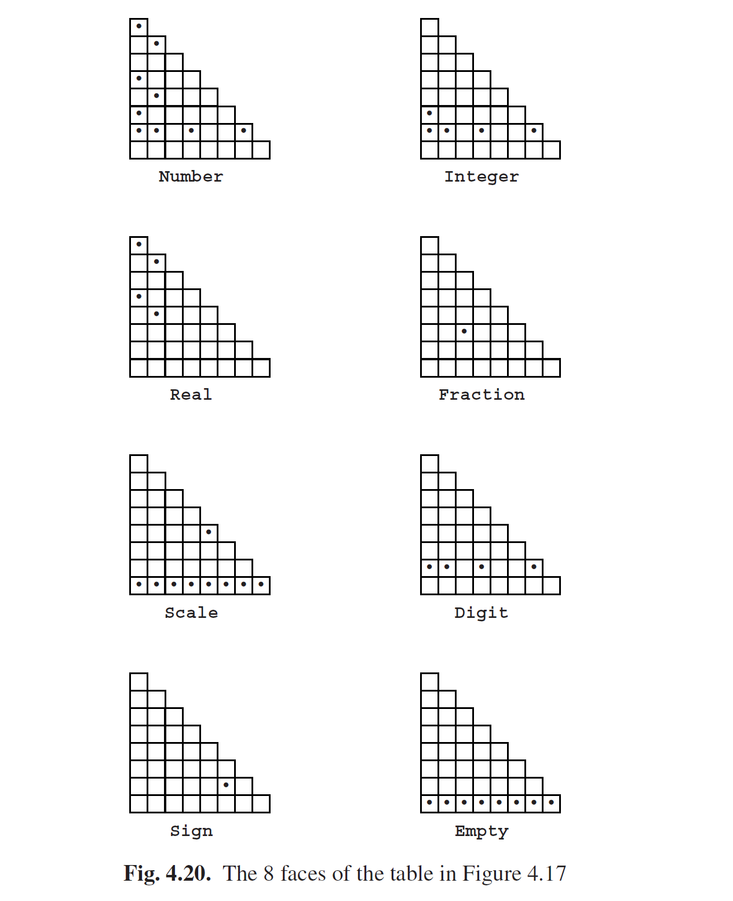

# 4.3 Tabular Parsing

We have drawn the CYK recognition tables as two-dimensional triangular matrices, but the complexity of the entries — sets of non-terminals — already shows that this representation is not in its most elementary form. Simplicity and insight can be gained by realizing that a CYK recognition table is a superposition of a number of tables, one for each non-terminal in the grammar; the entries in these tables are just bits, saying “Present” or “Not Present”. Since the grammar for numbers from Figure 4.6 has 8 non-terminals, the recognition table from Figure 4.17 is a superposition of 8 matrices. They are shown in Figure 4.20. The dot in the top left corner of the table for Number means that a Number of length 7 has been recognized in position 1; the one almost at the bottom right corner means that a Number of length 1 has been recognized in position 7; etc.

Imagine these 8 tables standing upright in the order Number · · · Empty, perhaps cut out of transparent plastic, glued together into a single block. Now topple the block backwards, away from you. A new matrix appears, T, on what was the bottom of the block before you toppled it, as shown in Figure 4.21, where the old recognition table is still visible on what is now the top. The new table still has the

positions in the input as the horizontal axis, but the vertical axis now consists of names of non-terminals, and the entries are lists of lengths. For example, the list {1,2,4,7} in T1,Number in the top left corner means that productions of Number of these lengths can be recognized in position 1. Parsing algorithms that use mainly this representation are called tabular parsing algorithms. It will be clear that no information is gained or lost in this transformation, but the tabular representation has its own advantages and disadvantages.

The table T is initialized by putting a 1 in all entries Ti,A where the input has a token t in position i and the grammar has a rule A→t. There are two ways to fill the rest of the table, top-down and bottom-up.