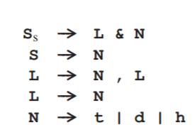
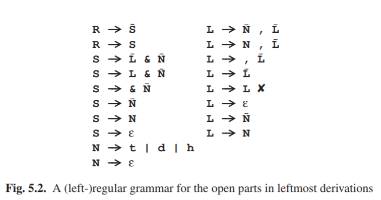

### 5.1.1 CF解析中的正则语言

​	在一些CF文法的解析器中，一个子分析器会在处理正则文法的时候被识别。这样一个子分析器是隐式地明确地基于下列这种令人惊讶的现象。考虑到最左推导和最右推导两种句子形式，这种句子形式由两部分组成，一个是关闭（结束）的部分，包含终结符，和一个开放（未结束）的部分，包含非终结符。在最左推导中，开放的部分，开始于最左边的非终结符，然后向右扩展，在最右推导中，开放的部分，开始于最右的非终结符，然后向左扩展。

​	显而易见的是，句中的开放部分在CF分析方法中其中非常重要的作用，能被正则文法描述，文法遵循CF文法。

​	为了解释得更加清楚，我们首先来解决一个概念上的问题，依惯例，使用大写字母来表示非终结符，小写字母表示终结符，然后接下来，我们将书写能产生句子形式的文法，自此这些句子形式中能包含非终结符，我们的文法中也能产生非终结符。为了在这个过程中从“活”的非终结符中区分出“死”的非终结符，我们在字符上用一根短线来表示，就像这样，$\overline{x}$.

​	伴随着上述提到的概念，我们来创建一个正则文法G,以一个开始符号R作为在2.4.3节中用到过的文法C的最左推导的开放部分。我们重复：

​	G中开始符号R的第一种可能是产生C的开始符号，所以我们得到R--->$\overline{S}$，这里$\overline{S}$只是一个标记（token），下一步是这个标记，成为句子形式中最左端的非终结符，它被转换成一个“活”的非终结符，从中我们将产生更多的句子形式，他们来自 R--->S。这里S是一个G中的非终结符，描述源于C中的S的句子形式中的开放部分。G中S的第一种可能是产生c中S的右边就像标记（tokens）:  S--->$\overline{L}$&$\overline{N}$，但是也可能是$\overline{N}$，成为句子最左侧的非终结符，L已经被激活： S--->L&$\overline{N}$，它甚至可能结束推导进程，因此，所有标记已经成为句子形式的关闭部分的一部分。开放部分&$\overline{N}$被留下，所以句子形式变为S--->&$\overline{N}$，接下来我们可以把&从开放部分移出去到关闭部分:S--->$\overline{N}$，又一次，这个$\overline{N}$变得能够产生句子，所以被激活:S--->N，就像上面的L，N最终完全消失: S--->ε。我们看到了原本的S--->$\overline{L}$&$\overline{N}$是怎样逐渐变为S--->ε，C中S的第二种选择是S--->N，推导过程的规则是S--->N¯, S--->N, 然后 S--->ε，这个推导我们上面已经做过了。

​	上述过程介绍了G中的非终结符L和N。它们的规则可以用与S相同的方法导出；结果是图5.2中的左正则语法。我们已经看到这个过程能创建同一个规则的副本。我们现在知道它也能产生循环，例如规则 L--->L，在图中被标为×，因为这样的规则没有任何贡献，所以被拒绝了。

​	相似地，在最右推导中一个右正则语法能构建句子形式的开放部分。这种文法有益于理解自顶向下和自底向上分析（第六章和第七章的内容）,是一些解析器功能的基础（9.13.2和10.2.3节）。

