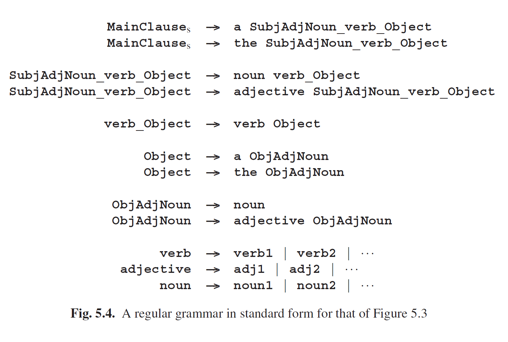

# 5.1.2 拥有无限存储的系统

CF (or stronger) grammars allow nesting. Since nesting can, in principle, be arbitrarily deep, the generation of correct CF (or stronger) sentences can require an arbitrary amount of memory to temporarily hold the unprocessed nesting information. Mechanical systems do not possess an arbitrary amount of memory and consequently cannot exhibit CF behavior and are restricted to regular behavior. This is immediately clear for simple mechanical systems like vending machines, traffic lights and DVD recorders: they all behave according to a regular grammar. It is also in principle true for more complicated mechanical systems, like a country’s train system or a computer. However, here the argument gets rather vacuous since nesting information can be represented very efficiently and a little memory can take care of a lot of nesting. Consequently, although these systems in principle exhibit regular behavior, it is often easier to describe them with CF or stronger means, even though that incorrectly ascribes infinite memory to them.

Conversely, the global behavior of many systems that do have a lot of memory can still be described by a regular grammar, and many CF grammars are already for a large part regular. This is because regular grammars already take adequate care of concatenation, repetition and choice; context-freeness is only required for nesting. If we call a rule that produces a regular (sub)language (and which consequently could be replaced by a regular rule) “quasi-regular”, we can observe the following. If all alternatives of a rule contain terminals only, that rule is quasi-regular (choice). If all alternatives of a rule contain only terminals and non-terminals with quasi-regular and non-recursive rules, then that rule is quasi-regular (concatenation). And if a rule is recursive but recursion occurs only at the end of an alternative and involves only quasi-regular rules, then that rule is again quasi-regular (repetition). This often covers large parts of a CF grammar. See Krzemie´n and Łukasiewicz [142] for an algorithm to identify all quasi-regular rules in a grammar.

Natural languages are a case in point. Although CF or stronger grammars seem necessary to delineate the set of correct sentences (and they may very well be, to catch many subtleties), quite a good rough description can be obtained through regular languages. Consider the stylized grammar for the main clause in a Subject- Verb-Object (SVO) language in Figure 5.3. This grammar is quasi-regular: Verb, Adjective and Noun are regular by themselves, Subject and Object are concatenations of repetitions of regular forms (regular non-terminals and choices) and are therefore quasi-regular, and so is MainClause. It takes some work to bring this grammar into standard regular form, but it can be done, as shown in Figure 5.4, in which the lists for verbs, adjectives and nouns have been abbreviated to verb, adjective and noun, to save space.

Even (finite) context-dependency can be incorporated: for languages that require the verb to agree in number with the subject, we duplicate the first rule:

MainClause ---> SubjectSingular VerbSingular Object | SubjectPlural VerbPlural Object

and duplicate the rest of the grammar accordingly. The result is still regular. Nested subordinate clauses may seem a problem, but in practical usage the depth of nesting is severely limited. In English, a sentence containing a subclause containing a subclause containing a subclause will baffle the reader, and even in German and Dutch nestings over say five deep are frowned upon. We replicate the grammar the desired number of times and remove the possibility of further recursion from the deepest level. Then the deepest level is regular, which makes the other levels regular in turn. The resulting grammar will be huge but regular and will be able to profit from all simple and efficient techniques known for regular grammars. The required duplications and modifications are mechanical and can be done by a program. Dewar, Bratley and Thorne [376] describe an early example of this approach, Blank [382] a more recent one.