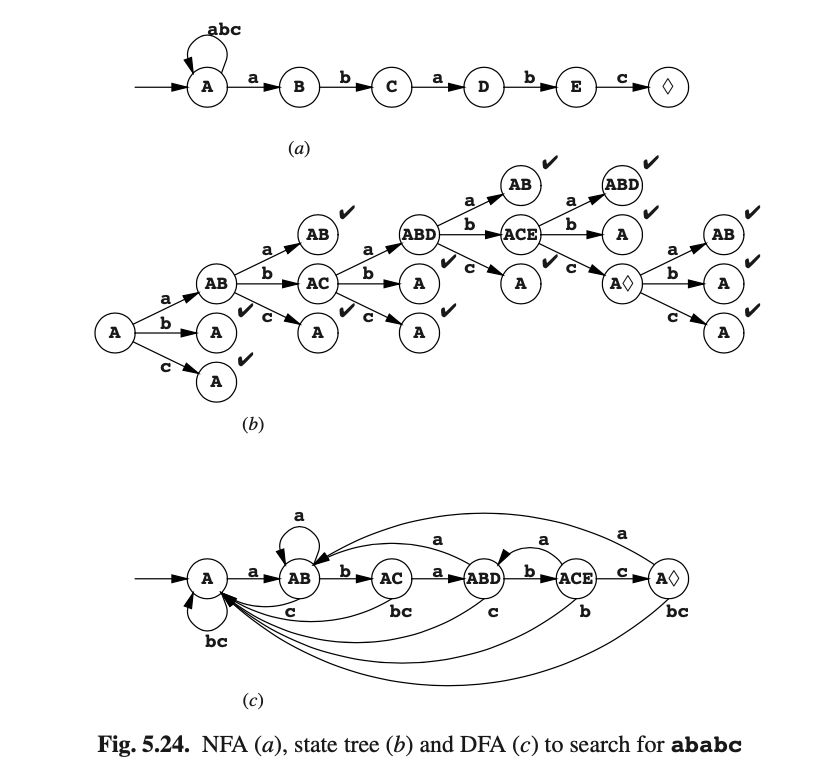
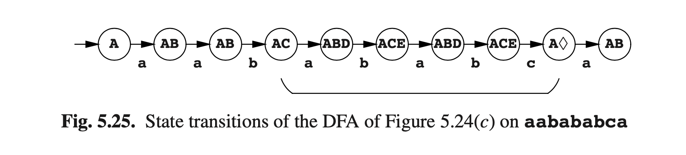

# 5.10 使用有限状态自动机快速文本搜索

Suppose we are looking for the occurrence of a short piece of text, for example, a word or a name (the “search string”) in a large piece of text, for example, a dictionary or an encyclopedia. One naive way of finding a search string of length n in a text would be to try to match it to the characters 1 to n; if that fails, shift the pattern one position and try to match against characters 2 to n + 1, etc., until we find the search string or reach the end of the text. This process is, however, costly, since we may have to look at each character n times.

Finite automata offer a much more efficient way to do text search. We derive a DFA from the string, let it run down the text and when it reaches an accepting state, it has found the string. Assume for example that the search string is ababc and that the text will contain only as, bs and cs. The NFA that searches for this string is shown in Figure 5.24(a); it was derived as follows. At each character in the text there are two possibilities: either the search string starts there, which is represented by the chain of states going to the right, or it does not start there, in which case we have to skip the present character and return to the initial state. The automaton is non-deterministic, since when we see an a in state A, we have two options: to believe that it is the start of an occurrence of ababc or not to believe it.

Using the traditional techniques, this NFA can be used to produce a state tree (b) and then a DFA (c). Figure 5.25 shows the states the DFA goes through when fed the text aabababca. We see that we have implemented superstring recognition, in which a substring of the input is recognized as matching the grammar rather than the entire input. This makes the input a superstring of a string in the language, hence the name.

This application of finite-state automata is known as the Aho and Corasick bibli- ographic search algorithm (Aho and Corasick [141]). Like any DFA, it requires only a few machine instructions per character. As an additional bonus it will search for several strings for the price of one. The DFA corresponding to the NFA of Figure 5.26 will search simultaneously for Kawabata, Mishima and Tanizaki. Note that three different accepting states result, ♦K, ♦M and ♦T.

The Aho and Corasick algorithm is not the last word in string search. It faces stiff competition from the Rabin-Karp algorithm (Karp and Rabin [145]) and the Boyer-Moore algorithm (Boyer and Moore [143]). An excellent overview of fast string search algorithms is given by Aho [147]. Watson [149] extends the Boyer- Moore technique, which searches for a single word, so it can search for a regular expression. However fascinating all these algorithms are, they are outside the scope of this book and will not be treated here.