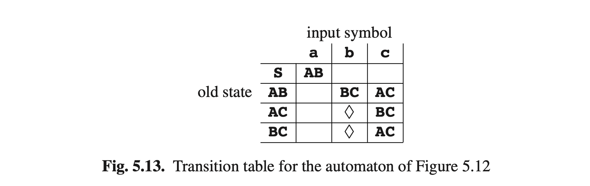

# 5.3.1 Replacing Sets by States

Although the process described above is linear in the length of the input (each next token takes an amount of work that is independent of the length of the input), still a lot of work has to be done for each token. What is worse, the grammar has to be consulted repeatedly and so we expect the speed of the process to depend adversely on the size of the grammar. In short, we have designed an interpreter for the non- deterministic automaton, which is convenient and easy to understand, but inefficient.

Fortunately there is a surprising and fundamental improvement possible: from the NFA in Figure 5.7 we construct a new automaton with a new set of states, where each new state is equivalent to a set of old states. Where the original — non-deterministic — automaton was in doubt after the first a, a situation we represented as {A, B}, the new — deterministic — automaton firmly knows that after the first a it is in state AB.

The states of the new automaton can be constructed systematically as follows. We start with the initial state of the old automaton, which is also the initial state of the new one. For each new state we create, we examine its contents in terms of the old states, and for each token in the language we determine to which set of old states the given set leads. These sets of old states are then considered states of the new automaton. If we create the same state a second time, we do not analyse it again. This process is called the subset construction and results initially in a (deterministic) state tree. The state tree for the grammar of Figure 5.6 is depicted in Figure 5.11. To stress that it systematically checks all new states for all symbols, outgoing arcs leading nowhere are also shown. Newly generated states that have already been generated before are marked with a ✔.

The state tree of Figure 5.11 is turned into a transition diagram by leading the arrows to states marked ✔ to their first-time representatives and removing the dead ends. The new automaton is shown in Figure 5.12. It is deterministic, and is therefore called a deterministic finite-state automaton, or a DFA for short.

When we now use the sentence abcba as a guide for traversing this transition
diagram, we find that we are never in doubt and that we safely arrive at the accepting state. All outgoing arcs from a state bear different symbols, so when following a list of symbols, we are always pointed to at most one direction. If in a given state there is no outgoing arc for a given symbol, then that symbol may not occur in that position. If it does, the input is in error.

There are two things to be noted here. The first is that we see that most of the possible states of the new automaton do not actually materialize: the old automaton had 5 states, so there were 25 = 32 possible states for the new automaton while in fact it has only 5; states like SB or ABC do not occur. This is usual; although there are non-deterministic finite-state automata with n states that turn into a DFA with 2n states, these are rare and have to be constructed on purpose. The average garden variety NFA with n states typically results in a DFA with less than or around 10 × n states.

The second is that consulting the grammar is no longer required; the state of the automaton together with the input token fully determine the next state. To allow efficient look-up the next state can be stored in a table indexed by the old state and the input token. The table for our DFA is given in Figure 5.13. Using such a table, an input string can be checked at the cost of only a few machine instructions per token. For the average DFA, most of the entries in the table are empty (cannot be reached by correct input and refer to error states). Since the table can be of considerable size (300 states times 100 tokens is normal), several techniques exist to exploit the empty space by compressing the table. Dencker, Dürre and Heuft [338] give a survey of some techniques.

The parse tree obtained looks as follows:

which is not the original parse tree. If the automaton is used only to recognize the input string this is no drawback. If the parse tree is required, it can be reconstructed in the following fairly obvious bottom-up way. Starting from the last state ♦ and the last token a, we conclude that the last right-hand side (the “handle segment” in bottom-up parsing) was a. Since the state was BC, a combination of B and C, we look through the rules for B and C. We find that a derived from C->a, which narrows down BC to C. The rightmost b and the C combine into the handle bC which in the set {A, C} must derive from A. Working our way backwards we find the parsing

This method again requires the grammar to be consulted repeatedly; moreover, the way back will not always be so straight as in the above example and we will have problems with ambiguous grammars.

Efficient full parsing of regular grammars has received relatively little attention; substantial information can be found in papers by Ostrand, Paull and Weyuker [144] and by Laurikari [151].