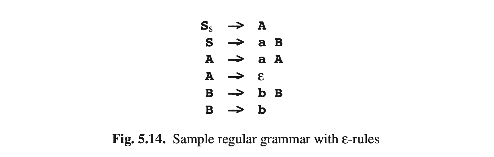

# 5.3.2 ε转换和非标准符号

标准形式的常规语法只会有*A → a*和*A → aB*的形式。我们先来用另外两种规则*A → B*和*A → ε*扩展一下符号，然后看看如何为他们构造NFAs和DFAs。接下来我们看看正则表达式和以正则表达式作为右侧的规则（例如*P → a∗bQ*），并展示如何将他们转换加入规则的扩展符号中。

图Fig5.14的语法包含两种新类型规则的例子；图Fig5.15展示了这个语法的三剑客：NFA，状态树和DFA。先看NF，当我们出于状态**S**的时候，我们会在令牌**a**处转换到预期状态**B**，最终得到标准规则**S->aB**。非标准规则**S->A**表示我们可以从状态**S**到状态**A**，而不需要读取（或生成）符号；即我们读取一个长度为0的ε字符串，并且做了一次*ε转换*（或ε转移）；**S $$\xrightarrow[]{ε}$$  A**。非标规则**A->ε**产生一个**ε**转换以得到可接受状态：**A $$\xrightarrow[]{ε}$$ ♦**。**ε**转换不能和**ε**规则混淆：单元规则产生**ε**转换得到不可接受状态，而**ε**规则产生的**ε**转换得到可接受状态。

现在我们已经构建了一个具有ε转移的NFA，现在的问题是我们如何处理ε转移以得到DFA。为了解决这个问题，我们像前面一样推导；在图Fig5.7中，在看到**a**之后我们并不知道现在是出于状态**A**还是**B**，我们将之记为 **{A, B}**。此时当我们进入状态**S**时，甚至在处理单个符号之前，我们就已经不知道我们是处于状态**S**还是**A**或者 **♦**了，由于后两者都可以通过ε转移由**S**到达。所以DFA的初始状态已经是复合的：**SA♦**。我们必须考虑此状态将会把符号**a**和**b**指向什么地方。如果是状态**S**，**a**将指向**B**，然后如果是**A**那么**a**将指向**A**。因此新状态包含**A**和**B**，而由于 **♦**可以由**A**通过ε转移到达，因此它也包含 **♦**且命名为**AB♦**。继续这条路径，我们可以构建完整的状态树（图Fig5.15(*b*)），折叠起来就成了DFA（*c*）。注意，DFA的所有状态都包含NFA的状态**♦**，因此输入可能以其中任何一个结束。

通过**a**的给定状态由ε转移得到NFA状态的集合称为那个状态的*ε闭合*。例如**S**的ε闭合是 **{S, A, ♦}**。

有关从最近发现在 XML 验证领域的常规语法获取 DFA 的完全不同方法，请参阅 Brzozowski [139]。