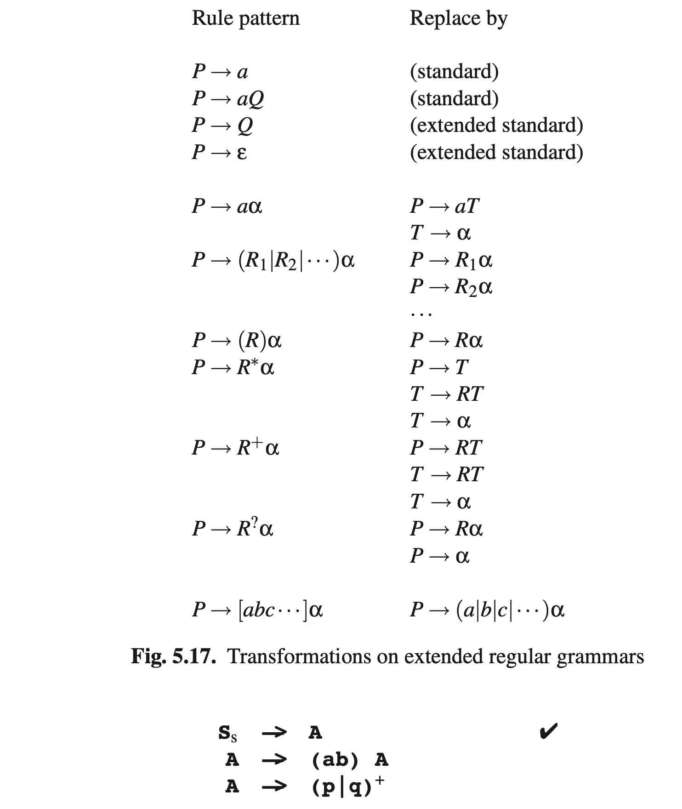
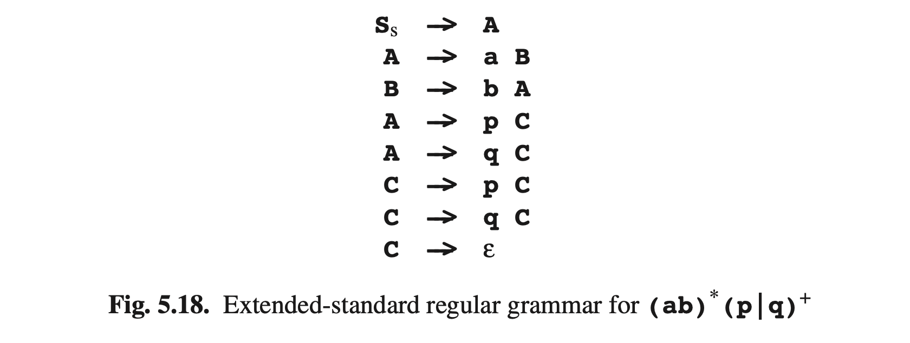

# 5.4.1 正则表达式产生的常规语法

通过使用图Fig5.17给出的转换方式，可以将正则表达式转换为正则语法。转换中的*T*代表中间的非终结符，被选择用来刷新转换的每个应用；α代表处非终结符之外的任意正则表达式，其后可能接着非终结符。如果α为空，当它单独出现在右手侧时应该用ε替换。

正则表达式到正则语法的扩展对于从正则表达式得到DFA很有帮助，对词汇分分析器如*lex*中是必须的。生成的常规语法可以直接用于NFA，它可用于生成上述的DFA。还有另一种方法从正则表达式创建一个NFA，但是这需要对正则表达式进行一些预处理；见Thompson [140]。

我们将用表达式 **(ab)* (p|q)+**说明该方法。我们的方法也将适用于包含正则表达式的常规语法（如 *A → ab∗cB*），实际上我们马上就要将正则表达式转换为此类语法：

**
Ss -> (ab)*(p|q)+
**

Although the table in Figure 5.17 uses T for generated non-terminals, we use A, B, C, . . . in the example since that is less confusing than T1 , T2 , T3 , . . . . The transformations are to be applied until all rules are in (extended) standard form.

The first transformation that applies is P → R∗α, which replaces Ss->(ab)*(p|q)+ by

The first rule is already in the desired form and has been marked ✔. The transforma- tions P → (R)α and P → aα work on A->(ab)A and result in

Now the transformation P → R+ α must be applied to A->(p|q)+ , yielding

The ε originated from the fact that (p|q)+ in A->(p|q)+ is not followed by any- thing (of which ε is a faithful representation). Now A->(p|q)C and C->(p|q)C are easily decomposed into

The complete extended-standard version can be found in Figure 5.18; an NFA and
DFA can now be derived using the methods of Section 5.3.1 (not shown).