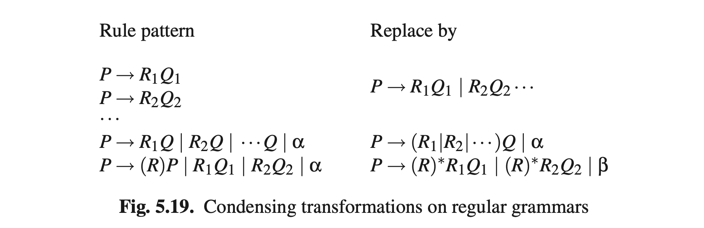

# 5.4.2 来自正则语法的正则表达式

例如在9.12节中，有时将正则语法压缩为正则表达式非常有用。转换可以通过交替替换规则并应用图Fig5.19的转换形式来执行。第一模式将同意非终结符的所有规则都结合起来了。第二种模式将右手侧的同一非终结符的所有正则表达式结合在一起；α是不以*Q*结尾的替代方法的列表（见下段）。第三种模式删除所有的右递归：如果重复部分为 *(R)*，那么所有非递归的备选项写作 *(R)*\*；而β包含所有α有的，以及 *(R)*\*所代表的。*Q1，Q2，...*并不等同于*P*（见下段）。当α为α时，且与非空正则表达式串联时，可以将它分离出来。

替换和转换可以按任意顺序使用，这并不会影响最后得到一个正确的正则表达式，但是最终结果却与应用的顺序有极大关系；为了获得一个“好”的正则表达式，就需要特别的指导。此外，上一段中的两个条件虽然不会让结果出错，但可能会让我们得到一个不太理想的正则表达式。

现在我们将转换应用于图Fig5.18的正则语法中，并加以指导。首先我们将规则和左手侧结合起来（转换1）：

**
S -> A       
**
**
A -> aB|pC|qC
**
**
B -> b A     
**
**
C -> pC|qC| ε
**

接下来我们替换**B**：

**
A -> abA|pC|qC
**
**
C -> pC|qC| ε 
**

后面接着前缀（转换2）：

**
A -> (ab) A | (p|q) C
**
**
C -> (p|q)C| ε       
**

注意，我们还需要将有前缀**A**的**ab**打包起来，以便下一次转换，这涉及到将递归转换为重复：

**
S -> A                       
**
**
A -> (ab)* (p|q) C
**
**
C -> (p|q)*       
**

现在，**C**可以用**A**和**S**中的**A**替换，得到：

**
S -> (ab)* (p|q) (p|q) *
**

这是等效的，但与我们开头用的 __(ab)\*(p|q)+__ 不同。