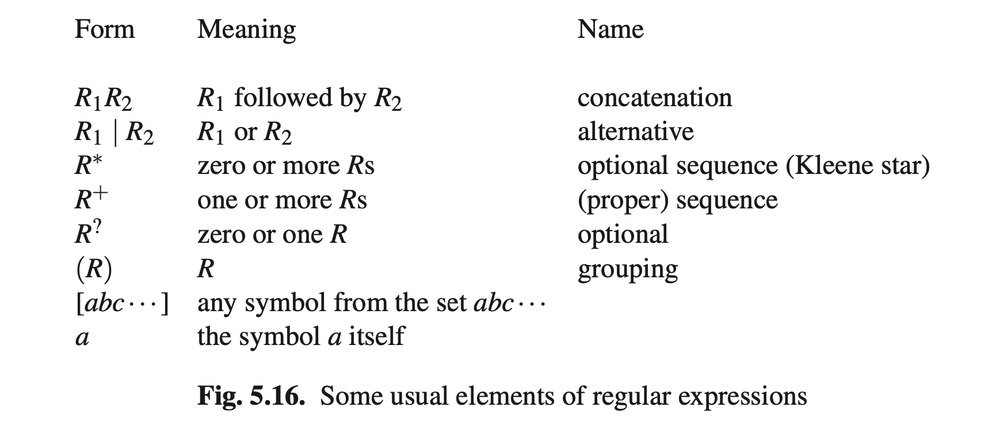

# 5.4 操作常规语法和正则表达式

如2.3.3节所述，常规语言通常由正则表达式而不是正则语法指定。例如 **[0-9]+(.[0-9]+)?**这个正则表达式，应该读作“集合0-9的一个或多个符号，后面跟着点，在后面是集合0-9的一个或多个符号”（表示包含小数点的一个数字）；还有 **(ab) * (p|q)+**应该读作“”As mentioned in Section 2.3.3, regular languages are often specified by regular expressions rather than by regular grammars. Examples of regular expressions are [0-9]+(.[0-9]+)? which should be read as “one or more symbols from the set 0 through 9, possibly followed by a dot which must then be followed by one or more symbols from 0 through 9” (and which represents numbers with possibly a dot in them) and (ab)*(p|q)+, which should be read as “zero or more strings ab fol- lowed by one or more ps or qs” (and which is not directly meaningful). The usual forms occurring in regular expressions are recalled in the table in Figure 5.16, where R, R1, and R2 are arbitrary regular expressions; some systems provide more forms, some provide fewer.

In computer input, no difference is generally made between the metasymbol * and
the symbol *, etc. Special notations will be necessary if the language to be described contains any of the symbols|*+?()[or].