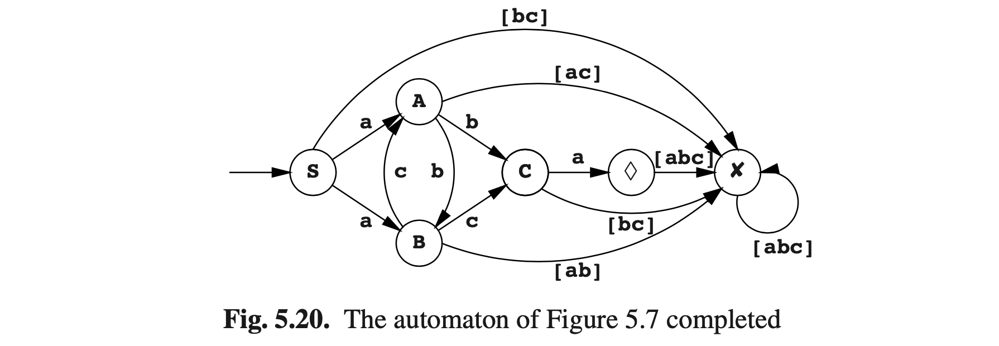
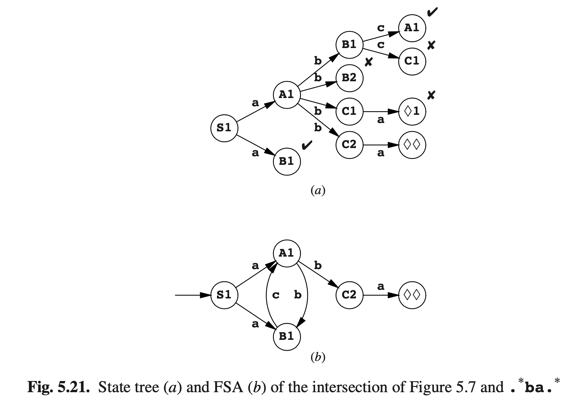

# 5.5 常规语言的操作

在第2.10节中，我们讨论了CF语言上的操作“union”，“intersection”，“negation”，并发现后面两种并不一定会产生CF语言。对于常规语言来说，情况更简单：这些常规语言的操作集合都可以得到常规语言。

为FS自动机*A1*和*A2*定义的两个联合常规语言创建一个FS自动机很简单：只需要创建一个新的起始状态，并将ε转换从该状态添加到*A1*和*A2*的起始状态。如果需要ε转换可以去掉，如5.3.1所述。

有一个有趣的方法来获取由FS自动机定义的常规语言*L*的反面（补充），前提是自动机是非ε的。当自动机是非ε时，其中的每个状态*t*都直接显示令牌集*Ct*，其中使自动机状态为*t*的输入可以继续：*Ct*是*t*的传出转换的令牌集。这意味着如果字符串继续带有不再*Ct*中的令牌，那么这个字符串不再*L*中，因此我们得出结论此字符串为*¬L*。现在我们可以通过在所有不在*Ct*中的令牌上添加传出箭头（并将这些箭头引导到非接受状态，我们称之为*s-1*）来完成状态*t*。如果我们对自动机（包括*s-1*）的所有状态都进行这样的补全，我们将获得一个完全自动机，即所有转换都定义好了的自动机。

图Fig5.7的自动机的完整版本如图Fig5.20所示，其中非接受状态标记为✘。

一个完整的自动机的重要性在于它永远不会在卡在任何（有限的）输入字符串上。对于属于自动机语言*L*的字符串，它以可接受状态结束；对于不属于自动机语言的字符串，它以非接受状态结束。这就建议获取*L*的一个自动机补全（反向）：交换可接受状态和非可接受状态，通过让可接受状态变为不可接受，非接受状态变为可接受来完成。

注意，补全自动机已经破坏了它的异常检测属性，因为它不会拒绝一个首字符有问题的输入字符串，然后在完成所有的操作后在返回。

补全过程要求自动机是非ε的。通过其确定性，这很容易实现，如第145页所述，但可能有些过度了。有关仅删除ε转换，请见问题5.4。

现在我们有了FSA的反向自动机，构建两个FSA的交集似乎很容易：只要联合两个自动机，取交集的结果在取非即可，适用摩根定律*p ∩ q = ¬((¬ p) ∪ (¬q))*。但有一个问题。只有当自动机是非ε的，并且取交集过程中将两个ε转换处于非常特殊的位置时，取交集才是容易的，这使得这种方法并不是很让人喜欢。

好在构建两个FS自动机的交集可以避免这些问题：同时运行两个自动机，在一个新状态下同时追踪两个自动机的状态。例如，我们会将图Fig5.7的自动机*A1*和一个FSA *A2*（要求输入包含序列 **. *ba. *** ）取交集。它需要3个状态，我们称之为1（起始态），2和♦（接受态）；他有以下转换：**$$1\overset{[abc]}{\rightarrow}1$$**，**$$1\overset{b}{\rightarrow}2$$**，**$$2\overset{a}{\rightarrow}\lozenge$$**，**$$\lozenge \overset{[abc]}{\rightarrow}\lozenge$$**。

我们在组合状态**S1**中取自动机*A1*和*A2*的交集*A1 ∩ A2*，**S1**状态由*A1*的起始态**S**和*A2*的起始态**1**组成。对于*A1*中每一个 *$$P_{1}\overset{t}{\rightarrow}Q_{1}$$*转换，和*A2*中每一个 *$$P_{2}\overset{t}{\rightarrow}Q_{2}$$*转换，在*A1 ∩ A2*中我们创造了一种新的转换 *$$(P_{1}P_{2})\overset{t}{\rightarrow}(Q_{1}Q_{2})$$* 。这为我们带来了图Fig5.21（a）的状态树；对应的FSA见（b）。可以看到它与图Fig5.7的类似，除了缺少了 **$$B\overset{t}{\rightarrow}C$$**：由于要求字符串包含**ba**序列因此删除了它。

原则上，FSA与*n*种状态的交集和与*m*种状态的交集，可能需要*n × m*种状态，但实际上像*c × (n + m)*这种，通常当*c*值较小时其才相等。

相反，一个复杂的FSA可以拆分为两个简单FSA的交集，这需要更大的内存，但有时也不能进行拆分。但不幸的是鲜有关于如何进行拆分的论文，只有一些思考：参见问题5.7。这个过程也称为“分解（factorization）”，但这也意味着一些问题，由于它表示我们找到的分解因子具有相同的特性，因此这意味着FSA的分解并不唯一。