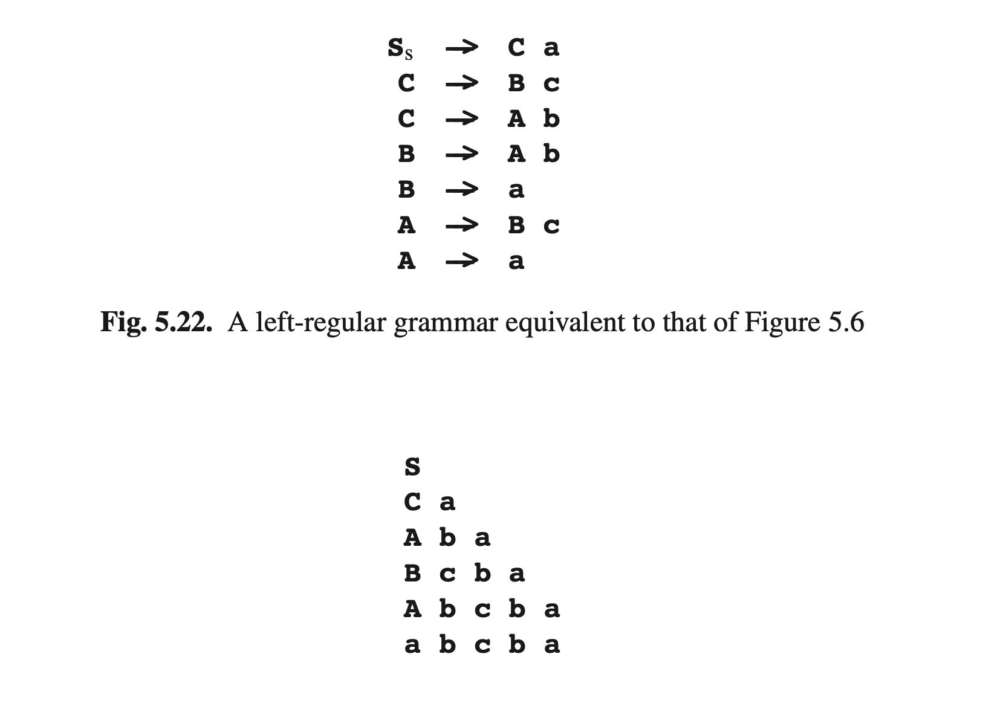
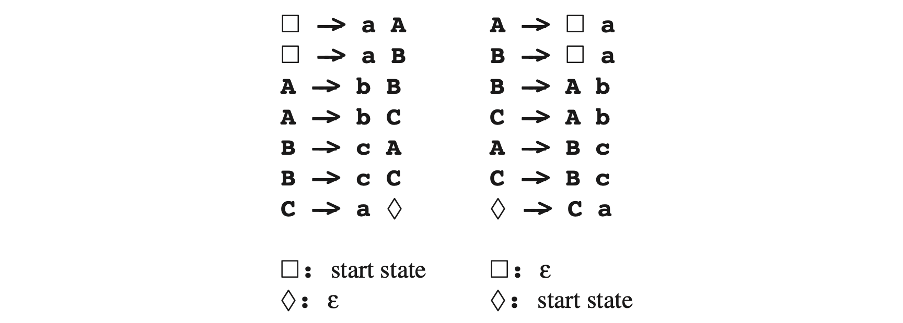

# 5.6 左常规语言

在左常规语法中，所有规则都是*A→a*或*A→Ba*（其中*a*非终结符，*A*和*B*为非终结符）形式。图Fig5.22给出了与图Fig5.6等效的左常规语法。

左常规语法经常被作为右常规语法的变体放在一边，但不论是形式还是给人的感觉都是截然不同的。例如，从语法中生成一个字符串。假设我们要生成5.3节中的句子**abcba**。为此，我们首先需要确定即将访问的所有状态，并且只有当最后一个状态也确定之后，才能生成第一个令牌：

一旦第一个令牌可用了，那么其他都可以了，并且我们也不再有别的选择了；这与右常规语法的生成过程大相径庭。

解析左常规语法同样很奇特。很容易看到，我们有了所有状态的集合 **{S,A,B,C}**，但如果我们看到在输入中有一个**a**，我们可以在两个规则**B->a**和**A->a**中互移**a**。假设我们使用规则**A->a**；我们将会处于什么状态呢？规则不指定除**A**以外的任何状态；那这样的移动有什么作用呢？

简单的方法是将语法转换为右常规语法（见下文），但尝试寻找**A->a**中移动**a**的意义也是非常有意思的。在这样一个操作之后我们唯一知道的就是，我们刚刚完成了**A**的生成，因此我们所处的状态可以描述为“A完成”；我们将这种状态写作**Af**。同样的，图Fig5.22的第一条规则表示，我们处于状态**Cf**并移动**a**时，我们的状态会是**Sf**；这就是一个转换**Cf$$\overset{a}{\rightarrow}$$Sf**。然后我们就知道“S完成”意味着我们已经解析了**S**的一个完整生成；因此状态**Sf**就是可接受状态♦，我们可以在图Fig5.7看到最右侧转换。

现在，我们看到规则*A → Bt*对应于转换*Bf$$\overset{t}{\rightarrow}$$Af*，规则*SS→Bt*对应*Bf$$\overset{t}{\rightarrow}\lozenge$$*，那*A → t*形式的规则呢？结束*t*的转换之后，我们就处于状态*Af*，但我们是从哪开始的呢？答案是我们还没看到任何一个终结符产生，因此我们处于状态*εf*，这就是起始符号！因此规则**A->a**和**B->a**对应的转换是 *εf$$\overset{**a**}{\rightarrow}$$**A**f* 和 *εf$$\overset{**a**}{\rightarrow}$$**B**f* ，图Fig5.7的另外两个部分。接下来我们通过修改状态名称，继续快速重建图Fig5.7的转换图：

这暴露的初始状态和可接受状态之间的不对称，与初始状态不同，可接受状态对应于语法中的一个符号。这种不对称，可以通过替换为一个更中性的符号部分消除，例如$$\square$$。然后我们就获得了下面介于左正则和右正则之间的语法：

从左正则语法中获取一个正则表达式很简单：5.4.2节中的大多数算法都可以在最小代价下被接管。只需要将转换方式由递归变成重复：

必须被替换为：

其中β'由所有α的备选项组成，每个都附加上 *(R)∗* 。这是因为**A->aA|b**产生**a* b**，而**A->Aa|b**产生**ba* **。