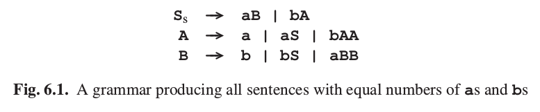
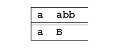

# 6.1 模仿最左推导

现在让我们用一个例子解释这样一个推导过程。考虑图6.1所示语法。这个语法生成所有有相同数量a和b的句子。

让我们从开始符号S开始尝试解析句子aabb。S是我们的第一个预测.我们的预测的第一个符号是非终结符，所以我们要用它的一个右侧替代它。在这个语法中，S有两个选择：我们或者用规则S&rarr;aB，或者用规则S&rarr;bA.句子从a开始而不是b，所以这里我们不能用第二个规则。应用第一个规则我们得到预测aB.现在预测的第一个自符是一个终结符。这里，我们没有选择：

我们要将这个字符和句子的当前字符匹配，这里当前字符也是a。所以匹配，接受a。这留给我们预测B和剩余的句子：abb。预测的第一个字符又是一个非终结符，所以要被它的一个右侧代替。现在我们有三种选择。然而，第一和第二个选择在这里不适用，因为它们由b开始，但我们需要a。所以，我们采用第三个选择，现在我们有了预测aBB：

我们再一次匹配了当前的输入字符，所以我们接受它，然后继续从预测BB去匹配bb。我们要再次将最左的B用它的右侧替代。句子的下一个字符是b，所以第三个选择不是用。这仍然留给我们两个选择：b和bS.所以我们可以两个都尝试，或者用一点更聪明的方法。如果我们采用bS,我们会得到至少一个a（因为s），所以这不可能是正确的选择。因此我们选择b，于是得到了对应bb的预测bB。我们再次得到了一个匹配结果，这留给我们预测B和句子b。由于同样的原因，我们选择b。匹配之后，我们的预测为空。幸运的是，我们同时到达了输入句子的末尾，所以我们接受这个句子。如果我们记录下了使用过的产生式，就能得到下面的推导过错：
    
S&rarr;aB&rarr;aaBB&rarr;aabB&rarr;aabb

图6.2用树的形式展现了解析的步骤。图中的虚线将已经处理过的部分和未处理部分分开。每个图中，预测部分最左边的符号被处理。
这个例子显示了本章讨论的解析器的几个共同点：

- 我们总是对预测中的最左符号进行处理
- 如果这个符号是终结符，我们没有选择：它和当前的输入字符匹配或者解析失败

- 如果这个符号是非终结符，我们需要做出一个预测：它需要被它的一个右侧替代。因此，我们总是先处理预测中的最左符号，从而得到了最左推导。
- 因此，自顶向下方法将解析树的节点用前序组织：父节点在它的儿子之前被识别。
