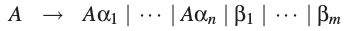
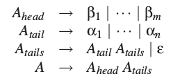
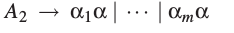

# 6.4 消除左递归

我们先讨论消除直接左递归的方法。假定&epsilon;-规则和单元规则（unit rule）已经被消除了（见4.2.3.1和4.2.3.2）。现在，令A是一个左递归的非终结符（原文为rule），并且

是A的所有规则。没有等于&epsilon;的&alpha;i，否则我们会有A&rarr;A，一个单元规则。也没有等于&epsilon;的&beta;j，否则会有一个&epsilon;-规则。A只用A&rarr;A&alpha;k规则生成的句型有这样的形式：

并且当A&rarr;&beta;i规则使用时，句型不再以A开头，对一些i，和一些k1,...,kj,它有如下的形式：

这里j可能为0.同样的句型可以被如下规则生成：

或者，使得没有新的&epsilon;规则重新生成的话：

这里Ahead,Atail和Atails是新引入的非终结符。没有&alpha;i是&epsilon;，所以Atail不会推导出&epsilon;，所以Atails不是左递归。A可能仍然是左递归的，但不是直接左递归，因为没有&beta;j以A开始。然而，它们可能推导出以A开始的句型。
一般的，消除间接左递归要更复杂。思路就是先将非终结符标号，标为A1,A2,...,An.现在，对一个左递归非终结符A，有一个推导

，每时每刻句型的最左边都是非终结符，然后再三地用它的一个右侧替代。每一个非终结符都有一个标号，写作i1,i2,...,im,于是在推导中我们得到了这么一串数：i1,i2,...,im,i1.现在，如果我们没有任何Ai&rarr;Aj&alpha;(j&le;i),这是就不可能的，因为i1&lt;i2&lt;&dots;&lt;im&lt;i1是不可能的。
现在就要消除这样的规则。我们从A1开始。对A1，要消除了只是直接递归的规则，我们已经看到了应该怎么做。接着轮到A2。每一个有着A2&rarr;A1&alpha;形式的产生式都要被替代成

这里A1的规则为

这不可能产生A2&rarr;A1&gamma;形式的新规则，因为我们已经消除了A1的左递归规则，而且&alpha;i都不为&epsilon;。接着，我们消除A2的直接递归规则。这样对A2的工作就结束了。类似的，我们对A3到An进行处理，按照总是先替代Ai&rarr;A1&gamma;,再Ai&rarr;A2&delta;等等的顺序。我们必须按照这样的顺序，因为，比如替换一个Ai&rarr;A2&delta;的规则会引入Ai&rarr;A3&gamma;这样的规则，而不会是Ai&rarr;A1&alpha;
