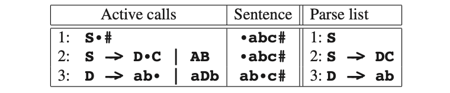

# 6.6.1 一个纯粹的方式

As a first approach, we regard a grammar rule as a procedure for recognizing its left-hand side. A rule like

S -> aB | bA

is regarded as a procedure to recognize an S. This procedure then states somethinglike the following:

S succeeds if

a succeeds and then B succeeds

or else

b succeeds and then A succeeds

This does not differ much from the grammar rule, but it does not look like a piece of program either. Like a cookbook recipe, which usually does not tell us that we must peel the potatoes, let alone how to do that, the procedure is incomplete.

There are several bits of information that we must maintain when carrying out such a procedure. First, there is the notion of a “current position” in the rule. This current position indicates what must be tried next. When we implement rules as procedures, this current position is maintained automatically, by the program counter, which tells us where we are within a procedure. Next, there is the input sentence itself. When implementing a backtracking parser, we usually keep the input sentence in a global array, with one element for each symbol in the sentence. The array must be global, because it contains information that must be accessible equally easily from all procedures.

Then there is the notion of a current position in the input sentence. When the current position in the rule indicates a terminal symbol, and this symbol corresponds to the symbol at the current position in the input sentence, both current positions will be advanced one position. The current position in the input sentence is also global information. We will therefore maintain this position in a global variable. Also, when starting a rule we must remember the current position in the input sentence, because we need it for the “or else” clauses. These must all be started at the same position in the input sentence. For example, starting with the rule for S of the grammar in Figure 6.1, suppose that the a matches the symbol at the current position of the input sentence. The current position is advanced and then B is tried. For B, we have a rule similar to that of S. Now suppose that B fails. We then have to try the next choice for S, and back up the position in the input sentence to what it was when we started the rule for S. This is backtracking, just as we have seen it earlier.

All this tells us how to deal with the procedure for one rule. However, usually we are dealing with a grammar that has more than one non-terminal, so there will be more than one rule. When we arrive at a non-terminal in a procedure for a rule, we have to call the procedure for that non-terminal, and, if it succeeds, return to the current invocation and continue there. We achieve this automatically by using the procedure-call mechanism of the implementation language.

Another detail that we have not covered yet is that we have to remember the grammar rules that we use. If we do not remember them, we will not know afterwards how the sentence was derived. Therefore we note them in a separate list, the “Parse list”, striking them out when they fail. Each procedure must keep its own copy of the index in this list, again because we need it for the “or else ” clauses: if a choice fails, all choices that have been made after the choice now failing must be discarded.

And the last detail to be filled in concerns the way the parser is started: by calling the procedure for the start symbol. When that procedure succeeds and the next sym- bol in the input is the end marker, the grammar rules left in the Parse list represent a leftmost derivation of the sentence.

Now let us see how a parser, as described above, works for an example. Let us consider again the grammar of Figure 6.6, and input sentence abc. We start with a call of S followed by a check for #, the input extended with #, and a Parse list consisting of just a node for S.

Our administration is divided into three parts. The “Active calls” part shows the active procedure calls, with a dot (•) indicating the current position within each call. The bottom rule in this part is the currently active procedure. The “Sentence” part indicates the sentence, including a position marker indicating the current position in the sentence. The “Parse list” will be used to remember the rules that we use (not only the currently active ones). The entries in this list are numbered, and each entry in the “Active calls” part also contains its index in the Parse list. As we shall see later, this is needed to back up after having taken a wrong choice.

Initially there is only one possibility: the current position in the active call indi- cates that we must invoke the procedure for S, so let us do so:

Notice that we have advanced the position in the call of S. It now indicates where we have to continue when we are finished with S: the dot represents the return address. Now we try the first alternative for S. There is a choice here, so the current position in the input sentence is saved. We have not made this explicit in the pictures, because this position is already present in the “Sentence” part of the entry that invoked S.

Now the first choice for D is tried. The a succeeds, and next the b also succeeds, so we get:

Now we are at the end of a choice for D. This means that the procedure for D succeeds and returns. We remove the entry from the list of active calls, after updating the current positions in the entry above. Next, it is C’s turn to be called:

Now the c succeeds, so the C succeeds, and then the S also succeeds:

Now the #s match, so we have found a parsing and the Parse list part represents a leftmost derivation of the sentence:

S -> DC -> abC -> abc

This method is called recursive descent, “descent” because it operates top-down, and “recursive” because each non-terminal is implemented as a procedure that can directly or indirectly (through other procedures) invoke itself. It should be stressed that “recursive descent” is merely an implementation issue, albeit an important one.It should also be stressed that the parser described above is a backtracking parser, independent of the implementation method used. Backtracking is a property of the parsing method, not of the implementation.

The backtracking method developed above is esthetically pleasing, because we in fact use the grammar itself as a program; we can actually transform the grammar rules into procedures mechanically, as we shall see below. There is only one problem: the recursive descent method, as described above, does not always work! We already know that it does not work for left-recursive grammars, but the problem is worse than that. For example, aabc and abcc are sentences that are not recognized, but should be. Parsing of the aabc sentence gets stuck after the first a, and parsing of the abcc sentence gets stuck after the first c. Yet, aabc can be derived as follows:

S -> AB -> aAB -> aaB -> aabc 

and abcc can be derived with

S -> DC -> abC -> abcC -> abcc

So let us examine why our method fails. A little investigation shows that we never try the A->aA choice when parsing aabc, because the A->a choice succeeds. Likewise we never try C->cD when parsing abcc, because C->c succeeds. Such a problem arises whenever more than one right-hand side can succeed, and this is the case whenever a right-hand side can derive a prefix of a string derivable from another right-hand side of the same non-terminal. The method developed so far is too optimistic, in that it assumes that if a choice succeeds, it must be the right choice. It does not allow us to backtrack over such a choice, when it was the wrong one. This is a particularly serious problem if the grammar has ε-rules, because ε-rules always succeed. Another consequence of being unable to backtrack over a succeeding choice is that it does not allow us to get all parses when there is more than one (this is possible for ambiguous grammars).

Improvement is certainly needed here. Our criterion for determining whether a choice is the right one clearly is wrong. Looking back at the backtracking parser of the beginning of this section, we see that that parser does not have this problem, because it does not evaluate choices independently of their context. One can only decide that a choice is the right one if taking it results in a successful parse; even if the choice ultimately succeeds, we have to try the other choices as well if we want all parses. In the next section, we will develop a recursive-descent parser which solves all the problems mentioned above.

Meanwhile, the method above only works for grammars that are prefix-free. A non-terminal A is prefix-free if it does not produce two different strings x and y such that one is a prefix of the other. And a grammar is prefix-free if all its non-terminals are prefix-free. For the above algorithm this means that an attempt to recognize A in a given position in the input string can never succeed in more than one way, so if the first recognition is rejected later on, there is no need to go back and try another recognition because there will not be one.
