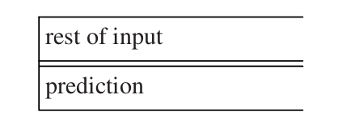

# 6 有向自顶向下解析

在这一章中，我们将要讨论用预测尝试重新推导出输入句子的自顶向下解析方法。正如3.2.1中解释的那样，我们从开始符号开始，尝试从它产生输入句子；在每一时刻，我们有一个句型代表我们对剩余输入句子的预测。将预测写在它所预测的输入句子的那部分正下面会很方便，左端对齐，就像我们在图3.5中做的那样：

这种句型由终结符和非终结符组成。如果是一个终结符在最前面，我们将它跟当前的输入字符匹配。如果是一个非终结符在最前面，我们选择它的右侧中的一个，用它替换该非终结符。这样，我们总是替换掉最左的非终结符，最后，如果成功了的话，我们就模仿了最左推导。注意，预测部分跟做最左推导时句型的开放部分是对应的，就像5.1.1讨论的那样。
