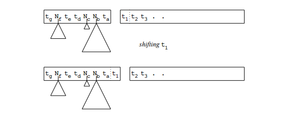
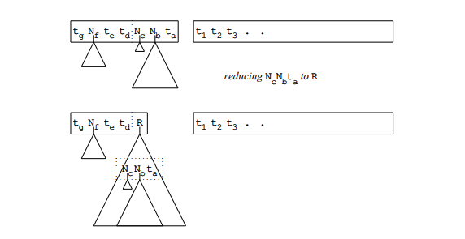

# 通常自下而上的解析
正如3.3.2节所述，自下而上的解析在概念上非常简单。在任何时候，我们有一系列句式，它通过一系列最左缩小（它反映了最右推断）的输入文本而来。在这个句式中有一个切口，将已经缩小的部分（左边）与尚未检查的部分（右边）分开。如Figure 7.1，左边的部分称为“堆栈”（Stack），右边的部分称为“剩余的输入”。后者仅包含终结符，因为它是原始句子未处理的部分，然而堆栈包含终结符和非终结符，由已经识别的右端产生。我们可以通过保留依靠于它们非终结符的缩小而创建的部分语法树来完成图片。现在，所有原始输入中的终结符依然存在；堆栈中的终结符是他们中的一部分，另一部分半隐藏在部分语法树中，其余部分在剩余的输入中没有改动。没有丢失信息，但是一些结构已经添加。当自下而上的解析器已经达到剩余的输入部分为空并且堆栈中仅仅包含起始符的情况，我们已经实现了解析并且解析树将会从起始符被悬空。这个观点清晰的解释了解析只不过是构建输入而已的理念。

Figure 7.1 自下而上解析的结构

为清晰起见，堆栈和剩余的输入之间的切口常常被绘画为间隔，然而在实际的实现中，二者在解析器中通常表现的大不相同。  

Figure 7.2 自下而上的自动机中按位移动

Figure 7.3 自下而上的自动机中缩小移动

我们的非确定性自下而上自动机只能做两件事：移位和缩小；看Figures 7.2和7.3，移位时，一个（终结）符号从剩余的输入中移动到了堆栈中。t1在Figure 7.2中被移动.缩小移动时，一些堆栈右侧底部的符号,它们形成非终结符规则的右侧，被那些非终结符替代并作为部分解析树附加到那些符上。在Figure 7.3中NcNbNa被缩小为R。注意，原始的NcNbNa仍然存在于部分解析树中。原则上，向后执行指令是没有坏处的，不移位和不缩小，尽管他们似乎将我们从我们的目标中移出，这会获得一个解析树。我们应该看到我们需要它们来进行回溯。在任何时间点，机器可以移动（如果有符号输入的话）或者不移动，或者进行一次或多次缩小，这取决于多少可以被识别的右侧。如果它不可做其中之一，让将不得不采取回溯移动，来找到其他的可能性。如果甚至不可以进行回溯，那就是完成了，已经找到了所有的（0或多个）解析。
