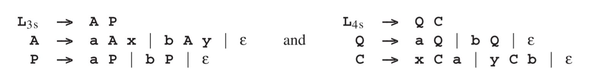

# 2.10 设定上下文无关和正则语言的属性

由于语言是集合，所以很自然会问到集合的标准操作——并集、交集和补集（补充）——是否能用在语言上，如果可以，要怎么做。

*S1*和*S2*的并集包含两两个集合中的全部元素；写作*S1*∪*S2*。交集包含了两个集合中的共同元素；写作*S1*∩*S2*。*S*的补集包含了属于Σ*但不属于*S*的元素；写作*$$\rightharpoondown$$S*。在形式语言的上下文中，这些集合是通过语法定义的，所以实际上我们是想要对语法进行操作，而不是语言。

为两种语言的并集构建语法，对上下文无关和正则语言来说是繁琐的（实际上对所有Chomsky类型都是）：仅仅构建一个新的起始符号*S'→S1|S2*，*S1*和*S2*是描述两种语言的语法的起始符号。（当然，如果我们想结合两种语言成为一种新的，那我们必须确保他们之中的名字是不同的，不过这是很容易的事情。）

然而交集是另一回事，因为两个上下文无关语言的交集并不一定是上下文无关的，如以下示例所示。有两个语言***L1 = anbncm***和***L2 = ambncn***，他们由CF语言描述

当我们拿到一个同时属于两个语言的字符串放入交集时，就有了**apbqcr**这种形式，而由于*L1*和*L2*其中*p = q*以及*q = r*。所以交集中包含**anbncn**这样形式的字符串，而我们知道这样的语言不是上下文无关的（见2.7.1节）。

CF语言的交集有一些奇特的属性。第一，两个CF语言的交集总是有一个1型语法——但这个语法却不容易构建。更值得注意的是，三个CF语言的交集比两个的交集要强大的多：Liu 和 Weiner[390]表明，可以获得*k*个CF语言的交集，而不是*k-1*个。除此之外，任何1型语言，甚至任何0型语言，可以通过两个CF语言的交集来构建，我们就能擦除结果字符串中的所有属于*可擦除符号*集中的符号。

我们将用来演示这个惊人现象的CS语言，是由两个相同部分的句子组成的集合：*ww*，*w*是给定字符集中的任何字符串；例如**aa**和**abbababbab**。用来相交的两个语言由以下定义：

其中**x**和**y**是可擦出符号。第一个语法生成的字符串由三个部分组成，**a**和**b**的序列*A1*，其次是其“黑暗镜像”*M1*，**a**对应**x**，**b**对应**y**，再接着是**a**和**b**的一个任意序列*G1*。第二个语法生成的字符串包含，**a**和**b**的一个任意序列*G2*，一个“黑暗”序列*M2*以及它的镜像*A2*，其中再次**a**对应**x**，**b**对应**y**。交集强制*A1 =G2, M1 =M2,and G1 =A2*。这使得*A2*成为了*A1*镜像的镜像，同理*A1*也是这样。交集中的一个句子示例如**abbabyxyyxabbab**，我们可以看到其镜像**abbab**和**yxyyx**。现在我们擦除可擦除符号**x**和**y**，就得到了最后的结果**abbababbab**。

通过使用应用上述镜像，就能够很简单的证明任何0型语言能够通过两个CF语言的交集，加上一组可擦除符号来构建了。详细介绍，见Révész [394]。

注意，一个上下文无关和一个正则语言的交集，一般都是一个上下文无关语言，并且，有一个相关的简单算法来为这个交集语言构建一个语法。这让非凡的解析算法得到了增长，浙江在13章进行讨论。

如果我们不能得到两个CF语言的交集，并且仍处于CF语言中，那我们肯定不能得到一个CF语言的补集并仍在CF语言中。如果我们能得到，我们就能得到两个语言的补集，让后取其交集然后在取其补集，最后就得到它们的补集。公式：*L1 ∩ L2 = $$\rightharpoondown$$(($$\rightharpoondown$$L1) ∪ ($$\rightharpoondown$$L2))*；这个公式就是大家熟知的De Morgan定律（De Morgan’s Law）。

在5.4节我们将会看到正则（3型）语言和正则语言的并集，交集和补集。

有趣的是推测一下将会有什么发送，如果形式语言是基于集合理论，一开始就使用所有的集合操作，而不是Chomsky层次理论。那么上下文无关语言还会被发明么？