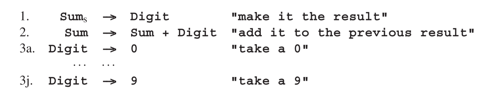

# 2.11.2 转导语法

转导语法将一个字符串（“输入字符串”）的语义定义为另一个字符串，“输出字符串”，而不是起始符号的最终属性：

这种方法没那么强大，但比起属性语法却更简单并且也够用了。生成规则中的语义子句只是应该在对应节点输出的字符串。我们假设一个节点的字符串紧接着它所有子节点的字符串后输出。其他的变种是可能的并且很正常。我们现在可以编写一个转导语法，其将数字之和转换为计算机指令之和。

这个转导语法将**3+5+1**转换为：

这就是**3+5+1**真实的“意义”。