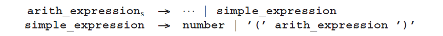
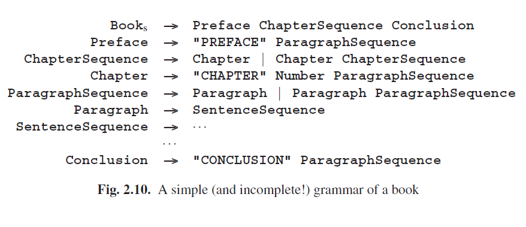
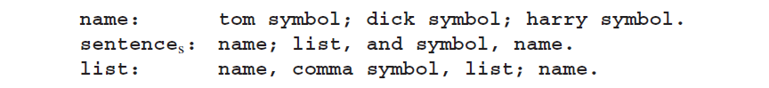
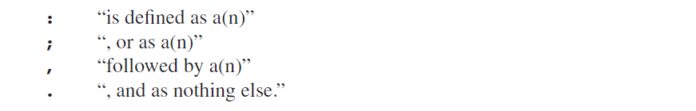
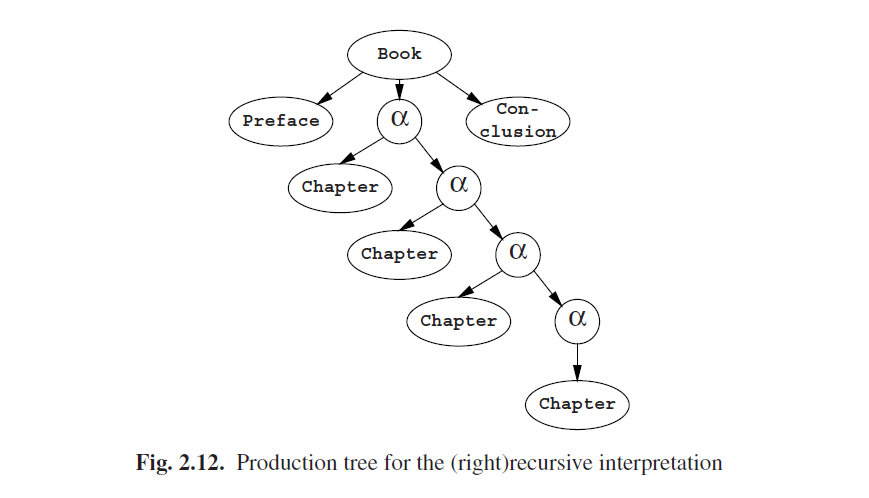

# 2.3.2 2型语法

2型语法被称为上下文无关语法（CF语法），其和上下文相关语法之间的关系如它们的名字所示。上下文无关语法和上下文相关语法是相似的，只是左侧和右侧的文字必须是空缺的（空的）。因此语法可能只包含一个规则，在其左侧只有一个非终结符。语法示例：

### 2.3.2.1 独立生成

由于左侧总是只有一个符号，生成图中的每个节点具有这样的属性，无论其生成什么都独立于其相邻节点的生成：非终结符的生成周期独立于其上下文。我们在图2.4，2.6，2.8中见到的星型结构不可能发生在上下文无关语法中，因此就会有一个纯粹的树形结构，其被称为*生成树*。示例如图2.9。

由于左侧只有一个符号，对于一个给定非终结符的所有右侧，可以放在同一个语法规则的集合中（在上述语法中我们已经做了），然后每个语法规则就像一个左侧的定义：

- 一个**Sentence**是后面接着**and**接着**Name**的**Name**或是**List**.
- 一个**List**是**Name**后面接着一个a，或接着**List**或是**Name**.

这显示了上下文无关语法构建字符串是经过了两个过程的：拼接（“...接着...”）和选择("要么...要么....")。除了这些过程在这里是识别机制，其链接了在右侧使用的非终结符的名字和定义规则（“...是一个...”）。

在这章节的开头，我们确定了一门语言作为字符串的一个集合，起始符号的终结符的生成物的集合。独立生成物的属性让我们可以把这个定义扩展到这个语法的任何非终结符上：每一个非终结符都生成一个集合、一门语言，独立于其他非终结符生成的。如果我们将A生成的字符串集合写作*L(A)*，而且A有两种可选的生成规则，*A → α|β*，那么*L(A) = L(α) $$\cup$$ L(β)*，*$$\cup$$*代表集合的并集运算符。这对应于上一段说到的选择。如果α由*PqR*三个字符组成，我们就有*L(α) = L(P) $$\circ$$ L(q) $$\circ$$ L(R)*，*$$\circ$$*代表字符串的串联运算符（实际上上集合中的字符串）。这对应于上一段说到的拼接。而*L(a)*中的a是终结符，属于集合{a}。语言中包含ε的非终结符被称为*空*。也可以说“生成空”。

注意，我们不能定义图Fig 2.7中Q的语言*L(Q)*：Q本身不能生成任何有意义的东西。为非起始符号定义语言只能在2型语法或更低级的语法上可能实现，将非起始的非终结符廷议为空也是一样的。

有关独立生成属性就是递归的概念。非终结符A是递归的，如果句子形式中的这个A可以生成再次包含A的东西。图Fig 2.9中的生成物开始于句子形式的Sentence，其使用了规则1.2来生成List和Name。下一步很可能是用Name,List来替换List，使用规则2.1。我们看到List生成了再次包含List的东西：

**Sentence ---> List and Name ---> Name , List and Name**

即List是递归的，尤其是，它是直接递归。非终结符A在**A--->Bc, B--->dA**中是间接递归的，不过这之间的差异并没有太多意义。

比之更重要的是List是右递归的：一个非终结符A是右递归的，如果它可以在右侧生成包含A的东西，则List为：

**List ---> Name , List**

同理，一个非终结符A是左递归的，如果它可以在左侧生成包含A的东西：我们就可以定义

**List ---> List , Name**

一个非终结符A是自嵌入的，有这样一个定义：如果A能在生成一个，左侧是α右侧是β中间依旧是A的东西。自嵌入描述了嵌套：α是进入另一层嵌套时生成的；β是结束这一层嵌套时生成的。嵌套最著名的例子是在算术表达式中括号的使用：

一个非终结符可以同时时左递归的和右递归的；它就是自嵌入的。**A--->Ab|cA|d**就是一个例子。

如果一个语法中没有非终结符时递归的，则每一个生成步骤使用一个非终结符，因为这个非终结符绝不会再次出现在这个**段**中。所以生成过程不可能无限持续，结果就产生了一个有限的语言。递归是语法生命周期所必须的。

### 2.3.2.2 一些例子

在现实世界中，很多事物是根据其他事物来定义的。上下文无关语法是一种非常简洁的方式来制定这种相互关系。一个最浅显的例子就是一本书的组成，如图Fig 2.10所示。

当然这是关于一本书的上下文无关描述，所以人们也可以期待其生成很多冠冕堂皇的废话，就像

不过至少可以保证结果能得到正确的结构。文档编制和文本标记系统，如SGML、HTML、XML使用这种方式来表达和控制文档的基本结构。

一个比较简短但相对重要的例子是，使所有电梯回到原始出发点的运动的语言（被限制在第五大道的Manhattan龟也会有一样的运动轨迹）

（我们假设电梯井使无限长的；第五大道也一样）。

如果我们忽略足够多的细节，我们也能认识到自然语言的句子中底层的上下文无关结构，例如英语：

英语中生成像这样的句子：

**the well-read cats criticize the wistful caterpillar**

然而，因为没有上下文被纳入，它也会生成不不正确的形式

**the cats admires the white well-read castle**

为了保持上下文我们需要使用短语结构语法（为了更简单的语言）：

标记Singular和Plural控制实际英文单词的生成。仍然，这个语法允许猫吠叫...。一种更好的控制上下文的方式，详见15章的各小节，尤其是Van Wijngaarde语法（15.2节）以及属性和词缀语法（15.3节）。

大部分的CF语法的列子来源于编程语言。这些语言（也就是程序）中的句子都必须自动处理（也就是，通过编译器），而且很快（大约1958年）人们就承认如果语言有一个良好定义的形式语法将会变得更容易。现今使用的所有编程语言的句法都是通过形式语言定义的。

一些作者（例如Chomsky）和一些解析算法，要求CF语法是单调的。CF规则为非单调的唯一方式是右侧为空。这一规则被称为*ε法则*，而不包含这类法则的语法被称为免ε。

免ε并不是一种限制，而只是一种妨碍。几乎任何一种CF语法都可以变成免ε的，通过ε法则的系统性替换；唯一的例外是一个语法的开头符号已经生成了ε。转换过程在4.2.3.1节有详细介绍，不过这里同时也介绍了其他很多语法的转换，而且不幸的是通常会破坏语法的结构。这个问题将在2.5节进一步讨论。

### 2.3.2.3 注释样式

编程语言中的CF语法有几种不同的注释样式，每个都有无尽的变形；不过它们的功能都是一样的。这里我们给出了两种主要形式。第一个是Backus-Naur形式(BNF)，最初用来定义ALGOL 60的。示例如下：

这个形式的主要属性是通过使用尖括号（<>）将非终结符括起来，"**::=**"来表示“可能生成”。在一些变形中，由分号结尾。

第二种样式是CF van Wijngaarden语法的。示例如下：

结尾符号用**...符号**；它们的表示是硬件依赖的而且不在语法中定义。规则都是正确终止的（以句点结束）。标点符号总是或多或少的按照传统方式使用；例如，逗号联结比分号要紧密。标点符号如下：

上述语法的第二条规则应该读作：“一个sentence被定义为一个name或一个list，其后跟着一个and-symbol然后跟着一个name，除此没有别的了。”虽然这种表达方式仅只在适用于两级Van Wijngaarden语法时能得到最大展现，它依旧有自己的优点：它非常正式且可读性很强。

### 2.3.2.4 CF语法扩展

CF语法通常是既比较紧凑又可读性较高的，通过为频繁使用的结构引入特殊的短项。如果我们回到图 2.10中的书本结构语法，将会看到类似下面这种规则频繁出现：

**SomethingSequence ---> Something | Something SomethingSequence**

 在上下文无关语法的扩展中，我们可以用**Something+**来表示“one or more **Something**”，而且我们不需要专门给出**Something+**的规则；于是有了下面的隐式显示：

**Something+ ---> Something | Something Something+**

同样，我们可以用**Something***来表示“零个或多个Somethings”，以及**Something?**来表示“零个或一个**Something**”（也就是说，可选择的**Something**）。这些例子中，符号+,*和?要与前面的符号一起起作用。它们的范围可以扩展，通过括号：**(Something ;)?**来表示“选择一个Something-followed-by-a-;”。这些措施非常有用并且让书本结构的语法可以更高效的写出来（图Fig 2.11）。有一些样式甚至允许**Something+4**这样的结构，用以表示“一个或不超过4个的Somethings”，或者是**Something+,**来表示“一个或多个通过逗号分隔的Somethings”；这似乎可以作为把一件好事做过头的例子。这种表示法被称为BNF扩展（EBNF）。

EBNF语法扩展不会增加其表现力：所有隐式规则都可以变成显式，结果得到一个BNF的正常CF语法注释。它们的力量在于其用户友好性。X*的星号表示“一连串的零个或多个*X*”，其被称为Kleene星号。如果X是一个集合，那X*应该表示“一连串的零个或多个元素X”；这与我们在2.1.3.3节中提到的Σ*中的星号一样。涉及到重复运算符*,+或者?以及分隔运算符 **(** 和 **)** 的运算形式被称为*正则表达式*。右侧拥有正则表达式的EBNF，就是其偶尔被称为右侧正则语法*RRP语法*（regular right part grammar）的原因，这个称呼比“上下文无关语法扩展”要更具表现性，不过也有人说这个名称有点像绕口令。

关于RRP语法的结构意义有两个不同的思想流派。一个流派主张规则应该是这样的：

**Book ---> Preface Chapter+ Conclusion**

上述应该是下面的缩写：

**Book ---> Preface α Conclusion**
**α ---> Chapter | Chapter α**

这是“（右）递归”的解释。它的优点是易于解释而且转换到“正则”CF语法很简单。缺点是转化过程包含了隐式规则（用α表示）而且，例如一本有四章的书的不平衡生成树不对应于我们关于这本书的结构的本来想法；见图Fig 2.12。

第二种流派主张

**Book ---> Preface Chapter+ Conclusion**

上述是下面的缩写：

这是“迭代”的解释。它的优点是能产生一个优美的生成树（图Fig 2.13），但是缺点是它涉及到了无限多的生成规则而且生成树的节点有着变化的fan-out。

因为迭代解释的实施是不会妄自菲薄的，最具实用性的解析生成器在一些时候使用递归解释，然而大多数研究都是关于迭代解释的。

