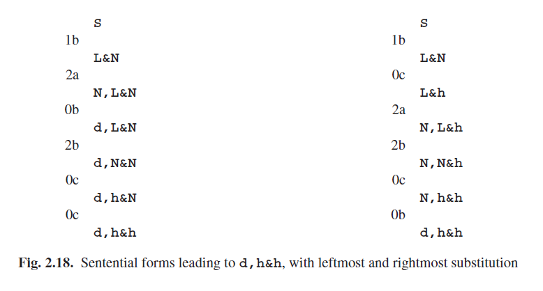
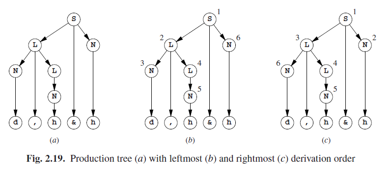

# 2.4.3 CF案例

当我们通过CF语法生成句子时，很多事情都简单很多。虽然我们的语法可能永远不会生成句子依旧有可能发生，不过我们现在可以事先进行检测，如下。首先，扫描语法以找出所有的非终结符，其对应右侧拥有终结符或为空的。这些非终结符确保能生成东西。现在再次扫描找到对应右侧只有唯一终结符的非终结符，这些非终结符确保能生成东西。这将给我们新的保证能生成东西的非终结符。重复这个过程直到不在有新的非终结符产生。如果按这种方式始终找不到起始符号，那这个语法将不会生成什么了。

此外我们已经看到如果语法是CF形式的，我们就能每次重写最左侧的非终结符（直到我们重写了所有的可选项）。当然我们也可以一直重写最右侧的非终结符。这种方法类似但也有不同。通过下面的语法：

让我们跟随句子形式历险，而这将最终导致**d,h&h**。虽然这将经历几次生成队列，但我们在这里只描述对它做了哪些改变。图Fig 2.18展示了句子形式最左侧或最右侧的替换，根据涉及到的规则和备选项；例如（1b）表示规则1备选项b，第二个备选项。

生成规则使用的序列与我们所期望的不同。当然在总体上，相同的规则和替代方案也是适用的，但序列既不相等也不是彼此的镜像，也没有其他什么关系。两个序列都定义了同一个生成树（图Fig 2.19（a）），但如果我们按重写的顺序对其中的非终结符进行编号，我们将得到不同的数字，如图（b）和（c）所示。

在最左侧重写中使用的生成规则序列，被称为句子的*最左侧派生（leftmost derivation）*。我们不必说明哪个位置必须适用规则，也不需要给出其规则编号。只是另一种选择就足够了；位置和非终结符是隐式的。*最右边派生（rightmost derivation）*是以类似的方式定义的。

最左侧的生成步骤可以用一个标记了小写*l*的箭头来表示：**N,L&N $$\underset{l}{\rightarrow}$$ d,L&N**，以及最左侧的生成序列：

**S $$\underset{l}{\rightarrow}$$ L&N $$\underset{l}{\rightarrow}$$ N,L&N $$\underset{l}{\rightarrow}$$ d,L&N $$\underset{l}{\rightarrow}$$ d,N&N $$\underset{l}{\rightarrow}$$ d,h&N $$\underset{l}{\rightarrow}$$ d,h&h**

可以缩写为 **S $$\xrightarrow[l ]{*}$$d,h&h**。同样，最右侧生成序列：

**S $$\underset{r}{\rightarrow}$$ L&N $$\underset{r}{\rightarrow}$$ L&h $$\underset{r}{\rightarrow}$$ N,L&h $$\underset{r}{\rightarrow}$$ N,N&h $$\underset{r}{\rightarrow}$$ N,h&h $$\underset{r}{\rightarrow}$$ d,h&h**

可以缩写为 **S $$\xrightarrow[r ]{ * }$$d,h&h**。实际上**S**以任何方式生成**d,h&h**被写成**S$$\overset{ * }{\rightarrow}$$d,h&h**。

解析的任务是为一个给定字符串重建推导树（或图）。一些非常有效率的解析技术可以被更容易的理解，如果将之视为试图重建输入语句的最左或最右推导过程的话；然后解析树就自动生成了。这就是为什么“[ 最左|最右 ]推导（[ left|right ]-most derivation）”概念在本书中频繁出现的原因（请注意此处使用的FC语法）。