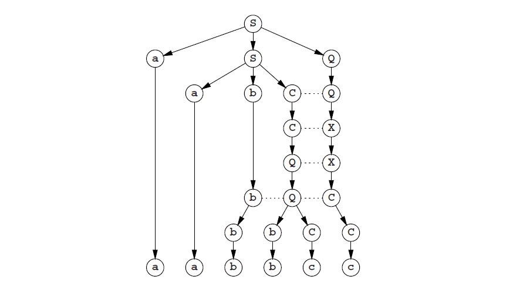
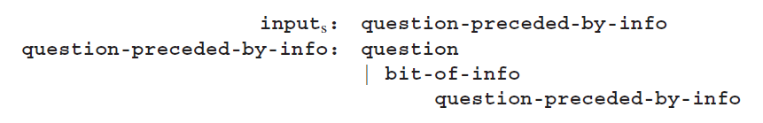
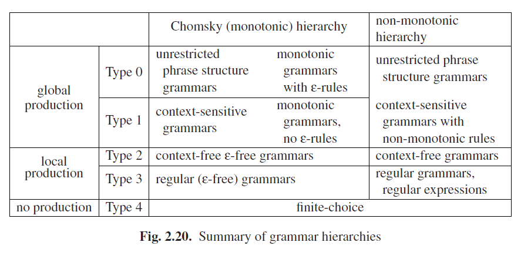

# 2.5 收敛或不收敛

在前面的段落中，关于是否一个规则的右侧要比其左侧简短，有时我们很明确但有时我们又是含糊不清的。0型规则应该说肯定是收敛的类型，而单调型规则肯定不是，2型和3型只有在生成空集（ε）时才是收敛的；这些都是肯定的。

原始Chomsky层次结构（Chomsky[385]）在这个问题上非常坚定：只有0型规则才能使句子形式收敛。1型、2型和3型规则都是单调的。此外1型规则必须使上下文相关类型，这意味着左侧非终结符的只有一个是被允许替换的（且不由ε替换）。这带来了一个合适的层次，使得每一层都是其父集的一个合适子集，以及使除了0型语法外的所有派生图实际上都是派生树。

作为一个例子，考虑一下图Fig 2.7中语言**anbncn**的语法：

它是单调的，但不是严格意义上的上下文相关。可以通过展开那烦人的规则3和为**c**引入一个非终结符来使其成为CS：

现在图Fig 2.8的生成图变成了一个生成树：

还有另一个理由回避ε规则：它让定理和解析器都变得更复杂，有时尤其复杂；例如9.5.4节。因此就出现了一个问题，我们到底是为什么要纠结ε规则呢；答案很简单因为这对语法作者和使用者来说十分方便。

如果有一个语言是使用ε规则的CF语法来描述的，而我们想要使用一个不含ε规则的语法来进行描述时，那这个语法将会是非常复杂的。假设我们有一个系统，可以输入比特信息，比如“Amsterdam is the capital of the Netherlands”，“Truffles are expensive”，那就会被问道一个问题了。在一个非常浅显的水平上，我们可以将其输入定义为：

**inputs: zero-or-more-bits-of-info question**

或者，以一种扩展的记法

**inputs: bit-of-info* question**

因为**zero-or-more-bits-of-info**将会生成空字符串，在其他字符串之间，至少在其语法中使用的规则之一是ε规则；在扩展记法中的 * 已经意味着ε规则了。 在使用者的角度来看，上述输入的定义很好的解释了这个问题，并且就是我们想要的。

任何试图为这个输入写ε规则，最终都会定义一个概念，包含后来的bits-of-info和问题一起（因为这个问题是唯一的非空部分，所以它必须出现在所有有关的规则中）。但是这个定义根本不是我们想要的，而且它是一个半成品：

随着语法变得越来越复杂，其是ε无关的要求就变得越来越令人讨厌：语法在和我们作对，而不是在为我们工作。

从理论角度来看这不成问题：任何CF语法都能被一个ε无关语法描述，并且ε规则在也不被需要。更妙的是任何带有ε规则的语法都能被转化为ε无关的语法，作为同一种语言。在以上示例中我们看到了这种转变，而算法详细将在4.2.3.1节讲述。但是我们付出的代价是，对任何语法的转换：这不在是我们的语法，并且它极少的反应原始结构。

底线是研究人员发现ε规则是一个有用的工具，并且除了通常的Chomsky层次结构外，是否存在非单调语法的层次结构，我们拭目以待。一个更大的扩展：2型和3型语法不需要是单调的（因为如果有需要，它们总是可以变成这样）；并且收敛的上下文相关语法总是等同于无限制的0型语法；而蕴含ε规则的单调语法总是等同于0型语法。系暗转我们可以把这两个层次画在一张图里面；见图Fig 2.20。将不同作用的语法类型用线条分隔。作用相同但理论上不同的语法用空格分隔。可以看到，如果我们坚持非单调性，那0型和1型的区别就消失了。

如果1型到3型语法本身包含空字符串，那就出现一个特殊的情况。这不能被纳入单调层次结构的语法中，因为其起始符号长度已经为1且没有单调规则能让它收敛。所以空字符串应该被重视作为语法的一个特殊属性。这样的问题不会出现在非单调层次结构中。

许多解析方法原则上只为ε无关语法工作：如果一个东西什么都不能产生，那你可能不太容易发现它是否在那。通常解析方法可以修改来控制ε规则，但这总是会增加方法的复杂度。这么说可能也是公平的，这本书将薄30%，如果ε规则不存在的话——不过，语法就要损失不止30%的价值了！
