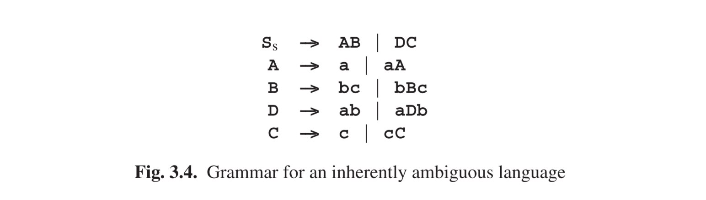

# 3.1.2 各种模糊性

一个语法产生的句子可以很容易拥有多于一个的生成树，既，很容易有多于一种的方式来生成一个句子。从形式角度来看，这不是大问题（一个集合不会计算它包含了一个元素多少次），但是只要我们对语义感兴趣，那这差别就很重要了。不足为奇的是，拥有多个生成树的的句子被称为模糊性，但是我们必须立即区分本质的模糊性和貌似的模糊性。差异来源于我们对生成树本身并不感兴趣的事实，而更感兴趣于它们所描述的语义。一个歧义句是貌似模糊性的，如果它的所有的生成树都描述同样的语义；如果部分语义不不同，其模糊性就是本质的。“模糊”的概念也可以用来定于语法：语法是本质模糊的如果它可以生成一个本质模糊的句子，是貌似模糊的如果它能生成一个貌似模糊的句子（但不是一个本质上模糊的），以及是非模糊性的如果都不能生成的话。一个语法的可能模糊性测试，间9.14节。

图Fig 3.1给出了一个简单的模糊性语法。注意规则2不同于图Fig 2.30中的。

现在**3+5+1**有了两个生成树（图Fig 3.2），但是两者的语义是一样的：9。模糊性是不确定的。然而如果我们把**+**变成**-**，那其模糊性就是本质的了，如图Fig 3.3。图Fig 2.30的非模糊性语法，当**+**变成**-**后，依旧是非模糊性，并且保持正确的语义。

奇怪的是，语言也可以是模糊性的：（上下文无关）语言，其语法没有非模糊性的。这样的语言是固有模糊性的。语言*L* = ***ambncn ∪ apbpcq***就是一个例子。*L*中的句子要么由一些**a**后接着一组嵌套的**b**和**c**的序列组成，要么由一些**c**后接着一组嵌套的**a**和**b**的序列组成。例句：**abcc**，**aabbc**，还有**aabbcc**；**abbc**是一个非句子例子。*L*由图Fig 3.4的语法生成。

直观的说，为什么*L*是模糊性的是相当清晰的：语法的任何可以生成**ambncn**的部分都无法避免生成**anbncn**，并且任何可以生成**apbpcq**的部分都无法避免生成**apbpcp**。所以无论我们做什么，与**a，b，c**数字相等的形式将总是会被生成两次。但真实的证明确实无法做到，这不是本书范围之内的东西了。