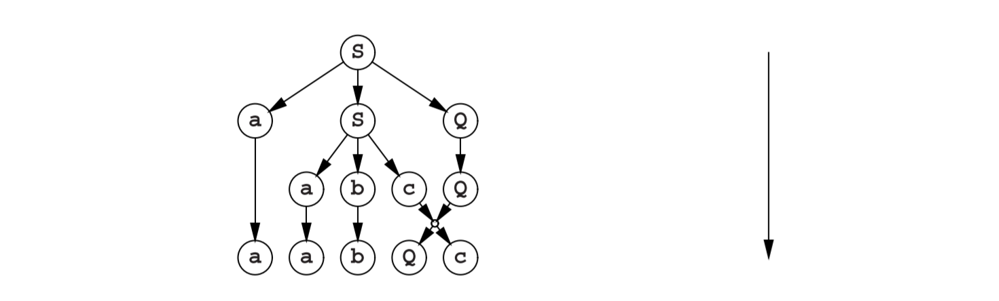
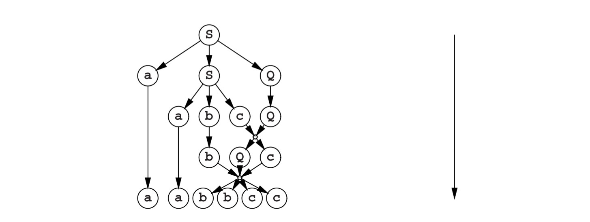

# 3.2.1 自顶向下解析

假设我们有图Fig 2.7中语言**anbncn**的单调语法，这里重新提一下：

并且假设（输入的）句子是**aabbcc**。首先我们尝试一些自顶向下解析方式。我们知道生成树必须从起始符号开始：

那现在第二步是什么？对于**S**我们有两个规则：**S--->aSQ**和**S--->abc**。第二个规则要求句子是从**ab**起始的，但这里不是的。这样就只剩**S--->aSQ**：

这为我们带来一个很好的解释，为句子中的第一个**a**。现在又有两个规则：**S--->aSQ**和**S--->abc**。一些反射将会揭示在这里第一个规则会是一个坏的选择：**S**的所有生成规则都起始于**a**，并且如果我们能推进到阶段**aaSQQ**，下一步就不可避免的导致**aaa**...，这与输入相矛盾。然而第二个规则，也不是没有问题的：

现在句子起始于**aabc**...，这也与输入相矛盾。然而，有另一条出路：**cQ--->Qc**：

现在就只有一条规则适用了：**bQc--->bbcc**，这样就获得了我们输入的句子（与解析树一起）：

自顶向下解析用前缀顺寻标识了生成规则（并因此特征化了解析树）。