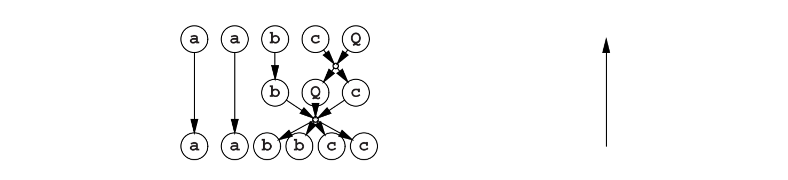
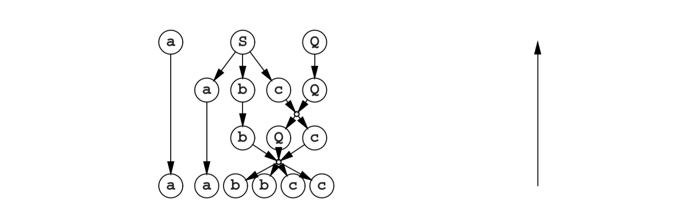
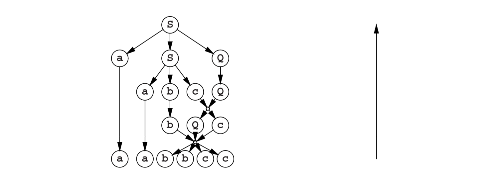

# 3.2.2 自底向上解析

使用自底向上技术，我们如下进行。一个生成步骤必须在最后，并且其结果在字符串中必须是可见的。我们在**aabbcc**中识别出**bQc--->bbcc**的右侧。这给了我们生成的最后一步（也是减少的第一步）：

现在我们识别出由**cQ--->Qc**派生的**Qc**：

再次，我们只发现了右侧：**abc**：

以及我们减少的最后一步也让我们没有选择：

自底向上解析倾向于找出前缀顺序中的生成规则。

有趣的是，自底向上解析把解析过程变成了一个生成过程。上述慢慢减少的过程可以被视为用反向语法的生成过程：

增加一条规则，将起始符号变成一个新的终结符：

**S--->!**

以及增加一条引入新起始符号的规则，原句是：

**Is ---> aabbcc**

如果，从**I**起始，我们能生成我们已经在输入字符串中识别的**!**，并且如果我们记录了我们做过的事情，那我们也就获得了解析树。

生成和减少的双重性被Deussen[21]使用，作为形式语言的一个非常根本的途径。