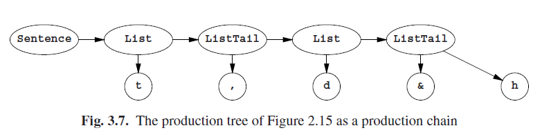

# 3.4.4 3型语法

在正则语法中，一个右侧包含最多一个非终结符，所以最左边和最右边推到没有区别。自顶向下方式对右正则语法来说有效的多；而对左正则语法来说，自底向上方式要好的多。当我们采取图Fig 2.15中的生成树，并且把它逆时针旋转45◦，我们就得到了图Fig 3.7的生成链。非终结符的序列向右滚动，当它们离开的时候就生成了终结符。在解析中，给我们的是终结符而希望得到的是非终结符序列。第一个起始符号是给出的（因此更适用自顶向下）。如果只有一条规则以输入的第一个符号开始，那我们就是幸运的并且知道接下来该怎么做。然后大多数时候，有许多规则是以同一个符号开始的，那时候我们就需要更多的智慧了。至于2型语法，我们当然可以通过试错找到正确的下一步，但存在着更多可以处理任何正则语法的更有效的方式。由于他们中的一些是以更先进的解析技术为基础的，所以我们将在第5章中一一介绍。

