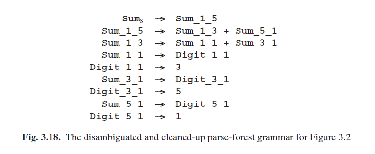

# 3.7.4 解析林语法

将解析的结果作为语法展示可能看起来很奇怪，甚至是有些令人失望的；毕竟应该从语法和字符串开始，做的所有解析工作，难道最后只是为了成为另一个语法？但是我们将看到解析林有相当多的优点。但这些优点都不明显，这可能也是为什么解析林直到上世纪八十年代才被提出，由Lang [210, 220, 31]引入。而“解析林语法”这个词似乎是被van Noord [221]首次使用。

图3.17 将图3.2 的解析树显示为一个解析林语法，而这之间的过程很有趣。对于原始语法中的每一个非终结符*A*，会从*i*的位置开始产生一个长度为*l*的段，在解析林语法中有一个非终结符*A_i_l*，以及显示*A_i_l*如何产生一个段的规则。例如，解析林语法存在的***Sum_1_5***展示了*Sum*产生了整个的输入字符串（从位置1开始，长度为5）；***Sum_1_5***有多个规则的事实表明, 解析是不明确的；两个规则显示了***Sum_1_5***产生整个输入字符串的两种可能方式。当我们使用这种语法来生成字符串时，它只生成***3+5+1***的输入字符串，但是生成了两次，由于不明确而导致。

我们写做*A_i_l*而不是*Ai,l*，因为*A_i_l*代表了一个语法符号的名称，而不是元素*A*的一个下角标；并没有A表或矩阵。*A_i_l*和*A_i_m*之间也没有任何关系；每个*A_i_l*都是一个单独的语法符号名称。

现在说说优势。首先，解析林语法以图形化的方式实现，这一概念已经在上一节中隐晦的表达了：即应该有一个实体来描述一个给定的非终结符如何生成给定的子字符串。

其次，它具有数学美：现在解析一个字符串可以可以看做一个函数，将一个语法映射到一个具体的语法或一个错误值。而不是三个概念——语法、输入字符串和解析林——现在我们只需要两个：语法和输入字符串。更实际的是，所有用于处理原始语法的软件也可以应用到解析林语法。

第三点，解析林语法在梳理过后很容易恢复，使用2.9.5中的算法。例如，将前一节的消歧法则应用于图3.17中的语法规则，可以确定**Sum_1_5**的第一条规则是相违背的。去除这一条规则并应用语法恢复算法生成图3.18的明确的语法，它对应于图3.16中的树。

第四，无限模糊解析是没有大的影响的：解析林语法只生成无限多个（相同的）字符串。而产生无穷多的字符串正是语法通常所做的。

最后但同样重要的一点，它很好的适应了解析作为一个新兴而又有希望的方法的交点，这点将在第13章进一步讨论。

现在可以说，解析林和解析林语法实际上是相同的，前者的指针在后者中被称为指代，但这也并不完全一样。指代要比指针更强大，因为指针只能指向一个对象，然而一个指代可以用来识别多个对象；通过重载或不明确指代：指代是多路径的指针。更具体的说，在图3.17中**Sum_1_5**指代了两个规则，因此在图3.14中承担了顶部或节点的角色。我们看到，在解析林语法中，我们不费丝毫就得到了一个与或树机制，因为它是建立在语法生成的机制上的。